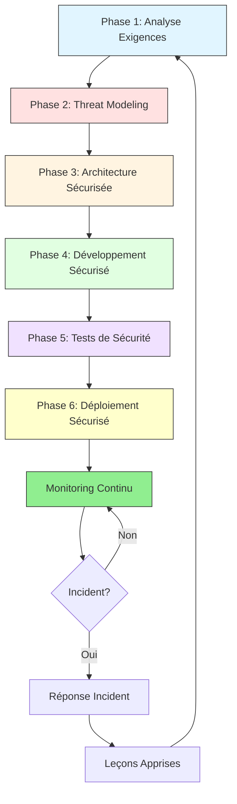

# SECURE BY DESIGN - GUIDE COMPLET

## 📚 Structure de la documentation

Ce guide est organisé en modules pour faciliter la navigation :

### Fichiers principaux

1. **[Secure_by_Design_00_Index.md](Secure_by_Design_00_Index.md)** ← Vous êtes ici
   - Vue d'ensemble
   - Introduction au Secure by Design
   - Coût selon les phases

2. **[Secure_by_Design_01_Analyse_Exigences.md](Secure_by_Design_01_Analyse_Exigences.md)**
   - Classification des données
   - Conformité réglementaire (RGPD, PCI-DSS)
   - Exigences de sécurité
   - Templates et exemples

3. **[Secure_by_Design_02_Threat_Modeling.md](Secure_by_Design_02_Threat_Modeling.md)**
   - Méthodologie STRIDE
   - Diagrammes DFD
   - Analyse de risques
   - Exemples complets

4. **[Secure_by_Design_03_Architecture.md](Secure_by_Design_03_Architecture.md)**
   - Zero Trust Architecture
   - Patterns de sécurité
   - Diagrammes Mermaid
   - Exemples d'architectures

5. **[Secure_by_Design_04_Developpement.md](Secure_by_Design_04_Developpement.md)**
   - SAST/SCA
   - Code Review sécurité
   - Exemples de code sécurisé
   - OWASP Top 10

6. **[Secure_by_Design_05_Tests.md](Secure_by_Design_05_Tests.md)**
   - DAST/Pentest
   - Pyramide des tests
   - Outils et automation
   - Scripts de test

7. **[Secure_by_Design_06_Deploiement.md](Secure_by_Design_06_Deploiement.md)**
   - Pipeline CI/CD sécurisé
   - Infrastructure as Code
   - Monitoring et alertes
   - Exemples GitLab/GitHub Actions

8. **[Secure_by_Design_07_Exemple_API.md](Secure_by_Design_07_Exemple_API.md)**
   - Cas complet d'une API REST bancaire
   - Code source complet
   - Configuration complète
   - Tests de sécurité

---

## Introduction au Secure by Design

### Définition

**Secure by Design** est une approche qui intègre la sécurité dès les premières phases de conception, plutôt que de l'ajouter après coup.

### Citation fondatrice

> "It is far easier to design security into a system than to add it later."
> — Gary McGraw, Software Security Expert

### Le problème : approche traditionnelle

```
┌─────────────────────────────────────────────────────────┐
│ MODÈLE TRADITIONNEL (Waterfall)                        │
├─────────────────────────────────────────────────────────┤
│                                                         │
│  Conception → Développement → Tests → Production       │
│                                          ↑              │
│                                 Sécurité ajoutée ici    │
│                                 (TROP TARD!)            │
│                                                         │
│  Conséquences :                                         │
│  ❌ Vulnérabilités découvertes tardivement             │
│  ❌ Refonte architecturale nécessaire                  │
│  ❌ Coûts exponentiels                                 │
│  ❌ Délais dépassés                                    │
└─────────────────────────────────────────────────────────┘
```

### La solution : Shift-Left Security

```
┌─────────────────────────────────────────────────────────┐
│ MODÈLE SECURE BY DESIGN                                │
├─────────────────────────────────────────────────────────┤
│                                                         │
│  Conception      Développement    Tests      Production│
│      +               +              +            +      │
│   Sécurité       Sécurité       Sécurité    Monitoring │
│      ↓               ↓              ↓            ↓      │
│  Threat Model    SAST/SCA       DAST/Pentest   SIEM    │
│                                                         │
│  Bénéfices :                                            │
│  ✅ Vulnérabilités détectées tôt                       │
│  ✅ Architecture sécurisée dès le départ               │
│  ✅ Coûts maîtrisés (1x vs 1000x)                     │
│  ✅ Conformité native                                  │
└─────────────────────────────────────────────────────────┘
```

### Coût de la sécurité selon la phase

**Étude IBM System Science Institute** :

| Phase | Coût de correction | Multiplicateur | Temps | Exemple (bug XSS) |
|-------|-------------------|----------------|-------|-------------------|
| **Conception** | 100€ | **1x** | 1 heure | Ajout validation dans specs |
| **Développement** | 1 000€ | **10x** | 1 jour | Refactoring + tests unitaires |
| **Tests** | 10 000€ | **100x** | 1 semaine | Modification architecture + régression |
| **Production** | 100 000€+ | **1000x** | 1 mois+ | Incident + patch urgent + communication |

**Graphique de l'impact :**

```
Coût de correction
│
│                                                    ╱
│                                               ╱
│                                          ╱
│                                     ╱
│                                ╱
│                           ╱
│                      ╱
│                 ╱
│            ╱
│       ╱
│  ╱
└─────────────────────────────────────────────────────────►
  Conception  Développement   Tests    Production   Phase

  1x          10x             100x     1000x        Multiplicateur
```

### Exemple concret : Absence de validation d'entrée (XSS)

#### Scénario : Application e-commerce

**En conception (Threat Modeling) - Coût : 100€**
```
• Identification de la menace : XSS dans champ commentaire
• Décision : Implémenter validation + sanitisation
• Temps : 1h de réflexion + documentation
• Action : Ajout exigence "Valider tous les inputs utilisateur"
```

**En développement - Coût : 1 000€**
```
• Bug détecté lors du code review
• Refactoring du composant de commentaires
• Ajout de tests unitaires
• Temps : 1 journée développeur
```

**En tests - Coût : 10 000€**
```
• Vulnérabilité détectée par scanner DAST
• Impact sur plusieurs composants (commentaires, recherche, profil)
• Refonte de la couche de validation
• Régression complète nécessaire
• Temps : 1 semaine équipe
```

**En production - Coût : 100 000€+**
```
• Incident de sécurité : XSS exploité par attaquant
• Vol de cookies de session de 1000+ utilisateurs
• Patch urgent en dehors des heures
• Communication de crise
• Investigation forensique
• Amendes RGPD potentielles
• Perte de confiance client
• Impact réputation
• Temps : 1 mois+ (équipe mobilisée)
```

### Les 6 phases du Secure by Design



### Vue d'ensemble des phases

#### Phase 1 : Analyse des Exigences de Sécurité
**Objectif :** Définir QUOI sécuriser

- Classification des données (Public, Confidentiel, Restreint)
- Analyse de conformité (RGPD, PCI-DSS, HIPAA, ISO 27001)
- Définition des exigences de sécurité (fonctionnelles et non-fonctionnelles)
- Critères d'acceptation sécurité

**Livrables :**
- Document d'exigences de sécurité (SRS)
- Registre des traitements (RGPD)
- Matrice de conformité

**Durée estimée :** 1-2 semaines

---

#### Phase 2 : Threat Modeling
**Objectif :** Identifier les MENACES potentielles

- Décomposition de l'application (DFD - Data Flow Diagram)
- Identification des menaces (méthodologie STRIDE)
- Évaluation des risques (Probabilité × Impact)
- Définition des contre-mesures

**Livrables :**
- Threat Model document
- Diagrammes DFD
- Registre des risques
- Plan de mitigation

**Durée estimée :** 2-3 semaines

---

#### Phase 3 : Architecture Sécurisée
**Objectif :** Concevoir COMMENT sécuriser

- Patterns de sécurité (Zero Trust, Defense in Depth)
- Choix technologiques sécurisés
- Segmentation réseau
- Principes de design (Fail Secure, Least Privilege)

**Livrables :**
- Document d'architecture de sécurité
- Diagrammes d'architecture
- Matrice de sécurisation par composant

**Durée estimée :** 2-4 semaines

---

#### Phase 4 : Développement Sécurisé
**Objectif :** IMPLÉMENTER la sécurité

- Secure coding practices (OWASP)
- Code review obligatoire
- SAST (Static Application Security Testing)
- SCA (Software Composition Analysis)
- Gestion des secrets

**Livrables :**
- Code sécurisé
- Rapports SAST/SCA
- Documentation du code de sécurité

**Durée estimée :** Continu pendant le développement

---

#### Phase 5 : Tests de Sécurité
**Objectif :** VALIDER la sécurité

- DAST (Dynamic Application Security Testing)
- Penetration testing
- Fuzzing
- Tests d'intrusion
- Validation conformité

**Livrables :**
- Rapports de tests de sécurité
- Rapport de penetration test
- Plan de remédiation

**Durée estimée :** 2-4 semaines avant release

---

#### Phase 6 : Déploiement Sécurisé
**Objectif :** DÉPLOYER en sécurité

- Pipeline CI/CD sécurisé
- Infrastructure as Code (IaC) sécurisée
- Hardening des environnements
- Monitoring et alertes
- Plan de réponse aux incidents

**Livrables :**
- Configuration CI/CD sécurisée
- Runbooks de déploiement
- Dashboards de monitoring
- Procédures d'incident response

**Durée estimée :** 1-2 semaines + amélioration continue

---

### Frameworks et standards de référence

#### OWASP SAMM (Software Assurance Maturity Model)

Modèle de maturité couvrant 5 domaines :

```
┌──────────────────────────────────────────────────────┐
│ OWASP SAMM - 5 Business Functions                   │
├──────────────────────────────────────────────────────┤
│                                                      │
│  1. GOVERNANCE                                       │
│     • Strategy & Metrics                             │
│     • Policy & Compliance                            │
│     • Education & Guidance                           │
│                                                      │
│  2. DESIGN                                           │
│     • Threat Assessment                              │
│     • Security Requirements                          │
│     • Security Architecture                          │
│                                                      │
│  3. IMPLEMENTATION                                   │
│     • Secure Build                                   │
│     • Secure Deployment                              │
│     • Defect Management                              │
│                                                      │
│  4. VERIFICATION                                     │
│     • Architecture Assessment                        │
│     • Requirements-driven Testing                    │
│     • Security Testing                               │
│                                                      │
│  5. OPERATIONS                                       │
│     • Incident Management                            │
│     • Environment Management                         │
│     • Operational Management                         │
│                                                      │
└──────────────────────────────────────────────────────┘
```

**Site officiel :** https://owaspsamm.org/

#### NIST SSDF (Secure Software Development Framework)

4 pratiques principales :

1. **PO** - Prepare the Organization
2. **PS** - Protect the Software
3. **PW** - Produce Well-Secured Software
4. **RV** - Respond to Vulnerabilities

**Document officiel :** NIST SP 800-218

#### Microsoft SDL (Security Development Lifecycle)

7 pratiques essentielles :

1. Provide Training
2. Define Security Requirements
3. Define Metrics and Compliance Reporting
4. Perform Threat Modeling
5. Establish Design Requirements
6. Define and Use Cryptography Standards
7. Manage Security Risk from Using Third-Party Components

### Bénéfices mesurables du Secure by Design

#### Comparaison Avant / Après

| Métrique | Sans Secure by Design | Avec Secure by Design | Amélioration |
|----------|----------------------|----------------------|--------------|
| **Vulnérabilités en production** | 50 par release | 5 par release | **-90%** |
| **Coût moyen de correction** | 10 000€ | 1 000€ | **-90%** |
| **Time to remediation** | 30 jours | 3 jours | **-90%** |
| **Incidents de sécurité** | 12 par an | 2 par an | **-83%** |
| **Taux de conformité audits** | 60% | 95% | **+58%** |
| **Temps détection vulnérabilité** | 277 jours (moyenne) | 7 jours | **-97%** |

#### ROI (Return on Investment)

**Investissement initial :**
- Formation équipes : 20 000€
- Outils SAST/DAST : 30 000€/an
- Consultant sécurité : 50 000€
- **Total : 100 000€**

**Gains annuels :**
- Réduction incidents : 500 000€ (5 incidents évités × 100k€)
- Réduction coûts correction : 450 000€ (50 bugs × 10k€ évités)
- Conformité (pas d'amendes) : 1 000 000€ (amendes RGPD évitées)
- **Total gains : ~2M€**

**ROI = (2M€ - 100k€) / 100k€ = 1900%**

### Culture DevSecOps

#### Principes fondamentaux

```
┌─────────────────────────────────────────────────────┐
│ DevSecOps = Dev + Security + Operations            │
├─────────────────────────────────────────────────────┤
│                                                     │
│  Principes :                                        │
│  • Shift-Left Security                              │
│  • Automation First                                 │
│  • Responsabilité partagée                          │
│  • Feedback rapide                                  │
│  • Amélioration continue                            │
│                                                     │
└─────────────────────────────────────────────────────┘
```

#### Rôles et responsabilités

| Rôle | Responsabilités Sécurité |
|------|--------------------------|
| **Développeurs** | • Code sécurisé (OWASP)<br>• Tests unitaires de sécurité<br>• Corriger vulnérabilités SAST |
| **Security Champions** | • Évangéliser bonnes pratiques<br>• Code review sécurité<br>• Lien avec équipe sécurité |
| **DevOps/SRE** | • Pipeline CI/CD sécurisé<br>• IaC sécurisée<br>• Monitoring sécurité |
| **Architectes** | • Threat Modeling<br>• Choix technologiques sécurisés<br>• Patterns de sécurité |
| **Security Team** | • Outils et formations<br>• Audits et pentests<br>• Réponse aux incidents |

---

## Comment utiliser ce guide ?

### Pour un nouveau projet

1. **Semaine 1-2 :** Lire et appliquer [Phase 1 - Analyse des Exigences](Secure_by_Design_01_Analyse_Exigences.md)
2. **Semaine 3-5 :** Réaliser le [Threat Modeling](Secure_by_Design_02_Threat_Modeling.md)
3. **Semaine 6-9 :** Concevoir l'[Architecture Sécurisée](Secure_by_Design_03_Architecture.md)
4. **Sprint 1-N :** Appliquer [Développement Sécurisé](Secure_by_Design_04_Developpement.md)
5. **Avant release :** Exécuter [Tests de Sécurité](Secure_by_Design_05_Tests.md)
6. **Déploiement :** Suivre [Déploiement Sécurisé](Secure_by_Design_06_Deploiement.md)

### Pour un projet existant

1. **Audit :** Évaluer l'état actuel avec les checklists de chaque phase
2. **Gap Analysis :** Identifier les écarts
3. **Prioriser :** Traiter les risques critiques d'abord
4. **Amélioration continue :** Intégrer progressivement les pratiques

---

## Ressources complémentaires

### Sites officiels

- **OWASP :** https://owasp.org/
- **NIST :** https://www.nist.gov/
- **ANSSI :** https://www.ssi.gouv.fr/
- **SANS :** https://www.sans.org/

### Outils recommandés

| Catégorie | Outil | Licence | Usage |
|-----------|-------|---------|-------|
| **Threat Modeling** | Microsoft Threat Modeling Tool | Gratuit | Création DFD + STRIDE |
| **SAST** | SonarQube | Open Source / Commercial | Analyse code statique |
| **SCA** | OWASP Dependency-Check | Open Source | Scan dépendances |
| **DAST** | OWASP ZAP | Open Source | Tests dynamiques |
| **Secrets Scanning** | GitGuardian | Commercial | Détection secrets dans code |
| **IaC Security** | Checkov | Open Source | Scan Terraform/CloudFormation |

---

**Prochaine étape :** Commencez par [Phase 1 - Analyse des Exigences](Secure_by_Design_01_Analyse_Exigences.md)

---

**Version :** 1.0
**Date :** 2026-01-05
**Auteur :** Guide Secure by Design
**Licence :** Usage interne / Formation
