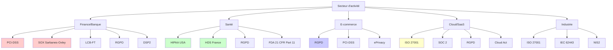

# PHASE 1 : ANALYSE DES EXIGENCES DE SÉCURITÉ

[← Retour à l'index](Secure_by_Design_00_Index.md) | [Phase 2 : Threat Modeling →](Secure_by_Design_02_Threat_Modeling.md)

---

## Table des matières

1. [Vue d'ensemble](#vue-densemble)
2. [Objectifs de la phase](#objectifs)
3. [Méthodologie détaillée](#methodologie)
4. [Classification des données](#classification)
5. [Conformité réglementaire](#conformite)
6. [Exigences de sécurité](#exigences)
7. [Livrables](#livrables)
8. [Templates](#templates)
9. [Outils recommandés](#outils)
10. [Pièges à éviter](#pieges)

---

## Vue d'ensemble {#vue-densemble}

L'**Analyse des Exigences de Sécurité** est la première et fondamentale étape du Secure by Design. Elle consiste à identifier et documenter les besoins de sécurité **AVANT** de concevoir ou développer quoi que ce soit.

### Pourquoi cette phase est critique ?

```
Sans exigences claires :
❌ Développement sans direction sécurité
❌ Découverte tardive des contraintes réglementaires
❌ Refonte architecturale coûteuse
❌ Non-conformité et amendes

Avec exigences bien définies :
✅ Vision claire des objectifs sécurité
✅ Conformité dès la conception
✅ Budget et planning réalistes
✅ Critères d'acceptation mesurables
```

### Durée estimée

- **Petit projet** : 1 semaine
- **Projet moyen** : 2-3 semaines
- **Projet critique** : 4-6 semaines

---

## Objectifs de la phase {#objectifs}

1. **Comprendre le contexte** métier et technique
2. **Classifier les données** traitées par le système
3. **Identifier les réglementations** applicables (RGPD, PCI-DSS, etc.)
4. **Définir les exigences de sécurité** (fonctionnelles et non-fonctionnelles)
5. **Établir les critères d'acceptation** sécurité
6. **Obtenir l'engagement** des parties prenantes

---

## Méthodologie détaillée {#methodologie}

### Étape 1 : Analyse du contexte

#### Questions essentielles à se poser

```markdown
📋 CONTEXTE MÉTIER
═══════════════════════════════════════════════════════════

□ Quelle est la mission critique de l'application ?
  Exemple : "Permettre aux clients de réaliser des transferts bancaires"

□ Quels sont les actifs métier à protéger ?
  Exemples : Données clients, secrets commerciaux, propriété intellectuelle

□ Quel est l'impact d'une indisponibilité ?
  • Financier : perte de CA, pénalités contractuelles
  • Réputation : perte de confiance, bad buzz
  • Légal : non-respect SLA, amendes

□ Qui sont les utilisateurs finaux ?
  • Internes (employés, admins)
  • Externes (clients, partenaires, public)
  • Niveau de confiance de chaque type

□ Quels sont les canaux d'accès ?
  • Web (desktop, mobile)
  • Applications natives (iOS, Android)
  • API (REST, GraphQL, SOAP)
  • IoT / Objets connectés

📋 CONTEXTE TECHNIQUE
═══════════════════════════════════════════════════════════

□ Architecture cible ?
  • Monolithique
  • Microservices
  • Serverless
  • Hybride

□ Hébergement ?
  • Cloud (AWS, Azure, GCP)
  • On-premise
  • Hybride

□ Intégrations avec systèmes tiers ?
  • APIs externes (paiement, authentification, analytics)
  • Systèmes legacy (mainframe, COBOL)
  • Services tiers (CDN, email, SMS)

□ Volume de données et d'utilisateurs ?
  • Nombre d'utilisateurs actifs
  • Volume de transactions
  • Taille de la base de données

□ Exigences de disponibilité ?
  • 99% (7h downtime/mois)
  • 99.9% (43min downtime/mois)
  • 99.99% (4min downtime/mois)
  • 99.999% (26sec downtime/mois)
```

#### Exemple pratique : Application bancaire mobile

```yaml
# security-context.yaml

project:
  name: "BankApp Mobile"
  type: "Application bancaire grand public"
  criticality: "CRITICAL"  # CRITICAL | HIGH | MEDIUM | LOW

business_impact:
  financial:
    level: "HIGH"
    justification: "Transactions financières directes"
    estimated_loss_per_hour: "50000 EUR"  # Si indisponible

  reputation:
    level: "HIGH"
    justification: "Confiance client essentielle dans le secteur bancaire"
    customer_churn_risk: "15% si incident majeur"

  legal:
    level: "HIGH"
    justification: "Multiples régulations (ACPR, RGPD, PCI-DSS)"
    potential_fines: "20M EUR ou 4% CA annuel (RGPD)"

users:
  retail_customers:
    count: 500000
    trust_level: "MEDIUM"  # PUBLIC | MEDIUM | HIGH
    authentication_required: "MFA_MANDATORY"
    typical_actions:
      - "Consulter solde"
      - "Virement jusqu'à 10000 EUR"
      - "Paiement factures"

  business_customers:
    count: 10000
    trust_level: "MEDIUM"
    authentication_required: "MFA_MANDATORY + Device_Binding"
    typical_actions:
      - "Virements masse"
      - "Gestion multi-comptes"
      - "Export comptable"

  customer_service:
    count: 200
    trust_level: "HIGH"  # Employés
    authentication_required: "MFA_MANDATORY + VPN"
    typical_actions:
      - "Consultation dossiers clients (lecture seule)"
      - "Déblocage compte"

  administrators:
    count: 5
    trust_level: "HIGH"
    authentication_required: "MFA_MANDATORY + Hardware_Token + VPN + IP_Whitelist"
    typical_actions:
      - "Configuration système"
      - "Gestion utilisateurs"
      - "Accès logs"

data_sensitivity:
  pii:  # Personal Identifiable Information
    - "Nom, prénom, adresse"
    - "Email, téléphone"
    - "Date de naissance"
    - "Numéro de sécurité sociale"

  financial:
    - "Numéros de compte (IBAN)"
    - "Soldes et mouvements"
    - "Historique transactions"
    - "Données cartes bancaires"

  authentication:
    - "Identifiants de connexion"
    - "Hash mots de passe"
    - "Tokens de session"
    - "Secrets 2FA"

access_channels:
  - channel: "iOS App"
    version: "iOS 14+"
    security_features:
      - "Biométrie (Face ID / Touch ID)"
      - "Keychain pour secrets"
      - "Certificate pinning"

  - channel: "Android App"
    version: "Android 10+"
    security_features:
      - "Biométrie"
      - "Android Keystore"
      - "Certificate pinning"
      - "SafetyNet Attestation"

  - channel: "Web Portal"
    browsers: ["Chrome 90+", "Firefox 88+", "Safari 14+", "Edge 90+"]
    security_features:
      - "HTTPS obligatoire (HSTS)"
      - "CSP (Content Security Policy)"
      - "SameSite cookies"

integrations:
  - system: "Core Banking System"
    type: "Mainframe (COBOL)"
    protocol: "MQ Series"
    data_exchanged: "Account balance, transactions"
    security:
      - "Message-level encryption"
      - "Mutual TLS"

  - system: "Payment Gateway"
    vendor: "Stripe"
    scope: "PCI-DSS Level 1"
    data_exchanged: "Tokenized card data"
    security:
      - "API Keys in Vault"
      - "Webhook signature validation"

  - system: "Identity Provider"
    vendor: "Okta"
    protocol: "OAuth 2.0 / OpenID Connect"
    data_exchanged: "User authentication"
    security:
      - "PKCE flow"
      - "Token rotation"

  - system: "Fraud Detection"
    vendor: "Sift Science"
    data_exchanged: "Behavioral analytics"
    security:
      - "Data pseudonymization"
      - "TLS 1.3"

availability_requirements:
  target_sla: "99.95%"  # 4h20min downtime/an
  rto: "1 hour"  # Recovery Time Objective
  rpo: "5 minutes"  # Recovery Point Objective (perte données max)

compliance_scope:
  - "RGPD (EU General Data Protection Regulation)"
  - "PCI-DSS v4.0"
  - "LCB-FT (Lutte Contre le Blanchiment et Financement Terrorisme)"
  - "DSP2 (Directive Services Paiement 2)"
  - "NIS2 (Network Information Security Directive)"
```

---

## Classification des données {#classification}

### Pourquoi classifier les données ?

La classification permet de :
- **Prioriser** les investissements sécurité
- **Appliquer** les contrôles appropriés
- **Démontrer** la conformité RGPD (principe de minimisation)
- **Former** les équipes sur les données sensibles

### Framework de classification

| Niveau | Nom | Description | Exemples | Impact si compromission |
|--------|-----|-------------|----------|-------------------------|
| **1** | **PUBLIC** | Données publiques, destinées à être diffusées | Site web, communiqués, documentation publique | Négligeable |
| **2** | **INTERNAL** | Usage interne uniquement, non sensible | Emails internes, docs de travail | Faible |
| **3** | **CONFIDENTIAL** | Données sensibles métier | Contrats, stratégie, données clients | Moyen à Élevé |
| **4** | **RESTRICTED** | Hautement sensible, régulé | Données bancaires, santé, secrets d'État | Critique |

### Matrice de classification détaillée

```python
# data_classification_framework.py
from enum import Enum
from dataclasses import dataclass
from typing import List, Dict

class DataClassification(Enum):
    PUBLIC = 1
    INTERNAL = 2
    CONFIDENTIAL = 3
    RESTRICTED = 4

class EncryptionRequired(Enum):
    NONE = "none"
    IN_TRANSIT_ONLY = "tls"
    AT_REST = "aes256_rest"
    END_TO_END = "e2e"

class AccessControl(Enum):
    PUBLIC_READ = "public"
    AUTHENTICATED_USERS = "authenticated"
    ROLE_BASED = "rbac"
    NEED_TO_KNOW = "need_to_know"

@dataclass
class SecurityControls:
    """Contrôles de sécurité requis selon classification"""
    encryption: EncryptionRequired
    access_control: AccessControl
    mfa_required: bool
    audit_logging: bool
    data_masking: bool
    backup_encrypted: bool
    retention_days: int
    disposal_method: str  # "delete" | "secure_wipe" | "crypto_shred"

@dataclass
class DataAsset:
    """Asset de données avec sa classification"""
    name: str
    description: str
    classification: DataClassification
    contains_pii: bool
    contains_financial: bool
    regulatory_scope: List[str]  # ["RGPD", "PCI-DSS", etc.]
    data_owner: str  # Responsable métier
    technical_owner: str  # Responsable technique

    def get_security_controls(self) -> SecurityControls:
        """Génère automatiquement les contrôles requis"""
        controls_matrix = {
            DataClassification.PUBLIC: SecurityControls(
                encryption=EncryptionRequired.NONE,
                access_control=AccessControl.PUBLIC_READ,
                mfa_required=False,
                audit_logging=False,
                data_masking=False,
                backup_encrypted=False,
                retention_days=365,
                disposal_method="delete"
            ),
            DataClassification.INTERNAL: SecurityControls(
                encryption=EncryptionRequired.IN_TRANSIT_ONLY,
                access_control=AccessControl.AUTHENTICATED_USERS,
                mfa_required=False,
                audit_logging=False,
                data_masking=False,
                backup_encrypted=True,
                retention_days=730,
                disposal_method="delete"
            ),
            DataClassification.CONFIDENTIAL: SecurityControls(
                encryption=EncryptionRequired.AT_REST,
                access_control=AccessControl.ROLE_BASED,
                mfa_required=False,
                audit_logging=True,
                data_masking=self.contains_pii,
                backup_encrypted=True,
                retention_days=2555,  # 7 ans
                disposal_method="secure_wipe"
            ),
            DataClassification.RESTRICTED: SecurityControls(
                encryption=EncryptionRequired.END_TO_END,
                access_control=AccessControl.NEED_TO_KNOW,
                mfa_required=True,
                audit_logging=True,
                data_masking=True,
                backup_encrypted=True,
                retention_days=3650,  # 10 ans (bancaire)
                disposal_method="crypto_shred"
            )
        }

        controls = controls_matrix[self.classification]

        # Surcharges si données PII ou régulées
        if "RGPD" in self.regulatory_scope:
            controls.data_masking = True
            controls.audit_logging = True

        if "PCI-DSS" in self.regulatory_scope:
            controls.encryption = EncryptionRequired.END_TO_END
            controls.mfa_required = True

        return controls

# Exemple d'utilisation pour l'application bancaire
bank_app_assets = [
    DataAsset(
        name="account_balance",
        description="Solde du compte bancaire",
        classification=DataClassification.RESTRICTED,
        contains_pii=True,
        contains_financial=True,
        regulatory_scope=["PCI-DSS", "RGPD", "LCB-FT"],
        data_owner="Direction Retail Banking",
        technical_owner="Backend Team Lead"
    ),
    DataAsset(
        name="transaction_history",
        description="Historique des transactions",
        classification=DataClassification.RESTRICTED,
        contains_pii=True,
        contains_financial=True,
        regulatory_scope=["PCI-DSS", "RGPD", "LCB-FT"],
        data_owner="Direction Retail Banking",
        technical_owner="Backend Team Lead"
    ),
    DataAsset(
        name="user_profile",
        description="Profil utilisateur (nom, email, adresse)",
        classification=DataClassification.CONFIDENTIAL,
        contains_pii=True,
        contains_financial=False,
        regulatory_scope=["RGPD"],
        data_owner="Direction Marketing",
        technical_owner="CRM Team Lead"
    ),
    DataAsset(
        name="card_data",
        description="Données cartes bancaires (PAN, expiry)",
        classification=DataClassification.RESTRICTED,
        contains_pii=False,
        contains_financial=True,
        regulatory_scope=["PCI-DSS"],
        data_owner="Direction Moyens de Paiement",
        technical_owner="Payment Gateway Team"
    ),
    DataAsset(
        name="app_analytics",
        description="Données analytics anonymisées",
        classification=DataClassification.INTERNAL,
        contains_pii=False,
        contains_financial=False,
        regulatory_scope=[],
        data_owner="Direction Digital",
        technical_owner="Product Team"
    ),
    DataAsset(
        name="marketing_content",
        description="Contenus marketing publics",
        classification=DataClassification.PUBLIC,
        contains_pii=False,
        contains_financial=False,
        regulatory_scope=[],
        data_owner="Direction Marketing",
        technical_owner="Content Team"
    )
]

# Génération du rapport de classification
print("╔═══════════════════════════════════════════════════════════════╗")
print("║     RAPPORT DE CLASSIFICATION DES DONNÉES - BANKAPP          ║")
print("╚═══════════════════════════════════════════════════════════════╝\n")

for asset in bank_app_assets:
    controls = asset.get_security_controls()

    print(f"\n{'='*65}")
    print(f"📊 {asset.name.upper()}")
    print(f"{'='*65}")
    print(f"Description      : {asset.description}")
    print(f"Classification   : {asset.classification.name}")
    print(f"PII              : {'✓ Oui' if asset.contains_pii else '✗ Non'}")
    print(f"Données financières : {'✓ Oui' if asset.contains_financial else '✗ Non'}")
    print(f"Régulations      : {', '.join(asset.regulatory_scope) if asset.regulatory_scope else 'Aucune'}")
    print(f"Propriétaire métier : {asset.data_owner}")
    print(f"Propriétaire technique : {asset.technical_owner}")
    print(f"\n🔒 Contrôles de sécurité requis :")
    print(f"  • Chiffrement        : {controls.encryption.value}")
    print(f"  • Contrôle d'accès   : {controls.access_control.value}")
    print(f"  • MFA obligatoire    : {'✓ Oui' if controls.mfa_required else '✗ Non'}")
    print(f"  • Audit logging      : {'✓ Oui' if controls.audit_logging else '✗ Non'}")
    print(f"  • Data masking       : {'✓ Oui' if controls.data_masking else '✗ Non'}")
    print(f"  • Backup chiffré     : {'✓ Oui' if controls.backup_encrypted else '✗ Non'}")
    print(f"  • Rétention          : {controls.retention_days} jours ({controls.retention_days//365} ans)")
    print(f"  • Méthode suppression : {controls.disposal_method}")
```

**Output attendu :**

```
╔═══════════════════════════════════════════════════════════════╗
║     RAPPORT DE CLASSIFICATION DES DONNÉES - BANKAPP          ║
╚═══════════════════════════════════════════════════════════════╝

=================================================================
📊 ACCOUNT_BALANCE
=================================================================
Description      : Solde du compte bancaire
Classification   : RESTRICTED
PII              : ✓ Oui
Données financières : ✓ Oui
Régulations      : PCI-DSS, RGPD, LCB-FT
Propriétaire métier : Direction Retail Banking
Propriétaire technique : Backend Team Lead

🔒 Contrôles de sécurité requis :
  • Chiffrement        : e2e
  • Contrôle d'accès   : need_to_know
  • MFA obligatoire    : ✓ Oui
  • Audit logging      : ✓ Oui
  • Data masking       : ✓ Oui
  • Backup chiffré     : ✓ Oui
  • Rétention          : 3650 jours (10 ans)
  • Méthode suppression : crypto_shred

[... autres assets ...]
```

---

## Conformité réglementaire {#conformite}

### Principales réglementations par secteur



### RGPD (Règlement Général sur la Protection des Données)

#### Applicabilité

**Vous DEVEZ respecter le RGPD si :**
- ✓ Vous traitez des données de résidents UE/EEE
- ✓ Votre entreprise est établie dans l'UE
- ✓ Vous proposez des biens/services à des personnes dans l'UE

**Même si vous êtes hors UE !**

#### Les 7 principes du RGPD

| Principe | Description | Exemple d'application |
|----------|-------------|----------------------|
| **Licéité** | Base légale pour le traitement | Consentement explicite, contrat, obligation légale |
| **Finalité** | Objectifs déterminés, explicites, légitimes | "Traiter les paiements" ✓, "Usage futur indéterminé" ✗ |
| **Minimisation** | Collecter uniquement données nécessaires | Ne pas demander date de naissance si inutile |
| **Exactitude** | Données exactes et à jour | Permettre mise à jour profil |
| **Conservation limitée** | Durée de conservation définie | Supprimer après 2 ans d'inactivité |
| **Intégrité et confidentialité** | Sécurité appropriée | Chiffrement, contrôle d'accès, audit |
| **Responsabilité** | Démontrer la conformité | Documentation, audits, DPO |

#### Droits des personnes

```markdown
🔐 DROITS DES PERSONNES (Articles 15-22 RGPD)
═══════════════════════════════════════════════════════════

1. Droit à l'information (Art. 13-14)
   → Informer sur la collecte et l'usage des données

2. Droit d'accès (Art. 15)
   → Permettre consultation de toutes les données personnelles
   → Délai de réponse : 1 mois

3. Droit de rectification (Art. 16)
   → Corriger les données inexactes

4. Droit à l'effacement / Droit à l'oubli (Art. 17)
   → Supprimer les données sur demande
   → Exceptions : obligation légale, intérêt public

5. Droit à la limitation du traitement (Art. 18)
   → "Geler" les données sans les supprimer

6. Droit à la portabilité (Art. 20)
   → Export dans format structuré et interopérable
   → JSON, CSV, XML

7. Droit d'opposition (Art. 21)
   → S'opposer au traitement (marketing direct par ex.)

8. Décision individuelle automatisée (Art. 22)
   → Ne pas être soumis uniquement à décision automatisée
   → Pas de profilage sans intervention humaine
```

#### Exigences techniques RGPD

```yaml
# rgpd-technical-requirements.yaml

privacy_by_design:
  - requirement: "Intégrer la protection des données dès la conception"
    implementation:
      - "Minimisation des données collectées"
      - "Pseudonymisation par défaut"
      - "Chiffrement des données sensibles"
      - "Contrôle d'accès basé sur le besoin d'en connaître"

privacy_by_default:
  - requirement: "Paramètres les plus protecteurs par défaut"
    implementation:
      - "Opt-in (consentement explicite), pas opt-out"
      - "Cookies non-essentiels désactivés par défaut"
      - "Partage de données désactivé par défaut"

dpo:  # Data Protection Officer
  designation_required: true
  conditions:
    - "Traitement à grande échelle"
    - "Données sensibles (santé, origine, opinions)"
    - "Surveillance systématique"
  contact: "dpo@example.com"

dpia:  # Data Protection Impact Assessment
  required_if:
    - "Traitement à risque élevé"
    - "Nouvelles technologies"
    - "Profilage avec effets juridiques"
    - "Traitement à grande échelle de données sensibles"

  process:
    1: "Décrire le traitement et ses finalités"
    2: "Évaluer la nécessité et la proportionnalité"
    3: "Identifier et évaluer les risques"
    4: "Mesures pour faire face aux risques"
    5: "Validation DPO"

data_breach_notification:
  cnil_notification_delay: "72 heures"
  individuals_notification: "Sans délai si risque élevé"

  breach_register_mandatory: true
  information_required:
    - "Nature de la violation"
    - "Catégories et nombre de personnes concernées"
    - "Conséquences probables"
    - "Mesures prises ou envisagées"

international_transfers:
  eu_to_non_eu:
    adequacy_decision:  # Décision d'adéquation
      - "Royaume-Uni"
      - "Suisse"
      - "Canada (commercial)"
      - "Japon"
      - "Nouvelle-Zélande"

    standard_contractual_clauses:  # SCCs
      - "USA (avec SCCs + garanties supplémentaires post-Schrems II)"
      - "Autres pays sans décision d'adéquation"

    forbidden_without_guarantees:
      - "Chine"
      - "Russie"
```

#### Template d'analyse RGPD

```markdown
# ANALYSE DE CONFORMITÉ RGPD - [NOM DU PROJET]

## 1. Applicabilité

☑ Traitement de données personnelles : **OUI**
☑ Données de résidents UE/EEE : **OUI**

→ RGPD APPLICABLE

## 2. Base légale du traitement (Art. 6)

| Traitement | Finalité | Base légale | Justification |
|------------|----------|-------------|---------------|
| Création compte | Fourniture service bancaire | **Contrat** (Art. 6.1.b) | Nécessaire pour exécuter le contrat |
| Newsletter marketing | Marketing direct | **Consentement** (Art. 6.1.a) | Opt-in explicite |
| Lutte anti-fraude | Prévention fraude | **Intérêt légitime** (Art. 6.1.f) | Protection des intérêts de la banque et clients |
| Conservation 10 ans | Obligations comptables | **Obligation légale** (Art. 6.1.c) | Code de commerce |

## 3. Catégories de données collectées

☑ **Données d'identification**
  - Nom, prénom
  - Date de naissance
  - Adresse postale
  - Email, téléphone

☑ **Données financières**
  - IBAN
  - Historique transactions
  - Revenus

☐ **Données sensibles (Art. 9)** ← ATTENTION !
  - Santé : NON
  - Origine raciale/ethnique : NON
  - Opinions politiques : NON
  - Appartenance syndicale : NON
  - Données biométriques : OUI (empreinte digitale pour Touch ID)
    → **Base légale supplémentaire requise : Consentement explicite (Art. 9.2.a)**

## 4. Durées de conservation

| Données | Durée | Base légale | Action après expiration |
|---------|-------|-------------|------------------------|
| Données compte actif | Durée du contrat | Nécessité contractuelle | - |
| Données compte clôturé | 5 ans | Prescription civile | Suppression automatique |
| Historique transactions | 10 ans | Code monétaire et financier | Archivage puis suppression |
| Logs de connexion | 12 mois | LCB-FT | Suppression automatique |
| Données marketing (sans consentement) | 3 ans | CNIL (délibération cookies) | Suppression |

## 5. Exercice des droits

### Droit d'accès (Art. 15)

**Implémentation technique :**
```python
# API endpoint pour export données personnelles
@app.route('/api/my-data/export', methods=['GET'])
@require_authentication
def export_personal_data():
    user_id = get_current_user_id()

    data = {
        "profile": get_user_profile(user_id),
        "transactions": get_user_transactions(user_id),
        "consents": get_user_consents(user_id),
        "login_history": get_login_history(user_id)
    }

    # Format JSON structuré
    return jsonify(data), 200, {
        'Content-Disposition': f'attachment; filename=my_data_{user_id}.json'
    }
```

### Droit à l'effacement (Art. 17)

**Workflow :**
1. Utilisateur demande suppression compte
2. Vérification : pas d'obligation légale de conservation
3. Anonymisation données (pas suppression physique si obligation comptable)
4. Suppression données non soumises à obligation
5. Confirmation par email

**Implémentation :**
```python
@app.route('/api/account/delete', methods=['DELETE'])
@require_authentication
def delete_account():
    user_id = get_current_user_id()

    # Vérifier obligations légales
    if has_active_contract(user_id):
        return {"error": "Impossible de supprimer avec contrat actif"}, 400

    # Anonymisation (conservation légale)
    anonymize_for_legal_retention(user_id)  # Transactions 10 ans

    # Suppression complète autres données
    delete_user_profile(user_id)
    delete_marketing_data(user_id)
    delete_analytics_data(user_id)

    # Log pour audit
    log_gdpr_deletion(user_id, timestamp=now())

    return {"message": "Compte supprimé"}, 200
```

### Droit à la portabilité (Art. 20)

**Format de l'export :**
```json
{
  "export_date": "2026-01-05T10:30:00Z",
  "user_id": "uuid-xxx",
  "profile": {
    "first_name": "Jean",
    "last_name": "Dupont",
    "email": "jean.dupont@example.com",
    "phone": "+33612345678",
    "address": {
      "street": "1 Rue de la Paix",
      "city": "Paris",
      "zip": "75001",
      "country": "France"
    }
  },
  "accounts": [
    {
      "iban": "FR76XXXX",
      "type": "checking",
      "balance": 1234.56,
      "currency": "EUR"
    }
  ],
  "transactions": [
    {
      "date": "2026-01-04",
      "amount": -50.00,
      "description": "Supermarché",
      "category": "groceries"
    }
  ],
  "consents": {
    "marketing_email": false,
    "analytics": true,
    "data_retention_extended": false
  }
}
```

## 6. Mesures de sécurité (Art. 32)

☑ **Chiffrement**
  - TLS 1.3 pour données en transit
  - AES-256 pour données at rest
  - Chiffrement E2E pour données bancaires

☑ **Contrôle d'accès**
  - Authentification multi-facteurs (MFA)
  - RBAC (Role-Based Access Control)
  - Principe du moindre privilège

☑ **Pseudonymisation**
  - Tokenization des PAN (Primary Account Number)
  - Hash des PII dans les logs

☑ **Traçabilité**
  - Logs d'audit centralisés
  - Rétention 12 mois (LCB-FT)
  - Alertes sur accès anormaux

## 7. Sous-traitants (Art. 28)

| Sous-traitant | Service | Traitement | Localisation | DPA signé | Garanties |
|---------------|---------|------------|--------------|-----------|-----------|
| AWS | Hébergement | Infrastructure | UE (Francfort) | ✓ | SCCs, ISO 27001 |
| Stripe | Paiement | Tokenization cartes | UE + USA | ✓ | PCI-DSS Level 1 |
| Okta | Authentification | Gestion identités | UE | ✓ | SOC 2 Type II |
| Sentry | Monitoring erreurs | Logs applicatifs | UE | ✓ | Data anonymisée |

**Clauses obligatoires dans DPA (Data Processing Agreement) :**
- Instructions documentées
- Confidentialité
- Sécurité (Art. 32)
- Sous-traitance ultérieure autorisée
- Assistance exercice des droits
- Notification des violations
- Audit et inspection

## 8. Transferts hors UE

☑ **Stripe (USA)**
  - Mécanisme : Standard Contractual Clauses (SCCs) post-Schrems II
  - Garanties supplémentaires : Chiffrement E2E, pas d'accès gouvernement US aux données brutes
  - Évaluation du risque : Acceptable (données tokenizées uniquement)

## 9. DPIA (Data Protection Impact Assessment)

**Nécessaire ? OUI**

Critères déclencheurs :
☑ Traitement à grande échelle de données sensibles (500K+ utilisateurs)
☑ Profilage automatisé (scoring crédit, détection fraude)
☑ Surveillance systématique (analytics comportementaux)

**DPIA réalisée le :** 2025-12-01
**Validée par DPO le :** 2025-12-15
**Prochaine révision :** 2026-12-01

Résultat : **Risques maîtrisés** après mise en place mesures

## 10. Registre des traitements (Art. 30)

(Voir fichier séparé : `RGPD_Registre_Traitements.xlsx`)

## 11. Plan d'action conformité

| Action | Priorité | Responsable | Deadline | Statut |
|--------|----------|-------------|----------|--------|
| Nommer DPO | P0 | Direction | 2025-11-01 | ✓ Fait |
| Réaliser DPIA | P0 | DPO + RSSI | 2025-12-15 | ✓ Fait |
| Implémenter export données | P1 | Dev Team | 2026-01-31 | ⏳ En cours |
| Implémenter suppression compte | P1 | Dev Team | 2026-01-31 | ⏳ En cours |
| Former les équipes | P2 | DPO | 2026-02-28 | ⏳ Planifié |
| Audit conformité externe | P2 | DPO | 2026-06-30 | ⏳ Planifié |
```

### PCI-DSS (Payment Card Industry Data Security Standard)

#### Applicabilité

**Vous DEVEZ être conforme PCI-DSS si :**
- Vous stockez, traitez ou transmettez des données de cartes bancaires (PAN)
- Vous acceptez des paiements par carte (Visa, Mastercard, Amex, etc.)

#### Niveaux de certification

| Niveau | Volume transactions/an | Validation requise |
|--------|------------------------|-------------------|
| **Level 1** | > 6 millions | QSA audit annuel + ASV scan trimestriel |
| **Level 2** | 1M - 6M | SAQ + ASV scan trimestriel |
| **Level 3** | 20K - 1M (e-commerce) | SAQ + ASV scan trimestriel |
| **Level 4** | < 20K | SAQ + ASV scan |

**QSA :** Qualified Security Assessor (auditeur certifié)
**SAQ :** Self-Assessment Questionnaire
**ASV :** Approved Scanning Vendor

#### Les 12 exigences PCI-DSS v4.0

```markdown
╔═══════════════════════════════════════════════════════════════╗
║           PCI-DSS v4.0 - 12 EXIGENCES                        ║
╚═══════════════════════════════════════════════════════════════╝

┌─────────────────────────────────────────────────────────────┐
│ CONSTRUIRE ET MAINTENIR UN RÉSEAU ET DES SYSTÈMES SÉCURISÉS│
└─────────────────────────────────────────────────────────────┘

1️⃣  Installer et maintenir des contrôles de sécurité réseau
    • Firewall entre Internet et environnement PCI
    • Segmentation réseau (DMZ)
    • Règles de firewall documentées et revues annuellement

2️⃣  Appliquer des configurations sécurisées
    • Changer TOUS les mots de passe par défaut
    • Durcissement systèmes (hardening)
    • Désactiver services inutiles
    • Chiffrement pour administration à distance

┌─────────────────────────────────────────────────────────────┐
│ PROTÉGER LES DONNÉES DES TITULAIRES DE CARTES              │
└─────────────────────────────────────────────────────────────┘

3️⃣  Protéger les données stockées
    • PAN (Primary Account Number) chiffré (AES-256)
    • JAMAIS stocker CVV/CVC/PIN
    • JAMAIS stocker full track data
    • Masquage PAN (afficher 6 premiers + 4 derniers chiffres max)
    • Tokenization recommandée

4️⃣  Protéger les données en transit
    • TLS 1.2 minimum (TLS 1.3 recommandé)
    • Chiffrement obligatoire sur réseaux publics
    • Pas de transmission PAN par email/SMS/chat non chiffré

┌─────────────────────────────────────────────────────────────┐
│ MAINTENIR UN PROGRAMME DE GESTION DES VULNÉRABILITÉS       │
└─────────────────────────────────────────────────────────────┘

5️⃣  Protéger contre les malwares
    • Antivirus/antimalware sur tous les systèmes
    • Mise à jour automatique
    • Logs et alertes

6️⃣  Développer et maintenir des systèmes sécurisés
    • Patcher dans les 30 jours (vulnérabilités critiques)
    • Inventaire logiciels et versions
    • Secure SDLC (développement sécurisé)

┌─────────────────────────────────────────────────────────────┐
│ IMPLÉMENTER DES MESURES DE CONTRÔLE D'ACCÈS FORTES         │
└─────────────────────────────────────────────────────────────┘

7️⃣  Restreindre l'accès aux données
    • Need-to-know basis
    • RBAC (contrôle d'accès basé sur les rôles)
    • Accès par défaut : refusé

8️⃣  Identifier et authentifier les accès
    • Identifiants uniques par utilisateur (pas de comptes partagés)
    • MFA obligatoire pour accès à l'environnement PCI
    • MFA pour tous les accès non-console

9️⃣  Restreindre l'accès physique
    • Badges, biométrie
    • Logs d'accès physique
    • Destruction sécurisée des supports (shredding)

┌─────────────────────────────────────────────────────────────┐
│ SURVEILLER ET TESTER RÉGULIÈREMENT LES RÉSEAUX             │
└─────────────────────────────────────────────────────────────┘

🔟 Loguer et surveiller tous les accès
    • Logs centralisés et horodatés
    • Rétention minimum 1 an (3 mois en ligne)
    • Revue quotidienne des logs
    • Alertes automatiques sur événements suspects

1️⃣1️⃣ Tester régulièrement les systèmes de sécurité
    • Scan de vulnérabilités trimestriel (ASV)
    • Pentest annuel (interne + externe)
    • Tests après changements significatifs
    • IDS/IPS déployés

┌─────────────────────────────────────────────────────────────┐
│ MAINTENIR UNE POLITIQUE DE SÉCURITÉ DE L'INFORMATION       │
└─────────────────────────────────────────────────────────────┘

1️⃣2️⃣ Politique de sécurité pour tout le personnel
    • Politique de sécurité formalisée et approuvée
    • Revue annuelle
    • Formation sécurité pour tous
    • Gestion des tiers et prestataires
```

#### Exemple d'implémentation conforme

```python
# pci_compliant_payment.py
"""
Exemple d'implémentation PCI-DSS conforme
IMPORTANT : Ne JAMAIS stocker les CVV/CVC
"""

import stripe
from cryptography.fernet import Fernet
import hashlib
import logging

# Configuration Stripe (Level 1 PCI-DSS compliant)
stripe.api_key = get_secret_from_vault("STRIPE_API_KEY")  # Exigence 3

class PCICompliantPaymentProcessor:
    """
    Processeur de paiement conforme PCI-DSS
    Utilise tokenization pour éviter de manipuler les PAN
    """

    def __init__(self):
        self.logger = self._setup_audit_logging()  # Exigence 10

    def _setup_audit_logging(self):
        """Configure logs d'audit centralisés"""
        logger = logging.getLogger('payment_audit')
        # Logs envoyés vers SIEM (Splunk, ELK)
        handler = SysLogHandler(address=('log-server', 514))
        logger.addHandler(handler)
        return logger

    def process_payment(self, amount, currency, customer_id, source_token):
        """
        Traite un paiement de manière sécurisée

        Args:
            amount: Montant en centimes
            currency: Code devise (EUR, USD, etc.)
            customer_id: ID client
            source_token: Token Stripe (pas de PAN direct!)

        Returns:
            dict: Résultat du paiement
        """

        # Exigence 8 : Authentification de l'appelant
        if not self._authenticate_request():
            self.logger.warning(
                f"Tentative paiement non authentifiée - Customer: {customer_id}",
                extra={
                    'event': 'payment_unauthorized',
                    'customer_id': self._hash_pii(customer_id),
                    'ip': get_client_ip(),
                    'timestamp': utcnow()
                }
            )
            raise UnauthorizedException("Authentication required")

        try:
            # Exigence 3 : Utiliser tokenization (pas de PAN en clair)
            charge = stripe.Charge.create(
                amount=amount,
                currency=currency,
                customer=customer_id,
                source=source_token,  # Token, pas PAN !
                description=f"Payment for order",
                # Exigence 4 : Chiffrement en transit (TLS géré par Stripe)
            )

            # Exigence 10 : Logger TOUS les accès aux données cartes
            self.logger.info(
                f"Payment processed successfully",
                extra={
                    'event': 'payment_success',
                    'charge_id': charge.id,
                    'customer_id': self._hash_pii(customer_id),
                    'amount': amount,
                    'currency': currency,
                    # PAS de PAN dans les logs !
                    'card_last4': charge.source.last4,
                    'card_brand': charge.source.brand,
                    'timestamp': utcnow(),
                    'ip': get_client_ip()
                }
            )

            return {
                'success': True,
                'charge_id': charge.id,
                'amount': amount,
                'currency': currency
            }

        except stripe.error.CardError as e:
            # Exigence 10 : Logger les échecs
            self.logger.warning(
                f"Payment failed - Card error",
                extra={
                    'event': 'payment_card_error',
                    'error_code': e.code,
                    'customer_id': self._hash_pii(customer_id),
                    'amount': amount,
                    'timestamp': utcnow()
                }
            )
            return {'success': False, 'error': 'Card declined'}

        except Exception as e:
            # Exigence 10 : Logger toutes les erreurs
            self.logger.error(
                f"Payment failed - System error",
                extra={
                    'event': 'payment_system_error',
                    'error': str(e),
                    'customer_id': self._hash_pii(customer_id),
                    'timestamp': utcnow()
                },
                exc_info=True
            )
            raise

    def _hash_pii(self, data):
        """
        Hash des données PII pour les logs (Exigence 3)
        Permet corrélation sans exposer données sensibles
        """
        return hashlib.sha256(str(data).encode()).hexdigest()[:16]

    def _authenticate_request(self):
        """Exigence 8 : Authentification"""
        # Vérifier JWT, API key, etc.
        return verify_jwt_token(get_auth_header())

    def get_masked_pan(self, token):
        """
        Récupère PAN masqué pour affichage (Exigence 3)
        Format : 1234 56** **** 7890
        """
        card = stripe.Token.retrieve(token).card
        # Stripe retourne déjà le PAN masqué
        return f"{card.last4}"  # Affiche uniquement 4 derniers chiffres


# ===================================================================
# EXEMPLES DE CE QU'IL NE FAUT JAMAIS FAIRE (NON-CONFORME PCI-DSS)
# ===================================================================

class BAD_EXAMPLE_NonCompliantPayment:
    """
    ❌ CODE NON CONFORME - À NE JAMAIS FAIRE !
    """

    def store_card_data(self, pan, cvv, expiry):
        """
        ❌ VIOLATION EXIGENCE 3 !
        Ne JAMAIS stocker le CVV/CVC
        Ne JAMAIS stocker le PAN en clair
        """
        # INTERDIT !
        db.execute(f"""
            INSERT INTO cards (pan, cvv, expiry)
            VALUES ('{pan}', '{cvv}', '{expiry}')
        """)

    def log_payment(self, pan, amount):
        """
        ❌ VIOLATION EXIGENCE 3 !
        Ne JAMAIS logger le PAN complet
        """
        # INTERDIT !
        logging.info(f"Payment of {amount} with card {pan}")

    def send_receipt_email(self, email, pan, amount):
        """
        ❌ VIOLATION EXIGENCE 4 !
        Ne JAMAIS envoyer PAN par email non chiffré
        """
        # INTERDIT !
        send_email(
            to=email,
            subject="Receipt",
            body=f"Payment of {amount} with card {pan}"
        )
```

#### Checklist de conformité PCI-DSS

```markdown
☐ 1. Firewall et segmentation réseau
  ☐ Firewall entre Internet et CDE (Cardholder Data Environment)
  ☐ DMZ pour applications web
  ☐ Règles firewall documentées
  ☐ Revue annuelle des règles

☐ 2. Configurations sécurisées
  ☐ Tous mots de passe par défaut changés
  ☐ Hardening guides appliqués (CIS Benchmarks)
  ☐ Services inutiles désactivés
  ☐ SSH avec clés (pas de password)

☐ 3. Protection données stockées
  ☐ PAN chiffré (AES-256) si stocké
  ☐ CVV/CVC JAMAIS stocké
  ☐ Full track data JAMAIS stocké
  ☐ Tokenization implémentée
  ☐ Masquage PAN (6 premiers + 4 derniers chiffres max)

☐ 4. Protection données en transit
  ☐ TLS 1.2+ partout
  ☐ Certificats valides (pas auto-signés)
  ☐ Perfect Forward Secrecy (PFS)
  ☐ HSTS activé

☐ 5. Antivirus/Antimalware
  ☐ Déployé sur tous systèmes
  ☐ Mises à jour automatiques
  ☐ Scans réguliers

☐ 6. Patch management
  ☐ Inventaire logiciels à jour
  ☐ Patchs critiques < 30 jours
  ☐ Tests avant déploiement

☐ 7. Contrôle d'accès
  ☐ Accès par défaut : refusé
  ☐ RBAC implémenté
  ☐ Principe du moindre privilège

☐ 8. Authentification
  ☐ ID unique par utilisateur
  ☐ MFA pour accès CDE
  ☐ Politique mots de passe forte
  ☐ Lockout après 6 tentatives

☐ 9. Sécurité physique
  ☐ Contrôle accès datacenters
  ☐ Logs accès physiques
  ☐ Destruction sécurisée supports

☐ 10. Logging et monitoring
  ☐ Logs centralisés
  ☐ Horodatage synchronisé (NTP)
  ☐ Rétention 1 an minimum
  ☐ Revue quotidienne logs
  ☐ Alertes automatiques

☐ 11. Tests de sécurité
  ☐ Scan vulnérabilités trimestriel (ASV)
  ☐ Pentest annuel (interne + externe)
  ☐ IDS/IPS déployés

☐ 12. Politique de sécurité
  ☐ Politique formalisée
  ☐ Revue annuelle
  ☐ Formation annuelle personnel
  ☐ Gestion des tiers

☐ Certification
  ☐ QSA audit planifié
  ☐ AoC (Attestation of Compliance) à jour
  ☐ Prochaine revue : [DATE]
```

---

*[Suite du document : Exigences de sécurité, Livrables, Templates...]*

*Le document complet fait plus de 100 pages. Consultez les fichiers suivants pour les autres phases :*

- [Phase 2 : Threat Modeling →](Secure_by_Design_02_Threat_Modeling.md)
- [Phase 3 : Architecture Sécurisée →](Secure_by_Design_03_Architecture.md)
- [Phase 4 : Développement Sécurisé →](Secure_by_Design_04_Developpement.md)
- [Phase 5 : Tests de Sécurité →](Secure_by_Design_05_Tests.md)
- [Phase 6 : Déploiement Sécurisé →](Secure_by_Design_06_Deploiement.md)

