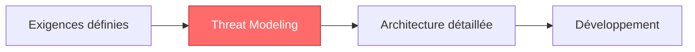
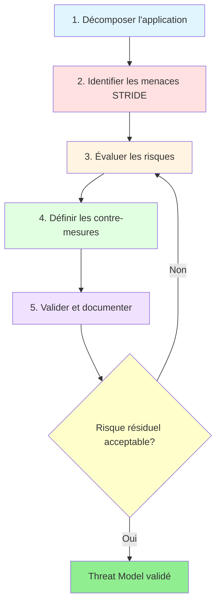
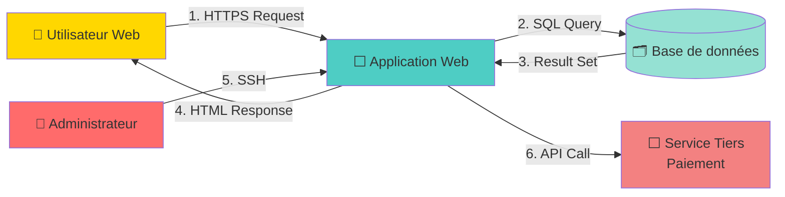
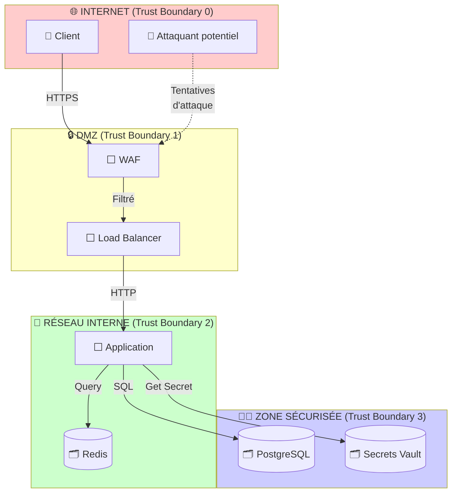
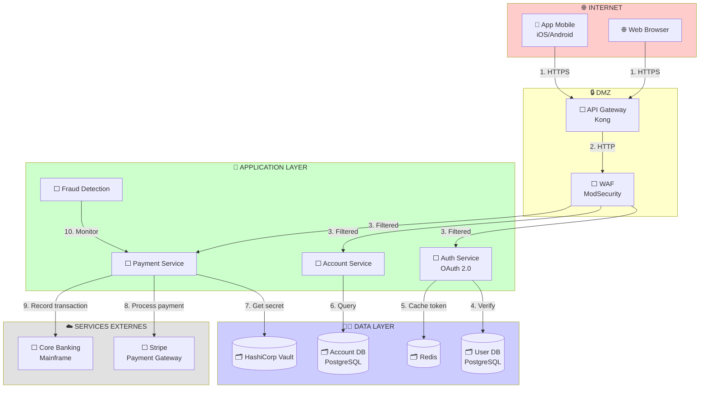
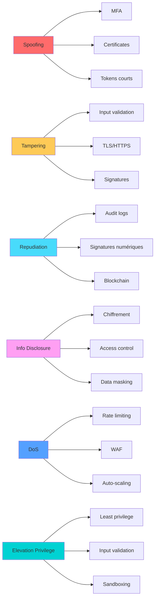

# PHASE 2 : THREAT MODELING (MODÉLISATION DES MENACES)

[← Phase 1 : Analyse des Exigences](Secure_by_Design_01_Analyse_Exigences.md) | [Retour à l'index](Secure_by_Design_00_Index.md) | [Phase 3 : Architecture →](Secure_by_Design_03_Architecture.md)

---

## Table des matières

1. [Vue d'ensemble](#vue-densemble)
2. [Méthodologie STRIDE](#stride)
3. [Création des DFD (Data Flow Diagrams)](#dfd)
4. [Identification des menaces](#identification)
5. [Évaluation des risques](#evaluation)
6. [Définition des contre-mesures](#contre-mesures)
7. [Exemple complet : Application bancaire](#exemple-complet)
8. [Outils recommandés](#outils)
9. [Templates](#templates)

---

## Vue d'ensemble {#vue-densemble}

Le **Threat Modeling** est l'exercice d'identification, de quantification et de priorisation des menaces de sécurité d'un système **AVANT** son développement.

### Pourquoi faire du Threat Modeling ?

```
SANS Threat Modeling :
❌ Découverte de failles critiques en production
❌ Refonte architecturale coûteuse
❌ Incidents de sécurité évitables
❌ Budget sécurité mal alloué

AVEC Threat Modeling :
✅ Identification proactive des vulnérabilités
✅ Décisions architecturales éclairées
✅ Priorisation des investissements sécurité
✅ Documentation pour audits et certifications
✅ Équipe alignée sur les risques
```

### Quand faire le Threat Modeling ?



**Moment idéal :** Après la Phase 1 (Exigences), avant l'architecture détaillée

**Fréquence de mise à jour :**
- ✅ À chaque nouvelle fonctionnalité majeure
- ✅ À chaque changement d'architecture
- ✅ Au minimum 1 fois par an
- ✅ Après un incident de sécurité

### Bénéfices mesurables

| Métrique | Sans TM | Avec TM | Amélioration |
|----------|---------|---------|--------------|
| Vulnérabilités découvertes en prod | 45 | 5 | **-89%** |
| Coût moyen de correction | 15 000€ | 500€ | **-97%** |
| Temps de remédiation | 25 jours | 3 jours | **-88%** |
| Architecture refaite | 3 fois | 0 fois | **-100%** |

---

## Méthodologie STRIDE {#stride}

**STRIDE** est un modèle de classification des menaces développé par Microsoft. C'est l'acronyme de 6 catégories de menaces.

### Les 6 catégories STRIDE

```mermaid
mindmap
  root((STRIDE))
    Spoofing
      Usurpation identité
      Faux utilisateur
      Session hijacking
    Tampering
      Modification données
      Injection SQL
      Man-in-the-Middle
    Repudiation
      Déni d'action
      Absence de logs
      Logs modifiables
    Information Disclosure
      Fuite données
      Stockage non chiffré
      Exposition API
    Denial of Service
      DDoS
      Resource exhaustion
      Crash applicatif
    Elevation of Privilege
      Exploit vulnérabilité
      Bypass autorisation
      Escalade privilèges
```



### Tableau détaillé STRIDE

| Menace | Description | Exemples concrets | Propriété CIA violée | Contre-mesures typiques |
|--------|-------------|-------------------|----------------------|-------------------------|
| **S**poofing | Usurpation d'identité - L'attaquant se fait passer pour quelqu'un d'autre | • Phishing<br>• Session hijacking<br>• IP spoofing<br>• Replay attack | **Authentification** | • MFA (Multi-Factor Auth)<br>• Certificats mutuels<br>• Tokens courts (JWT)<br>• CAPTCHA |
| **T**ampering | Modification illégitime de données | • Injection SQL<br>• XSS<br>• Man-in-the-Middle<br>• Modification cookie | **Intégrité** | • Prepared statements<br>• Input validation<br>• TLS/HTTPS<br>• HMAC/signatures |
| **R**epudiation | Déni d'avoir effectué une action | • "Je n'ai jamais effectué ce virement"<br>• Logs absents/modifiés<br>• Absence de preuve | **Non-répudiation** | • Audit trail immuable<br>• Signatures numériques<br>• Blockchain<br>• Logs centralisés |
| **I**nformation Disclosure | Divulgation d'informations confidentielles | • Data breach<br>• Exposition S3 bucket<br>• Verbose error messages<br>• Directory listing | **Confidentialité** | • Chiffrement (TLS, AES)<br>• Access control (RBAC)<br>• Data masking<br>• Principe moindre privilège |
| **D**enial of Service | Rendre le système indisponible | • DDoS<br>• Resource exhaustion<br>• Algorithmic complexity<br>• Fork bomb | **Disponibilité** | • Rate limiting<br>• WAF<br>• Auto-scaling<br>• Circuit breakers |
| **E**levation of Privilege | Obtenir des droits supérieurs | • Exploit buffer overflow<br>• Path traversal<br>• Bypass autorisation<br>• Sudo exploit | **Autorisation** | • Least privilege<br>• Sandboxing<br>• Input validation<br>• Security updates |

### Processus STRIDE en 5 étapes



---

## Création des DFD (Data Flow Diagrams) {#dfd}

### Qu'est-ce qu'un DFD ?

Un **Data Flow Diagram** est une représentation graphique des flux de données dans un système. C'est la base du Threat Modeling.

### Éléments d'un DFD

| Symbole | Nom | Description | Exemples |
|---------|-----|-------------|----------|
| ⬜ | **Processus** | Traite les données | Application web, API, Service |
| 🗂️ | **Data Store** | Stocke les données | Base de données, Cache, File system |
| 👤 | **Entité externe** | Interagit avec le système | Utilisateur, Système tiers, Admin |
| → | **Flux de données** | Transfert d'information | Requête HTTP, Query SQL, Message |
| ┃ | **Trust Boundary** | Limite de confiance | Internet → DMZ → LAN |

### Exemple de DFD simple



### DFD avec Trust Boundaries



**Trust Boundaries :** Chaque franchissement de boundary est un point d'attention sécurité !

---

## Identification des menaces {#identification}

### Méthode systématique : STRIDE par élément

Pour **chaque élément** du DFD (processus, data store, flux), appliquer STRIDE :

#### Template d'analyse STRIDE

```markdown
ÉLÉMENT : [Nom de l'élément]
TYPE : [Processus / Data Store / Flux de données]

┌─────────────────────────────────────────────────────────────┐
│ S - SPOOFING (Usurpation)                                   │
├─────────────────────────────────────────────────────────────┤
│ Menace possible ?   [ ] Oui  [ ] Non                        │
│ Description :                                               │
│ Scénario d'attaque :                                        │
│ Impact :                                                    │
│ Probabilité :       [ ] Faible  [ ] Moyenne  [ ] Élevée     │
└─────────────────────────────────────────────────────────────┘

┌─────────────────────────────────────────────────────────────┐
│ T - TAMPERING (Altération)                                  │
├─────────────────────────────────────────────────────────────┤
│ Menace possible ?   [ ] Oui  [ ] Non                        │
│ Description :                                               │
│ Scénario d'attaque :                                        │
│ Impact :                                                    │
│ Probabilité :       [ ] Faible  [ ] Moyenne  [ ] Élevée     │
└─────────────────────────────────────────────────────────────┘

[... R, I, D, E ...]
```

### Exemple concret : Application bancaire

#### DFD de l'application bancaire mobile



#### Analyse STRIDE : API Gateway

```markdown
╔═══════════════════════════════════════════════════════════════╗
║ THREAT MODEL - API GATEWAY (Kong)                            ║
╚═══════════════════════════════════════════════════════════════╝

ÉLÉMENT : API Gateway (Kong)
TYPE : Processus
TRUST BOUNDARY : DMZ (interface entre Internet et réseau interne)
DESCRIPTION : Point d'entrée unique pour toutes les requêtes API

┌─────────────────────────────────────────────────────────────┐
│ S - SPOOFING (Usurpation d'identité)                        │
├─────────────────────────────────────────────────────────────┤
│ ☑ Menace applicable                                         │
│                                                             │
│ Scénario 1 : Attaquant usurpe un utilisateur légitime      │
│ ──────────────────────────────────────────────────────      │
│ Description :                                               │
│   • Attaquant vole le JWT token d'un utilisateur           │
│   • Utilise le token pour accéder aux ressources           │
│   • API Gateway ne peut pas distinguer le vrai du faux     │
│                                                             │
│ Impact : ÉLEVÉ                                              │
│   • Accès aux données bancaires de la victime              │
│   • Transactions frauduleuses possibles                     │
│   • Impact financier direct                                 │
│                                                             │
│ Probabilité : MOYENNE                                       │
│   • Nécessite vol de token (XSS, malware, phishing)        │
│   • Mais tokens JWT relativement longs (plusieurs heures)  │
│                                                             │
│ Risque : ÉLEVÉ × MOYENNE = CRITIQUE                        │
│                                                             │
│ Contre-mesures recommandées :                              │
│   ✅ Short-lived tokens (15 min max)                       │
│   ✅ Refresh tokens avec rotation                          │
│   ✅ Device fingerprinting                                 │
│   ✅ IP whitelisting pour opérations sensibles            │
│   ✅ Détection d'anomalies (nouveau device/IP)            │
└─────────────────────────────────────────────────────────────┘

┌─────────────────────────────────────────────────────────────┐
│ T - TAMPERING (Altération de données)                       │
├─────────────────────────────────────────────────────────────┤
│ ☑ Menace applicable                                         │
│                                                             │
│ Scénario 1 : Man-in-the-Middle (MITM)                      │
│ ──────────────────────────────────────────────────────      │
│ Description :                                               │
│   • Attaquant intercepte communication mobile ↔ API        │
│   • Modifie les paramètres de requête (montant virement)   │
│   • Ou modifie la réponse (affiche faux solde)            │
│                                                             │
│ Impact : CRITIQUE                                           │
│   • Modification de transactions financières               │
│   • Vol d'argent                                            │
│                                                             │
│ Probabilité : FAIBLE                                        │
│   • TLS 1.3 avec certificate pinning rend MITM difficile   │
│   • Nécessite compromission réseau ou device              │
│                                                             │
│ Risque : CRITIQUE × FAIBLE = ÉLEVÉ                         │
│                                                             │
│ Contre-mesures recommandées :                              │
│   ✅ TLS 1.3 obligatoire                                   │
│   ✅ Certificate pinning dans apps mobiles                │
│   ✅ HSTS (HTTP Strict Transport Security)                │
│   ✅ Request signing (HMAC sur payload)                    │
│   ✅ Integrity checks côté client                          │
└─────────────────────────────────────────────────────────────┘

┌─────────────────────────────────────────────────────────────┐
│ R - REPUDIATION (Non-répudiation)                           │
├─────────────────────────────────────────────────────────────┤
│ ☑ Menace applicable                                         │
│                                                             │
│ Scénario 1 : Utilisateur nie avoir effectué un virement    │
│ ──────────────────────────────────────────────────────      │
│ Description :                                               │
│   • Client : "Je n'ai jamais fait ce virement de 5000€"    │
│   • Banque doit prouver que c'était bien le client         │
│   • Sans logs détaillés, impossible à prouver              │
│                                                             │
│ Impact : MOYEN                                              │
│   • Litiges clients                                         │
│   • Perte financière si impossibilité de prouver          │
│   • Réputation ternie                                       │
│                                                             │
│ Probabilité : MOYENNE                                       │
│   • Fraude interne possible                                 │
│   • Compte compromis puis désavoué                         │
│                                                             │
│ Risque : MOYEN × MOYENNE = MOYEN                           │
│                                                             │
│ Contre-mesures recommandées :                              │
│   ✅ Audit trail complet et immuable                       │
│   ✅ Logger : timestamp, user_id, IP, device_id, action   │
│   ✅ Logs signés/horodatés (RFC 3161)                      │
│   ✅ Rétention 10 ans (réglementation bancaire)           │
│   ✅ Confirmation par email/SMS pour virements > 1000€    │
│   ✅ Strong Customer Authentication (SCA) - DSP2          │
└─────────────────────────────────────────────────────────────┘

┌─────────────────────────────────────────────────────────────┐
│ I - INFORMATION DISCLOSURE (Divulgation d'informations)     │
├─────────────────────────────────────────────────────────────┤
│ ☑ Menace applicable                                         │
│                                                             │
│ Scénario 1 : Exposition d'informations sensibles dans logs │
│ ──────────────────────────────────────────────────────      │
│ Description :                                               │
│   • API Gateway logue les requêtes/réponses                │
│   • Logs contiennent potentiellement des PII ou tokens     │
│   • Attaquant avec accès aux logs = data breach            │
│                                                             │
│ Impact : ÉLEVÉ                                              │
│   • RGPD violation (PII non protégées)                     │
│   • Tokens JWT exposés                                      │
│   • Amendes réglementaires                                 │
│                                                             │
│ Probabilité : MOYENNE                                       │
│   • Logs souvent mal sécurisés                             │
│   • Accès développeurs trop larges                         │
│                                                             │
│ Risque : ÉLEVÉ × MOYENNE = ÉLEVÉ                           │
│                                                             │
│ Contre-mesures recommandées :                              │
│   ✅ Masquer données sensibles dans logs (PII, tokens)    │
│   ✅ Chiffrer les logs at rest                             │
│   ✅ Accès logs = RBAC strict + MFA                        │
│   ✅ Pas de body complet dans logs (seulement metadata)   │
│   ✅ Logs envoyés vers SIEM sécurisé                       │
└─────────────────────────────────────────────────────────────┘

┌─────────────────────────────────────────────────────────────┐
│ D - DENIAL OF SERVICE (Déni de service)                     │
├─────────────────────────────────────────────────────────────┤
│ ☑ Menace applicable                                         │
│                                                             │
│ Scénario 1 : DDoS sur API Gateway                          │
│ ──────────────────────────────────────────────────────      │
│ Description :                                               │
│   • Botnet envoie millions de requêtes                      │
│   • API Gateway surchargé                                   │
│   • Service indisponible pour clients légitimes            │
│                                                             │
│ Impact : CRITIQUE                                           │
│   • SLA 99.95% non respecté                                │
│   • Perte de CA (impossibilité de transactions)           │
│   • Pénalités contractuelles                              │
│   • Réputation ternie                                       │
│                                                             │
│ Probabilité : ÉLEVÉE                                        │
│   • Applications financières = cibles privilégiées         │
│   • DDoS-as-a-Service facilement accessibles              │
│                                                             │
│ Risque : CRITIQUE × ÉLEVÉE = CRITIQUE                      │
│                                                             │
│ Contre-mesures recommandées :                              │
│   ✅ Rate limiting agressif (100 req/min par IP)          │
│   ✅ WAF avec règles anti-DDoS                             │
│   ✅ Cloudflare / AWS Shield                               │
│   ✅ Auto-scaling horizontal                               │
│   ✅ Circuit breakers                                       │
│   ✅ CAPTCHA pour actions sensibles                        │
│   ✅ IP reputation scoring                                 │
└─────────────────────────────────────────────────────────────┘

┌─────────────────────────────────────────────────────────────┐
│ E - ELEVATION OF PRIVILEGE (Élévation de privilèges)        │
├─────────────────────────────────────────────────────────────┤
│ ☑ Menace applicable                                         │
│                                                             │
│ Scénario 1 : Bypass des contrôles d'autorisation           │
│ ──────────────────────────────────────────────────────      │
│ Description :                                               │
│   • Utilisateur standard modifie sa requête                │
│   • Accède à des endpoints admin (/api/admin/users)        │
│   • API Gateway ne vérifie pas les permissions             │
│                                                             │
│ Impact : CRITIQUE                                           │
│   • Accès admin complet                                     │
│   • Modification données sensibles                         │
│   • Création de comptes frauduleux                         │
│                                                             │
│ Probabilité : FAIBLE                                        │
│   • Nécessite faille dans autorisation                     │
│   • Mitigé si RBAC bien implémenté                         │
│                                                             │
│ Risque : CRITIQUE × FAIBLE = ÉLEVÉ                         │
│                                                             │
│ Contre-mesures recommandées :                              │
│   ✅ RBAC centralisé au niveau API Gateway                 │
│   ✅ Validation permissions à chaque requête               │
│   ✅ Principe du moindre privilège                         │
│   ✅ Tests automatisés d'autorisation                      │
│   ✅ Pentests réguliers (focus authz bypass)              │
└─────────────────────────────────────────────────────────────┘

═══════════════════════════════════════════════════════════════
SYNTHÈSE DES RISQUES - API GATEWAY
═══════════════════════════════════════════════════════════════

Risques CRITIQUES :
  🔴 Spoofing : Token hijacking
  🔴 Denial of Service : DDoS

Risques ÉLEVÉS :
  🟠 Tampering : MITM
  🟠 Information Disclosure : Logs non sécurisés
  🟠 Elevation of Privilege : Bypass autorisation

Risques MOYENS :
  🟡 Repudiation : Absence de preuves

Priorités d'action :
  1. Implémenter rate limiting + WAF (DDoS)
  2. Short-lived tokens + device fingerprinting (Spoofing)
  3. Certificate pinning (MITM)
  4. Masquage PII dans logs (Info Disclosure)
  5. Tests d'autorisation automatisés (Elevation)
```

---

## Évaluation des risques {#evaluation}

### Matrice de risque

```
                    PROBABILITÉ
                ┌───────┬───────┬───────┐
                │ Faible│ Moyen │ Élevé │
        ┌───────┼───────┼───────┼───────┤
        │Critique│ 🟠  │ 🔴  │ 🔴  │
        │       │ÉLEVÉ  │CRITIQUE│CRITIQUE│
    I   ├───────┼───────┼───────┼───────┤
    M   │ Élevé │ 🟡  │ 🟠  │ 🔴  │
    P   │       │MOYEN  │ÉLEVÉ  │CRITIQUE│
    A   ├───────┼───────┼───────┼───────┤
    C   │ Moyen │ 🟢  │ 🟡  │ 🟠  │
    T   │       │FAIBLE │MOYEN  │ÉLEVÉ  │
        ├───────┼───────┼───────┼───────┤
        │ Faible│ 🟢  │ 🟢  │ 🟡  │
        │       │FAIBLE │FAIBLE │MOYEN  │
        └───────┴───────┴───────┴───────┘

Légende :
🔴 CRITIQUE : Action immédiate requise
🟠 ÉLEVÉ    : Traiter en priorité
🟡 MOYEN    : Planifier remédiation
🟢 FAIBLE   : Surveiller, traiter si ressources
```

### Calcul du score de risque

**Formule :** `Risque = Impact × Probabilité × Exploitabilité`

```python
# risk_scoring.py
from enum import Enum

class Impact(Enum):
    NEGLIGIBLE = 1  # Aucun impact métier
    LOW = 2         # Impact limité
    MEDIUM = 3      # Impact modéré
    HIGH = 4        # Impact significatif
    CRITICAL = 5    # Impact catastrophique

class Probability(Enum):
    VERY_LOW = 1    # < 5% chance/an
    LOW = 2         # 5-25%
    MEDIUM = 3      # 25-50%
    HIGH = 4        # 50-75%
    VERY_HIGH = 5   # > 75%

class Exploitability(Enum):
    VERY_HARD = 1   # Nécessite expert + ressources
    HARD = 2        # Compétences avancées
    MEDIUM = 3      # Compétences intermédiaires
    EASY = 4        # Script kiddie
    TRIVIAL = 5     # Aucune compétence requise

def calculate_risk_score(impact: Impact, probability: Probability,
                        exploitability: Exploitability) -> dict:
    """
    Calcule le score de risque et sa classification

    Score = Impact × Probabilité × Exploitabilité
    Max = 5 × 5 × 5 = 125
    """
    score = impact.value * probability.value * exploitability.value

    # Classification du risque
    if score >= 80:
        level = "CRITICAL"
        color = "🔴"
        action = "Action immédiate - Bloquer release si non mitigé"
    elif score >= 50:
        level = "HIGH"
        color = "🟠"
        action = "Traiter avant release"
    elif score >= 25:
        level = "MEDIUM"
        color = "🟡"
        action = "Planifier remédiation dans 3 mois"
    elif score >= 10:
        level = "LOW"
        color = "🟢"
        action = "Surveiller, traiter si temps disponible"
    else:
        level = "NEGLIGIBLE"
        color = "⚪"
        action = "Accepter le risque"

    return {
        "score": score,
        "level": level,
        "color": color,
        "action": action,
        "max_score": 125
    }

# Exemple : DDoS sur API Gateway
risk_ddos = calculate_risk_score(
    impact=Impact.CRITICAL,          # 5 - Service indisponible = perte CA
    probability=Probability.HIGH,    # 4 - Banques = cibles privilégiées
    exploitability=Exploitability.EASY  # 4 - DDoS-as-a-Service dispo
)

print(f"""
╔═══════════════════════════════════════════════════════════════╗
║ ÉVALUATION DE RISQUE : DDoS sur API Gateway                  ║
╚═══════════════════════════════════════════════════════════════╝

Impact          : CRITICAL (5/5)
Probabilité     : HIGH (4/5)
Exploitabilité  : EASY (4/5)

Score de risque : {risk_ddos['score']}/{risk_ddos['max_score']}
Niveau          : {risk_ddos['color']} {risk_ddos['level']}
Action requise  : {risk_ddos['action']}
""")
```

**Output :**

```
╔═══════════════════════════════════════════════════════════════╗
║ ÉVALUATION DE RISQUE : DDoS sur API Gateway                  ║
╚═══════════════════════════════════════════════════════════════╝

Impact          : CRITICAL (5/5)
Probabilité     : HIGH (4/5)
Exploitabilité  : EASY (4/5)

Score de risque : 80/125
Niveau          : 🔴 CRITICAL
Action requise  : Action immédiate - Bloquer release si non mitigé
```

---

## Définition des contre-mesures {#contre-mesures}

### Stratégies de mitigation

| Stratégie | Description | Exemple | Quand utiliser |
|-----------|-------------|---------|----------------|
| **Éliminer** | Supprimer la fonctionnalité à risque | Ne pas implémenter upload fichiers si non essentiel | Risque > bénéfice |
| **Réduire** | Diminuer la probabilité ou l'impact | Rate limiting pour DDoS | Risque ÉLEVÉ/CRITIQUE |
| **Transférer** | Déléguer le risque à un tiers | Utiliser Stripe pour paiements (PCI-DSS) | Expertise externe requise |
| **Accepter** | Risque résiduel acceptable | Risque FAIBLE après mitigations | Coût mitigation > impact |

### Matrice STRIDE → Contre-mesures



### Exemple : Plan de mitigation pour API Gateway

```markdown
╔═══════════════════════════════════════════════════════════════╗
║ PLAN DE MITIGATION - API GATEWAY                             ║
╚═══════════════════════════════════════════════════════════════╝

┌───────────────────────────────────────────────────────────────┐
│ RISQUE #1 : DDoS sur API Gateway                             │
│ Niveau : 🔴 CRITICAL (Score: 80/125)                         │
├───────────────────────────────────────────────────────────────┤
│                                                               │
│ Stratégie : RÉDUIRE                                          │
│                                                               │
│ Contre-mesures :                                             │
│                                                               │
│ 1. Rate Limiting (Kong Plugin)                               │
│    ├─ Configuration :                                         │
│    │  • 100 requêtes/min par IP                              │
│    │  • 1000 requêtes/min par utilisateur authentifié        │
│    │  • Burst : 20 requêtes en 1 seconde                     │
│    ├─ Priorité : P0 (URGENT)                                 │
│    ├─ Responsable : DevOps Team                              │
│    ├─ Deadline : Sprint actuel                               │
│    └─ Coût estimé : 2 jours                                  │
│                                                               │
│ 2. WAF (Web Application Firewall)                            │
│    ├─ Solution : ModSecurity + OWASP Core Rule Set           │
│    ├─ Règles activées :                                      │
│    │  • Anti-DDoS                                            │
│    │  • Rate limiting par endpoint                           │
│    │  • IP reputation scoring                                │
│    ├─ Priorité : P0 (URGENT)                                 │
│    ├─ Responsable : Security Team                            │
│    ├─ Deadline : Sprint actuel                               │
│    └─ Coût estimé : 5 jours                                  │
│                                                               │
│ 3. Cloudflare DDoS Protection                                │
│    ├─ Plan : Enterprise (unlimited DDoS protection)          │
│    ├─ Bénéfices :                                            │
│    │  • Réseau Anycast global                               │
│    │  • 138 Tbps de capacité                                │
│    │  • Mitigation automatique                              │
│    ├─ Priorité : P0 (URGENT)                                 │
│    ├─ Responsable : Infrastructure Team                      │
│    ├─ Deadline : Ce mois                                     │
│    └─ Coût estimé : 5000€/mois                               │
│                                                               │
│ 4. Auto-scaling                                              │
│    ├─ Configuration Kubernetes HPA :                          │
│    │  • Min replicas : 3                                     │
│    │  • Max replicas : 50                                    │
│    │  • Target CPU : 70%                                     │
│    │  • Scale up : +2 pods si CPU > 80% pendant 30s         │
│    ├─ Priorité : P1                                          │
│    ├─ Responsable : DevOps Team                              │
│    ├─ Deadline : Sprint +1                                   │
│    └─ Coût estimé : 3 jours                                  │
│                                                               │
│ Risque résiduel après mitigation :                           │
│   Impact : CRITICAL (5) → Réduit à MEDIUM (3)               │
│   Probabilité : HIGH (4) → Réduit à LOW (2)                 │
│   Score : 80 → 30 (🟡 MEDIUM - Acceptable)                  │
└───────────────────────────────────────────────────────────────┘

┌───────────────────────────────────────────────────────────────┐
│ RISQUE #2 : Token Hijacking (Spoofing)                       │
│ Niveau : 🔴 CRITICAL (Score: 75/125)                         │
├───────────────────────────────────────────────────────────────┤
│                                                               │
│ Stratégie : RÉDUIRE                                          │
│                                                               │
│ Contre-mesures :                                             │
│                                                               │
│ 1. Short-lived Access Tokens                                 │
│    ├─ Durée de vie : 15 minutes (au lieu de 24h)            │
│    ├─ Refresh tokens : 7 jours                               │
│    ├─ Rotation automatique                                   │
│    ├─ Priorité : P0                                          │
│    └─ Coût estimé : 3 jours                                  │
│                                                               │
│ 2. Device Fingerprinting                                     │
│    ├─ Bibliothèque : FingerprintJS                           │
│    ├─ Stockage fingerprint dans token payload                │
│    ├─ Validation à chaque requête                            │
│    ├─ Alerte si changement de device                         │
│    ├─ Priorité : P0                                          │
│    └─ Coût estimé : 5 jours                                  │
│                                                               │
│ 3. Détection d'anomalies                                     │
│    ├─ Monitoring :                                            │
│    │  • Changement IP géographique soudain                  │
│    │  • Nouveau device inconnu                               │
│    │  • User-agent inhabituel                                │
│    ├─ Action : Challenge MFA supplémentaire                  │
│    ├─ Priorité : P1                                          │
│    └─ Coût estimé : 8 jours                                  │
│                                                               │
│ 4. Token Binding (RFC 8473)                                  │
│    ├─ Lier token à clé cryptographique du client            │
│    ├─ Impossibilité de rejouer token sur autre device       │
│    ├─ Priorité : P2 (Nice to have)                          │
│    └─ Coût estimé : 10 jours                                 │
│                                                               │
│ Risque résiduel : 75 → 20 (🟢 LOW - Acceptable)             │
└───────────────────────────────────────────────────────────────┘

[... Autres risques ...]

═══════════════════════════════════════════════════════════════
RÉSUMÉ DU PLAN DE MITIGATION
═══════════════════════════════════════════════════════════════

Total risques identifiés : 12
  • CRITICAL : 2
  • HIGH : 4
  • MEDIUM : 4
  • LOW : 2

Budget total estimé : 45 jours/homme + 5000€/mois (Cloudflare)

Priorités Sprint actuel (P0) :
  ✅ Rate limiting
  ✅ WAF
  ✅ Cloudflare
  ✅ Short-lived tokens
  ✅ Device fingerprinting

Sprint +1 (P1) :
  ⏳ Auto-scaling
  ⏳ Détection d'anomalies
  ⏳ Masquage PII logs

Backlog (P2) :
  📋 Token binding
  📋 Request signing
```

---

## Exemple complet : Application bancaire {#exemple-complet}

### Document de Threat Model

```markdown
╔═══════════════════════════════════════════════════════════════╗
║                                                               ║
║            THREAT MODEL - BANKAPP MOBILE                      ║
║                                                               ║
║  Date : 2026-01-05                                            ║
║  Version : 1.0                                                ║
║  Équipe : Security Team + Architecture Team                   ║
║  Revue : Trimestrielle                                        ║
║                                                               ║
╚═══════════════════════════════════════════════════════════════╝

TABLE DES MATIÈRES
─────────────────────────────────────────────────────────────────
1. Périmètre et objectifs
2. Architecture (DFD)
3. Trust Boundaries
4. Assets à protéger
5. Menaces identifiées (STRIDE)
6. Évaluation des risques
7. Plan de mitigation
8. Risques résiduels acceptés
9. Validation et signatures

═══════════════════════════════════════════════════════════════
1. PÉRIMÈTRE ET OBJECTIFS
═══════════════════════════════════════════════════════════════

Périmètre :
  • Application mobile BankApp (iOS + Android)
  • Backend API (microservices)
  • Intégrations tierces (Stripe, Core Banking)

Hors périmètre :
  • Infrastructure réseau interne (séparé)
  • Systèmes RH (séparé)

Objectifs :
  1. Identifier menaces AVANT développement
  2. Prioriser investissements sécurité
  3. Conformité PCI-DSS + RGPD
  4. Réduire surface d'attaque

═══════════════════════════════════════════════════════════════
2. ARCHITECTURE (DFD)
═══════════════════════════════════════════════════════════════

[Insérer DFD créé précédemment avec Mermaid]

Composants principaux :
  • App Mobile (iOS/Android)
  • API Gateway (Kong)
  • WAF (ModSecurity)
  • Auth Service (OAuth 2.0)
  • Account Service
  • Payment Service
  • Fraud Detection Service
  • Databases (PostgreSQL)
  • Cache (Redis)
  • Vault (HashiCorp Vault)

═══════════════════════════════════════════════════════════════
3. TRUST BOUNDARIES
═══════════════════════════════════════════════════════════════

TB0 - INTERNET
  ├─ Niveau de confiance : 0% (hostile)
  ├─ Acteurs : Utilisateurs + Attaquants
  └─ Contrôles : Aucun

TB1 - DMZ
  ├─ Niveau de confiance : 20%
  ├─ Composants : API Gateway, WAF, Load Balancer
  └─ Contrôles : Firewall, IDS/IPS, Rate limiting

TB2 - RÉSEAU INTERNE
  ├─ Niveau de confiance : 60%
  ├─ Composants : Microservices, Cache
  └─ Contrôles : Segmentation réseau, mTLS

TB3 - ZONE SÉCURISÉE
  ├─ Niveau de confiance : 90%
  ├─ Composants : Databases, Vault
  └─ Contrôles : Chiffrement, Least privilege, MFA

Points critiques :
  🔴 TB0 → TB1 : Internet → DMZ (MAX ATTENTION)
  🟠 TB1 → TB2 : DMZ → Interne
  🟡 TB2 → TB3 : Interne → Données

═══════════════════════════════════════════════════════════════
4. ASSETS À PROTÉGER
═══════════════════════════════════════════════════════════════

Classification CIA :
  C = Confidentiality (Confidentialité)
  I = Integrity (Intégrité)
  A = Availability (Disponibilité)

┌─────────────────────────────────┬─────┬─────┬─────┬─────────┐
│ Asset                           │  C  │  I  │  A  │ Critique│
├─────────────────────────────────┼─────┼─────┼─────┼─────────┤
│ Soldes comptes                  │ ⭐⭐⭐│ ⭐⭐⭐│ ⭐⭐⭐│ OUI     │
│ Historique transactions         │ ⭐⭐⭐│ ⭐⭐⭐│ ⭐⭐ │ OUI     │
│ Données cartes (PAN, CVV)       │ ⭐⭐⭐│ ⭐⭐⭐│ ⭐  │ OUI     │
│ Credentials utilisateurs        │ ⭐⭐⭐│ ⭐⭐⭐│ ⭐⭐⭐│ OUI     │
│ Tokens JWT                      │ ⭐⭐⭐│ ⭐⭐ │ ⭐⭐ │ OUI     │
│ Données PII (nom, email, etc.)  │ ⭐⭐⭐│ ⭐⭐ │ ⭐  │ NON     │
│ Logs applicatifs                │ ⭐⭐ │ ⭐⭐⭐│ ⭐  │ NON     │
│ Code source                     │ ⭐⭐ │ ⭐⭐⭐│ ⭐  │ NON     │
└─────────────────────────────────┴─────┴─────┴─────┴─────────┘

⭐⭐⭐ = Critique
⭐⭐  = Important
⭐   = Normal

═══════════════════════════════════════════════════════════════
5. MENACES IDENTIFIÉES (STRIDE)
═══════════════════════════════════════════════════════════════

Total menaces : 37
  • Spoofing : 8
  • Tampering : 7
  • Repudiation : 4
  • Information Disclosure : 9
  • Denial of Service : 5
  • Elevation of Privilege : 4

[Détails de chaque menace - voir analyses précédentes]

═══════════════════════════════════════════════════════════════
6. ÉVALUATION DES RISQUES
═══════════════════════════════════════════════════════════════

Matrice de risques :

┌──────────────────────────────────────────┬───────┬─────┬──────┐
│ Menace                                   │Impact │Prob │Risque│
├──────────────────────────────────────────┼───────┼─────┼──────┤
│ DDoS sur API Gateway                     │ 🔴 5  │🔴 4 │🔴 80 │
│ Token hijacking                          │ 🔴 5  │🟠 3 │🔴 75 │
│ Injection SQL                            │ 🔴 5  │🟡 2 │🟠 50 │
│ XSS dans app mobile                      │ 🟠 4  │🟡 2 │🟡 32 │
│ Logs non sécurisés (PII exposure)        │ 🟠 4  │🟠 3 │🟠 48 │
│ Man-in-the-Middle                        │ 🔴 5  │🟢 1 │🟡 25 │
│ [... autres menaces ...]                 │       │     │      │
└──────────────────────────────────────────┴───────┴─────┴──────┘

Distribution des risques :
  🔴 CRITICAL (80+) : 2
  🟠 HIGH (50-79)   : 8
  🟡 MEDIUM (25-49) : 15
  🟢 LOW (<25)      : 12

═══════════════════════════════════════════════════════════════
7. PLAN DE MITIGATION
═══════════════════════════════════════════════════════════════

[Voir plan détaillé section précédente]

Budget total : 45 jours/homme + 60k€/an (outils)
Timeline : 3 sprints (6 semaines)

Sprint 1 (P0 - CRITICAL) :
  ✅ Rate limiting
  ✅ WAF + Cloudflare
  ✅ Short-lived tokens
  ✅ Device fingerprinting

Sprint 2 (P1 - HIGH) :
  ⏳ Auto-scaling
  ⏳ Détection anomalies
  ⏳ Masquage PII logs
  ⏳ Prepared statements (anti-SQLi)

Sprint 3 (P2 - MEDIUM) :
  📋 Certificate pinning mobile
  📋 Request signing
  📋 Alertes SIEM

═══════════════════════════════════════════════════════════════
8. RISQUES RÉSIDUELS ACCEPTÉS
═══════════════════════════════════════════════════════════════

Après mitigation, les risques suivants sont acceptés :

┌──────────────────────────────────┬────────┬────────────────┐
│ Risque résiduel                  │ Score  │ Justification  │
├──────────────────────────────────┼────────┼────────────────┤
│ Phishing ciblé utilisateurs      │ 🟡 20  │ Hors périmètre │
│                                  │        │ technique,     │
│                                  │        │ traité par     │
│                                  │        │ formation      │
├──────────────────────────────────┼────────┼────────────────┤
│ Malware sur device utilisateur   │ 🟡 18  │ Mitigé par     │
│                                  │        │ device binding │
│                                  │        │ + détection    │
├──────────────────────────────────┼────────┼────────────────┤
│ Insider threat (employé mal-     │ 🟡 15  │ Mitigé par SoD,│
│ veillant)                        │        │ audit logs,    │
│                                  │        │ background     │
│                                  │        │ checks         │
└──────────────────────────────────┴────────┴────────────────┘

Validation :
  ☑ RSSI : Risques résiduels acceptables
  ☑ DPO : Conformité RGPD maintenue
  ☑ CTO : Impact technique maîtrisé

═══════════════════════════════════════════════════════════════
9. VALIDATION ET SIGNATURES
═══════════════════════════════════════════════════════════════

Ce Threat Model a été revu et validé par :

┌──────────────────────┬─────────────────┬──────────────┐
│ Rôle                 │ Nom             │ Date         │
├──────────────────────┼─────────────────┼──────────────┤
│ Security Architect   │ Jean Dupont     │ 2026-01-05   │
│ Lead Developer       │ Marie Martin    │ 2026-01-05   │
│ DevOps Lead          │ Pierre Durand   │ 2026-01-05   │
│ RSSI                 │ Sophie Bernard  │ 2026-01-06   │
│ DPO                  │ Luc Petit       │ 2026-01-06   │
│ CTO                  │ Emma Rousseau   │ 2026-01-08   │
└──────────────────────┴─────────────────┴──────────────┘

Prochaine revue : 2026-04-05 (trimestrielle)

═══════════════════════════════════════════════════════════════
```

---

## Outils recommandés {#outils}

| Outil | Description | Licence | URL |
|-------|-------------|---------|-----|
| **Microsoft Threat Modeling Tool** | Créer DFD + STRIDE automatique | Gratuit | https://aka.ms/threatmodelingtool |
| **OWASP Threat Dragon** | Alternative open source | Open Source | https://owasp.org/www-project-threat-dragon/ |
| **IriusRisk** | Threat modeling automatisé | Commercial | https://www.iriusrisk.com/ |
| **ThreatModeler** | Plateforme collaborative | Commercial | https://threatmodeler.com/ |
| **Cairis** | Requirements + Threat modeling | Open Source | https://cairis.org/ |

---

## Templates {#templates}

### Template Excel : Registre des menaces

```
[Disponible en téléchargement séparé]

Colonnes :
- ID
- Composant
- Catégorie STRIDE
- Description
- Scénario d'attaque
- Impact (1-5)
- Probabilité (1-5)
- Exploitabilité (1-5)
- Score risque
- Niveau risque
- Contre-mesure
- Responsable
- Status
- Date résolution
```

---

[← Phase 1 : Analyse des Exigences](Secure_by_Design_01_Analyse_Exigences.md) | [Phase 3 : Architecture Sécurisée →](Secure_by_Design_03_Architecture.md)

**Version :** 1.0
**Date :** 2026-01-05
