# PHASE 3 : ARCHITECTURE SÉCURISÉE

[← Phase 2 : Threat Modeling](Secure_by_Design_02_Threat_Modeling.md) | [Retour à l'index](Secure_by_Design_00_Index.md) | [Phase 4 : Développement →](Secure_by_Design_04_Developpement.md)

---

## Table des matières

1. [Vue d'ensemble](#vue-densemble)
2. [Principes d'architecture sécurisée](#principes)
3. [Zero Trust Architecture](#zero-trust)
4. [Patterns de sécurité](#patterns)
5. [Architecture par couches](#couches)
6. [Exemples d'architectures](#exemples)
7. [Choix technologiques](#technologies)
8. [Diagrammes détaillés](#diagrammes)

---

## Vue d'ensemble {#vue-densemble}

L'**Architecture Sécurisée** consiste à concevoir la structure technique du système en intégrant la sécurité comme un élément fondamental, en s'appuyant sur les menaces identifiées lors du Threat Modeling.

### Objectifs de cette phase

1. **Traduire** les exigences de sécurité en design technique
2. **Appliquer** les patterns de sécurité éprouvés
3. **Concevoir** la segmentation et l'isolation des composants
4. **Définir** les flux de données sécurisés
5. **Sélectionner** les technologies appropriées

### Livrables attendus

- Document d'architecture de sécurité
- Diagrammes d'architecture (C4, UML, Mermaid)
- Matrice de sécurisation par composant
- Spécifications techniques de sécurité
- Decision records (ADR - Architecture Decision Records)

---

## Principes d'architecture sécurisée {#principes}

### 1. Defense in Depth (Défense en profondeur)

**Concept :** Plusieurs couches de sécurité indépendantes

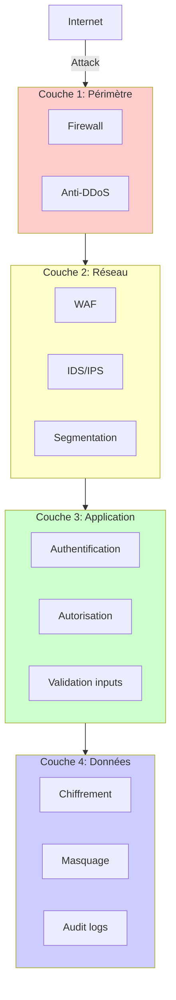

**Application :** Si une couche est contournée, les autres continuent à protéger.

### 2. Least Privilege (Moindre privilège)

**Concept :** Accès minimum nécessaire pour fonctionner

```yaml
# Exemple Kubernetes RBAC
apiVersion: rbac.authorization.k8s.io/v1
kind: Role
metadata:
  namespace: production
  name: payment-service-role
rules:
  # Uniquement ce qui est nécessaire
  - apiGroups: [""]
    resources: ["secrets"]
    resourceNames: ["stripe-api-key"]  # Secret spécifique uniquement
    verbs: ["get"]

  - apiGroups: [""]
    resources: ["configmaps"]
    resourceNames: ["payment-config"]
    verbs: ["get"]

  # PAS de droits admin, PAS d'accès autres secrets
```

### 3. Fail Secure (Échec sécurisé)

**Concept :** En cas d'erreur, refuser l'accès par défaut

```python
# Mauvais exemple - Fail Open
def check_access(user, resource):
    try:
        return permission_service.verify(user, resource)
    except Exception:
        # DANGER : En cas d'erreur, on autorise !
        return True

# Bon exemple - Fail Secure
def check_access(user, resource):
    try:
        return permission_service.verify(user, resource)
    except Exception as e:
        logger.error(f"Permission check failed: {e}")
        # En cas d'erreur, on REFUSE
        return False
```

### 4. Complete Mediation (Médiation complète)

**Concept :** Vérifier les permissions à CHAQUE accès

```javascript
// Mauvais - Vérification uniquement au login
app.get('/api/account/:id', async (req, res) => {
  // Pas de vérification, on suppose que l'utilisateur est autorisé
  const account = await db.getAccount(req.params.id);
  res.json(account);
});

// Bon - Vérification à chaque requête
app.get('/api/account/:id',
  authenticateJWT,  // Vérifier token
  async (req, res) => {
    const accountId = req.params.id;

    // Vérifier que l'utilisateur peut accéder à CE compte
    if (!canAccessAccount(req.user.id, accountId)) {
      return res.status(403).json({ error: 'Forbidden' });
    }

    const account = await db.getAccount(accountId);
    res.json(account);
  }
);
```

### 5. Separation of Duties (Séparation des responsabilités)

**Concept :** Diviser les responsabilités critiques

```mermaid
graph LR
    Dev[Développeur] -->|Écrit code| Code[Code]
    Code -->|PR| Review[Code Review]
    Lead[Lead Dev] -->|Approuve| Review
    Review -->|Merge| Main[Main Branch]
    Main -->|Trigger| CI[CI/CD]
    DevOps[DevOps] -->|Approuve deploy| Prod[Production]

    Dev -.X.->|Ne peut PAS| Prod
    Lead -.X.->|Ne peut PAS| Prod
    DevOps -.X.->|Ne peut PAS| Code

    style Dev fill:#ffd700
    style Lead fill:#87ceeb
    style DevOps fill:#98fb98
```

### 6. Economy of Mechanism (Simplicité)

**Concept :** Plus c'est simple, plus c'est sécurisé

```python
# Complexe = Vulnérable
def custom_crypto_hash(password, salt, iterations, algorithm, pepper, ...):
    # 200 lignes de cryptographie maison
    # Probablement cassable
    pass

# Simple = Sûr
from werkzeug.security import generate_password_hash

hashed = generate_password_hash(password)  # bcrypt, audité, maintenu
```

---

## Zero Trust Architecture {#zero-trust}

### Concept

**Zero Trust :** "Never trust, always verify"

**Principes clés :**
1. ❌ Pas de "réseau de confiance"
2. ✅ Vérifier **chaque** accès
3. ✅ Assumer que le réseau est compromis
4. ✅ Micro-segmentation
5. ✅ Least privilege partout

### Comparaison : Modèle traditionnel vs Zero Trust

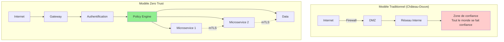

### Architecture Zero Trust détaillée

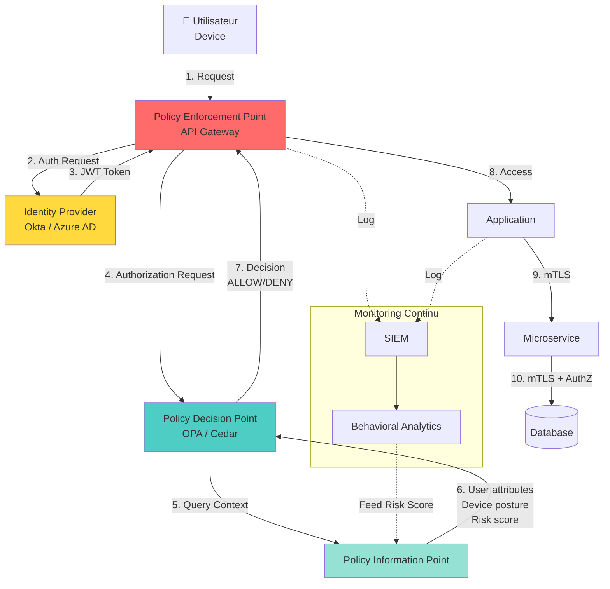

**Composants Zero Trust :**

| Composant | Rôle | Technologies |
|-----------|------|--------------|
| **PEP** (Policy Enforcement Point) | Applique les décisions | API Gateway (Kong, Envoy) |
| **PDP** (Policy Decision Point) | Décide Autoriser/Refuser | OPA, AWS Cedar, Google Zanzibar |
| **PIP** (Policy Information Point) | Fournit contexte | CMDB, SIEM, Risk scoring |
| **IdP** (Identity Provider) | Authentifie | Okta, Azure AD, Keycloak |

### Implémentation Zero Trust avec OPA (Open Policy Agent)

```rego
# policy.rego - Politique Zero Trust

package bankapp.authorization

import future.keywords.if
import future.keywords.in

# Par défaut, tout est REFUSÉ
default allow = false

# Règle 1 : Utilisateur doit être authentifié
allow if {
    input.user.authenticated == true
    input.user.mfa_verified == true
}

# Règle 2 : Virement > 1000€ nécessite Strong Customer Authentication
allow if {
    input.action == "transfer"
    input.amount <= 1000
    valid_user_context
}

allow if {
    input.action == "transfer"
    input.amount > 1000
    valid_user_context
    input.user.sca_verified == true  # SCA requis
    input.device.trusted == true
}

# Règle 3 : Accès admin uniquement depuis VPN + IP whitelistée
allow if {
    input.user.role == "admin"
    input.network.vpn == true
    input.source_ip in data.admin_ips
    input.time.hour >= 8
    input.time.hour <= 18  # Heures ouvrables uniquement
}

# Règle 4 : Détection d'anomalie géographique
allow if {
    not suspicious_location
    valid_user_context
}

# Fonctions helpers
valid_user_context if {
    input.user.authenticated == true
    input.user.account_status == "active"
    not input.user.flagged_for_fraud
}

suspicious_location if {
    # Changement de pays en moins de 1 heure = suspect
    last_login_country := data.user_history[input.user.id].last_country
    current_country := input.geo.country

    last_login_country != current_country
    time_since_last_login_minutes < 60
}
```

**Utilisation dans l'API Gateway (Kong + OPA plugin) :**

```yaml
# kong.yaml
services:
  - name: payment-service
    url: http://payment-service:8080
    routes:
      - name: transfer
        paths:
          - /api/v1/transfer
    plugins:
      - name: opa
        config:
          policy_uri: http://opa:8181/v1/data/bankapp/authorization/allow
          include_body: true
          include_headers: true
```

**Requête exemple :**

```json
POST /api/v1/transfer

Headers:
  Authorization: Bearer eyJhbGc...
  X-Device-ID: abc123

Body:
{
  "from": "FR76...",
  "to": "FR89...",
  "amount": 5000,
  "currency": "EUR"
}

→ Kong envoie à OPA :
{
  "input": {
    "user": {
      "id": "user-123",
      "authenticated": true,
      "mfa_verified": true,
      "sca_verified": false,  ← Problème !
      "role": "customer"
    },
    "action": "transfer",
    "amount": 5000,  ← > 1000€
    "device": {
      "id": "abc123",
      "trusted": true
    },
    "source_ip": "203.0.113.42",
    "geo": {
      "country": "FR"
    }
  }
}

← OPA répond :
{
  "result": false,  ← REFUSÉ
  "reason": "SCA required for transfers > 1000€"
}

→ Kong retourne 403 Forbidden avec message approprié
```

---

## Patterns de sécurité {#patterns}

### 1. API Gateway Pattern

**Problème :** Multiples microservices, chacun doit gérer auth, rate limiting, logs...

**Solution :** Centraliser les préoccupations transverses

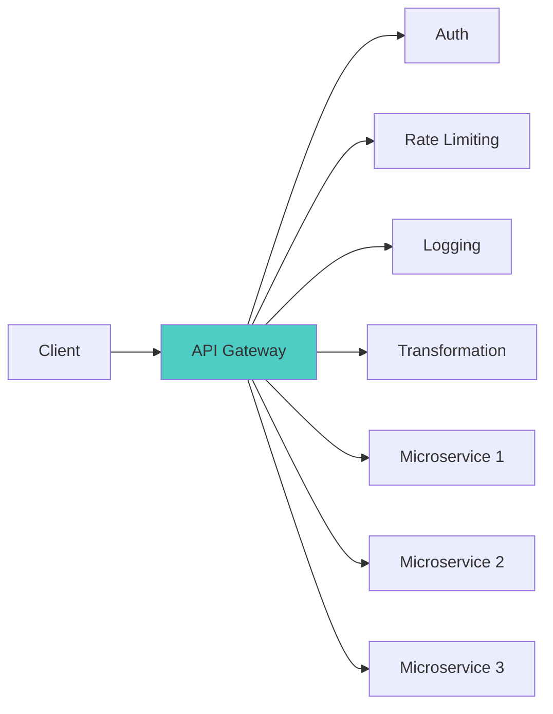

**Bénéfices :**
- ✅ Single point of entry
- ✅ Centralisation sécurité
- ✅ Simplification microservices
- ✅ Rate limiting global

**Inconvénients :**
- ⚠️ Single point of failure (mitigé par HA)
- ⚠️ Peut devenir bottleneck (mitigé par scaling)

### 2. Circuit Breaker Pattern

**Problème :** Service dépendant crashe ou est lent → cascade failure

**Solution :** Couper automatiquement si trop d'échecs

```python
from circuitbreaker import circuit

@circuit(failure_threshold=5, recovery_timeout=60)
def call_payment_gateway(transaction):
    """
    Circuit ouvert si 5 échecs consécutifs
    Retente après 60 secondes
    """
    response = requests.post(
        'https://payment-gateway.com/api/charge',
        json=transaction,
        timeout=5
    )
    response.raise_for_status()
    return response.json()

# Utilisation
try:
    result = call_payment_gateway(tx_data)
except CircuitBreakerError:
    # Circuit ouvert, service indisponible
    logger.warning("Payment gateway circuit open")
    return {"error": "Service temporarily unavailable", "retry_after": 60}
```

**États du circuit :**

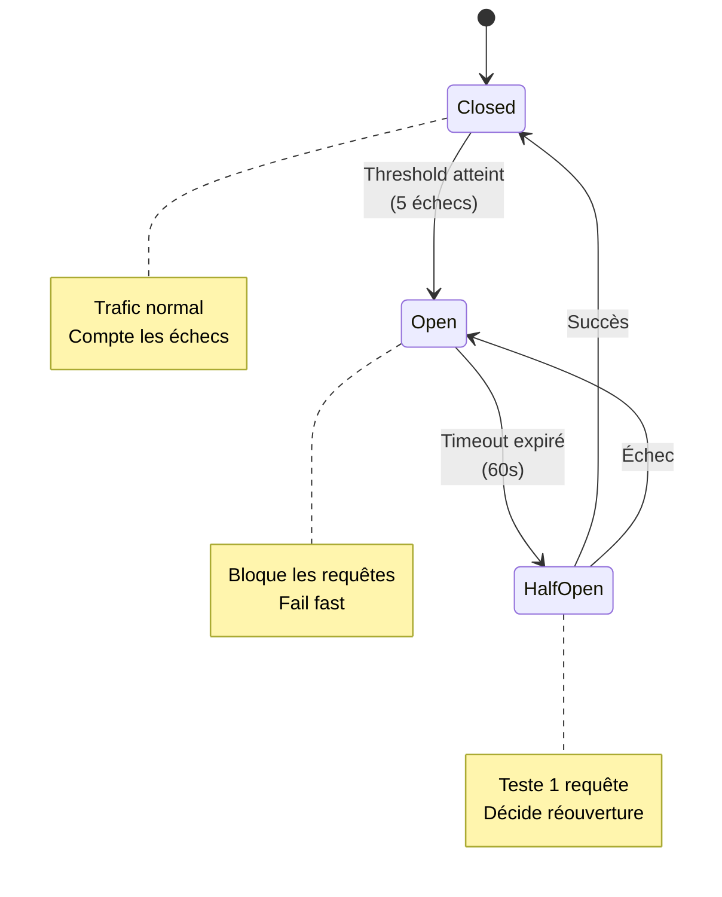

### 3. Secrets Management Pattern

**Problème :** Secrets (API keys, passwords) dans le code ou config

**Solution :** Centraliser dans un vault

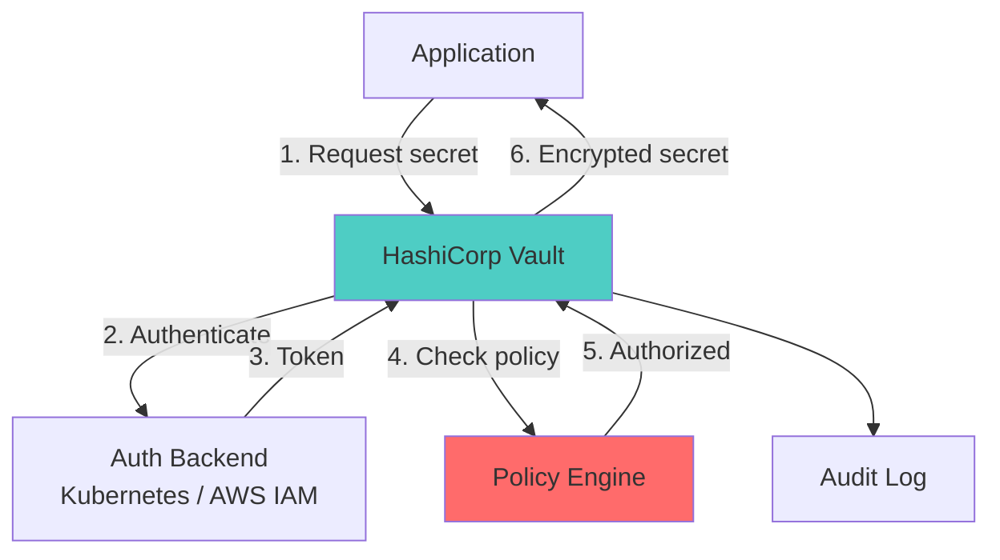

**Exemple HashiCorp Vault :**

```bash
# 1. Activer secrets engine
vault secrets enable -path=bankapp kv-v2

# 2. Stocker secret
vault kv put bankapp/stripe \
  api_key="sk_live_..." \
  webhook_secret="whsec_..."

# 3. Créer policy
vault policy write payment-service - <<EOF
path "bankapp/data/stripe" {
  capabilities = ["read"]
}
EOF

# 4. Lier policy au service (via Kubernetes service account)
vault write auth/kubernetes/role/payment-service \
  bound_service_account_names=payment-service \
  bound_service_account_namespaces=production \
  policies=payment-service \
  ttl=1h
```

**Dans l'application :**

```python
import hvac

# Connexion à Vault via Kubernetes auth
client = hvac.Client(url='http://vault:8200')

# Authentification automatique via service account
with open('/var/run/secrets/kubernetes.io/serviceaccount/token') as f:
    jwt = f.read()

client.auth.kubernetes.login(
    role='payment-service',
    jwt=jwt
)

# Récupération du secret
secret = client.secrets.kv.v2.read_secret_version(
    path='stripe',
    mount_point='bankapp'
)

STRIPE_API_KEY = secret['data']['data']['api_key']
# Pas de hardcoding, pas de variable d'environnement en clair
```

### 4. Strangler Fig Pattern (Migration sécurisée)

**Problème :** Migrer une app legacy monolithique vers microservices

**Solution :** Rediriger progressivement le trafic

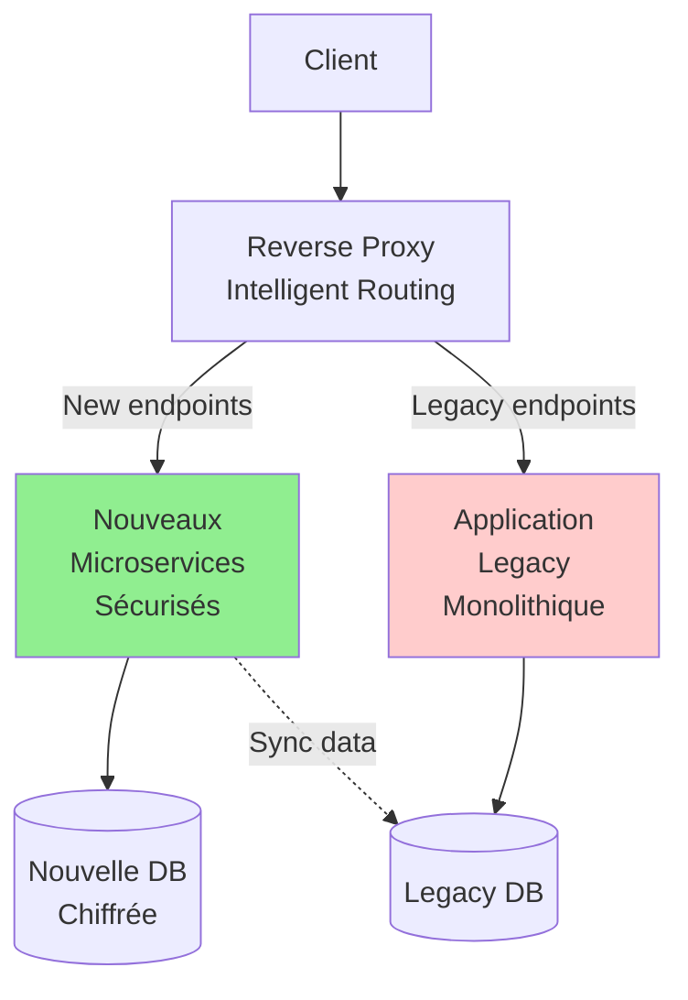

**Configuration Nginx :**

```nginx
# strangler.conf

upstream legacy_app {
    server legacy:8080;
}

upstream new_microservices {
    server api-gateway:8080;
}

server {
    listen 443 ssl http2;
    server_name bankapp.com;

    # Nouveaux endpoints sécurisés → Microservices
    location /api/v2/ {
        proxy_pass http://new_microservices;

        # Headers sécurité
        add_header Strict-Transport-Security "max-age=31536000" always;
        add_header X-Content-Type-Options "nosniff" always;
        add_header X-Frame-Options "DENY" always;
    }

    # Anciens endpoints → Legacy (temporaire)
    location /api/v1/ {
        proxy_pass http://legacy_app;

        # Logs pour tracking migration
        access_log /var/log/nginx/legacy_usage.log combined;
    }

    # Feature flag : redirection progressive
    location /api/v1/accounts {
        # Si header X-Beta: true → nouveau service
        if ($http_x_beta = "true") {
            proxy_pass http://new_microservices/api/v2/accounts;
        }

        # Sinon → legacy
        proxy_pass http://legacy_app;
    }
}
```

### 5. Backends for Frontends (BFF) Pattern

**Problème :** API unique pour mobile + web + IoT → over-fetching, complexité

**Solution :** Backend dédié par type de client

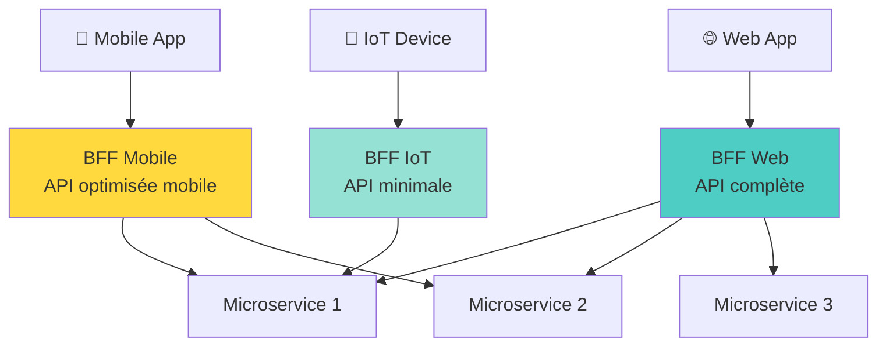

**Bénéfices sécurité :**
- ✅ Surface d'attaque réduite par client
- ✅ Policies différentes (mobile = MFA, IoT = cert client)
- ✅ Rate limiting adapté par type

---

## Architecture par couches {#couches}

### Architecture complète BankApp

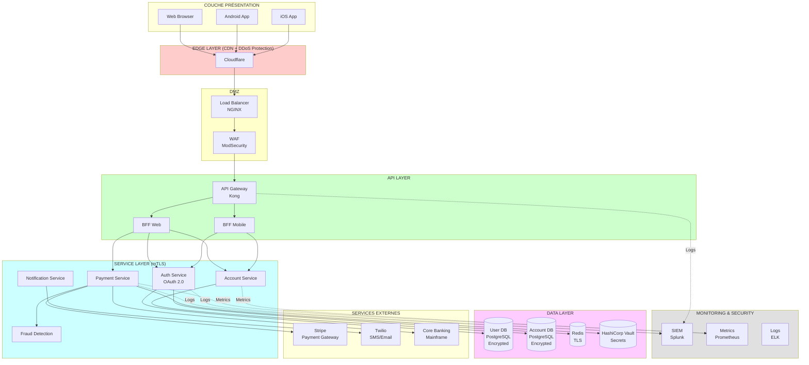

### Matrice de sécurisation par couche

| Couche | Contrôles de sécurité | Technologies |
|--------|----------------------|--------------|
| **Edge** | • Anti-DDoS (138 Tbps)<br>• WAF managed<br>• Rate limiting global<br>• Bot mitigation | Cloudflare Enterprise |
| **DMZ** | • WAF (OWASP CRS)<br>• TLS termination<br>• IP whitelisting<br>• GeoIP blocking | NGINX + ModSecurity |
| **API Gateway** | • JWT validation<br>• Rate limiting per user<br>• Request/response logging<br>• API key management | Kong + OPA |
| **Services** | • mTLS entre services<br>• RBAC<br>• Input validation<br>• Circuit breakers | Service Mesh (Istio) |
| **Data** | • Encryption at rest (AES-256)<br>• Encryption in transit (TLS 1.3)<br>• Access control (RBAC)<br>• Audit logging | PostgreSQL + TDE<br>Redis TLS |
| **Monitoring** | • SIEM<br>• Behavioral analytics<br>• Alerting<br>• Incident response | Splunk + PagerDuty |

---

## Exemples d'architectures {#exemples}

### Architecture Microservices avec Service Mesh

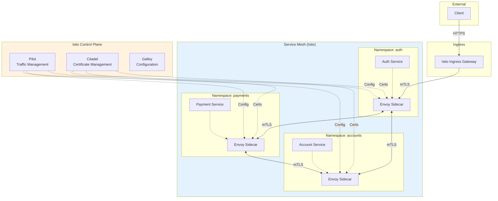

**Configuration Istio - mTLS strict :**

```yaml
# peer-authentication.yaml
apiVersion: security.istio.io/v1beta1
kind: PeerAuthentication
metadata:
  name: default
  namespace: production
spec:
  mtls:
    mode: STRICT  # mTLS obligatoire entre tous les services

---
# authorization-policy.yaml
apiVersion: security.istio.io/v1beta1
kind: AuthorizationPolicy
metadata:
  name: payment-authz
  namespace: production
spec:
  selector:
    matchLabels:
      app: payment-service

  action: ALLOW

  rules:
    # Seul account-service peut appeler payment-service
    - from:
        - source:
            principals: ["cluster.local/ns/production/sa/account-service"]
      to:
        - operation:
            methods: ["POST"]
            paths: ["/internal/api/v1/process-payment"]
```

### Architecture Serverless Sécurisée (AWS)

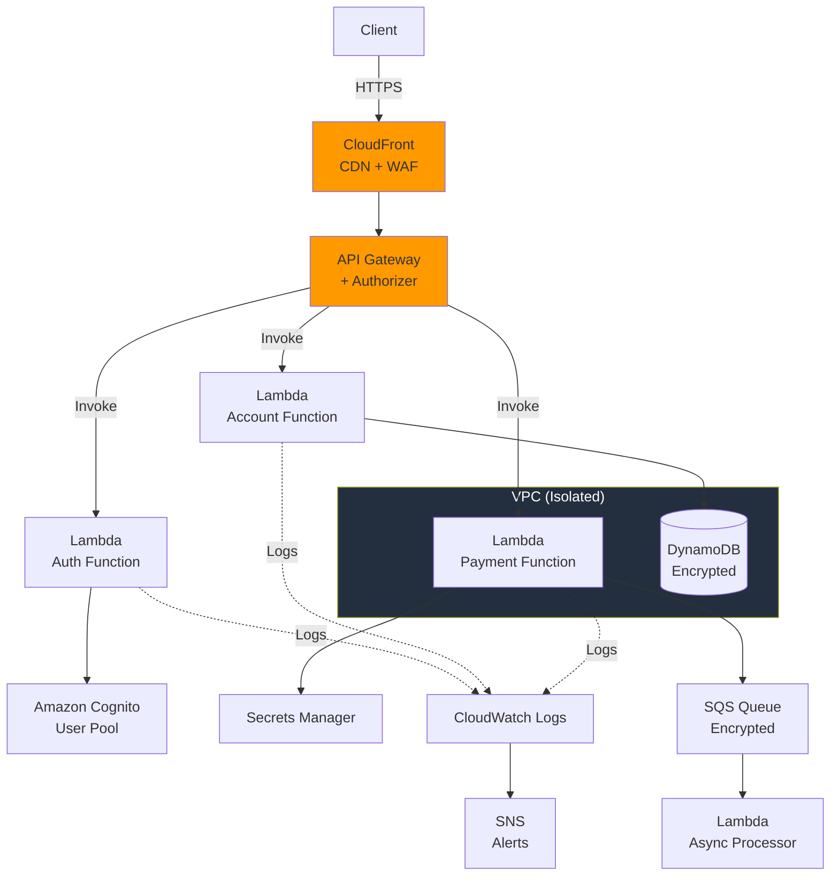

**Sécurisation Lambda :**

```yaml
# serverless.yml
service: bankapp

provider:
  name: aws
  runtime: python3.11
  region: eu-west-1

  # Least privilege par fonction
  iam:
    role:
      statements:
        - Effect: Allow
          Action:
            - dynamodb:GetItem
            - dynamodb:PutItem
          Resource: !GetAtt AccountTable.Arn

        - Effect: Allow
          Action:
            - secretsmanager:GetSecretValue
          Resource: arn:aws:secretsmanager:eu-west-1:123456789:secret:stripe-api-key-*

  # Encryption
  environment:
    STAGE: ${self:provider.stage}
    # Secrets via Secrets Manager (pas en clair ici)

  # VPC pour isolation
  vpc:
    securityGroupIds:
      - sg-xxxxx
    subnetIds:
      - subnet-xxxxx
      - subnet-yyyyy

functions:
  processPayment:
    handler: handlers/payment.process
    timeout: 30
    reservedConcurrency: 100  # Limit DoS

    # Variables chiffrées
    environment:
      STRIPE_SECRET_ARN: arn:aws:secretsmanager:...

    events:
      - http:
          path: /payment
          method: post
          authorizer:
            name: authFunction
            resultTtlInSeconds: 300

          # Validation des inputs
          request:
            schemas:
              application/json: ${file(schemas/payment-request.json)}

resources:
  Resources:
    # Table DynamoDB chiffrée
    AccountTable:
      Type: AWS::DynamoDB::Table
      Properties:
        TableName: accounts-${self:provider.stage}
        SSESpecification:
          SSEEnabled: true
          SSEType: KMS
          KMSMasterKeyId: alias/aws/dynamodb

        PointInTimeRecoverySpecification:
          PointInTimeRecoveryEnabled: true
```

---

## Choix technologiques {#technologies}

### Matrice de décision : API Gateway

| Critère | Kong | AWS API Gateway | Nginx + Lua | Envoy |
|---------|------|----------------|-------------|-------|
| **Open Source** | ✅ (+ Enterprise) | ❌ (Managed) | ✅ | ✅ |
| **Rate Limiting** | ✅ Excellent | ✅ Bon | ⚠️ Custom | ✅ Bon |
| **Plugin Ecosystem** | ✅ Large | ⚠️ Limité | ⚠️ Custom | ✅ Filters |
| **OAuth 2.0** | ✅ Native | ✅ Cognito | ⚠️ Custom | ⚠️ Ext Auth |
| **Monitoring** | ✅ Prometheus | ✅ CloudWatch | ⚠️ Custom | ✅ Prometheus |
| **Performance** | ✅ Excellent | ✅ Auto-scale | ✅ Excellent | ✅ Excellent |
| **Learning Curve** | ⚠️ Moyen | ✅ Facile | ❌ Difficile | ⚠️ Moyen |
| **Cost** | 💰💰 (Enterprise) | 💰 Pay-per-use | 💰 Infra only | 💰 Infra only |

**Recommandation pour BankApp :** Kong Enterprise
- Fonctionnalités sécurité riches
- Support PCI-DSS
- Audit trail complet
- Support professionnel

---

[← Phase 2 : Threat Modeling](Secure_by_Design_02_Threat_Modeling.md) | [Phase 4 : Développement Sécurisé →](Secure_by_Design_04_Developpement.md)

**Version :** 1.0
**Date :** 2026-01-05
