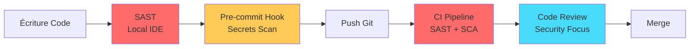

# PHASE 4 : DÉVELOPPEMENT SÉCURISÉ

[← Phase 3 : Architecture](Secure_by_Design_03_Architecture.md) | [Retour à l'index](Secure_by_Design_00_Index.md) | [Phase 5 : Tests →](Secure_by_Design_05_Tests.md)

---

## Table des matières

1. [Vue d'ensemble](#vue-densemble)
2. [OWASP Top 10](#owasp-top-10)
3. [Secure Coding Practices](#secure-coding)
4. [Code Review de sécurité](#code-review)
5. [SAST (Static Analysis)](#sast)
6. [SCA (Software Composition Analysis)](#sca)
7. [Gestion des secrets](#secrets)
8. [Pipeline CI/CD sécurisé](#cicd)

---

## Vue d'ensemble {#vue-densemble}

Le **Développement Sécurisé** consiste à écrire du code qui résiste aux attaques en appliquant des pratiques éprouvées et en utilisant des outils automatisés.

### Objectifs

1. **Éliminer** les vulnérabilités communes (OWASP Top 10)
2. **Valider** tous les inputs utilisateur
3. **Détecter** les vulnérabilités tôt (SAST/SCA)
4. **Former** les développeurs aux bonnes pratiques
5. **Automatiser** les contrôles de sécurité

### Shift-Left Security dans le développement



---

## OWASP Top 10 (2021) {#owasp-top-10}

### A01 - Broken Access Control

**Description :** Contournement des contrôles d'autorisation

**Exemples :**
- IDOR (Insecure Direct Object Reference)
- Accès à ressources d'autres utilisateurs
- Élévation de privilèges

#### Vulnérable

```python
# VULNÉRABLE - Pas de vérification ownership
@app.route('/api/account/<account_id>')
@login_required
def get_account(account_id):
    # N'importe quel utilisateur authentifié peut accéder
    # à N'IMPORTE QUEL compte en modifiant l'URL !
    account = db.session.get(Account, account_id)
    return jsonify(account.to_dict())

# Attaque :
# GET /api/account/123  → Mon compte (OK)
# GET /api/account/456  → Compte d'un autre ! (VULNÉRABLE)
```

#### Sécurisé

```python
# SÉCURISÉ - Vérification ownership
@app.route('/api/account/<account_id>')
@login_required
def get_account(account_id):
    account = db.session.get(Account, account_id)

    if not account:
        abort(404)

    # Vérifier que l'utilisateur connecté possède ce compte
    if account.user_id != current_user.id:
        logger.warning(
            f"Access denied: User {current_user.id} "
            f"tried to access account {account_id}"
        )
        abort(403)  # Forbidden

    return jsonify(account.to_dict())

# Alternative : Utiliser l'ID utilisateur, pas l'ID compte
@app.route('/api/my-accounts')
@login_required
def get_my_accounts():
    # Récupérer uniquement les comptes de l'utilisateur connecté
    accounts = Account.query.filter_by(
        user_id=current_user.id
    ).all()
    return jsonify([a.to_dict() for a in accounts])
```

#### Pattern : Autorisation centralisée

```python
# decorators.py
from functools import wraps
from flask import abort

def require_account_ownership(f):
    """
    Vérifie que l'utilisateur possède le compte
    """
    @wraps(f)
    def decorated_function(*args, **kwargs):
        account_id = kwargs.get('account_id')

        if not account_id:
            abort(400)

        account = db.session.get(Account, account_id)

        if not account or account.user_id != current_user.id:
            abort(403)

        # Passer le compte à la fonction
        kwargs['account'] = account
        return f(*args, **kwargs)

    return decorated_function

# Usage
@app.route('/api/account/<account_id>')
@login_required
@require_account_ownership
def get_account(account_id, account):  # account injecté par decorator
    return jsonify(account.to_dict())
```

---

### A02 - Cryptographic Failures

**Description :** Échec de protection des données sensibles

**Exemples :**
- Données transmises en HTTP (pas HTTPS)
- Mots de passe stockés en clair ou MD5
- Algorithmes faibles (DES, RC4)

#### Vulnérable

```python
# VULNÉRABLE - MD5 n'est PAS sécurisé pour passwords
import hashlib

def create_user(username, password):
    # MD5 est cassable en quelques secondes
    password_hash = hashlib.md5(password.encode()).hexdigest()

    user = User(
        username=username,
        password_hash=password_hash
    )
    db.session.add(user)
    db.session.commit()

# Aussi VULNÉRABLE :
# - SHA-1 (cassé depuis 2017)
# - Simple SHA-256 sans salt (rainbow tables)
```

#### Sécurisé

```python
# SÉCURISÉ - bcrypt avec salt automatique
from werkzeug.security import generate_password_hash, check_password_hash

def create_user(username, password):
    # bcrypt avec work factor = 12 (2^12 iterations)
    # Salt généré automatiquement
    password_hash = generate_password_hash(
        password,
        method='pbkdf2:sha256',  # ou 'bcrypt'
        salt_length=16
    )

    user = User(
        username=username,
        password_hash=password_hash
    )
    db.session.add(user)
    db.session.commit()

def verify_password(user, password):
    return check_password_hash(user.password_hash, password)

# Autres bonnes pratiques :
# - Argon2 (winner Password Hashing Competition)
# - scrypt
# - JAMAIS de crypto maison
```

#### Chiffrement des données sensibles

```python
# encryption.py
from cryptography.fernet import Fernet
import base64
import os

class DataEncryption:
    """
    Chiffrement AES-256 via Fernet (cryptography library)
    """

    def __init__(self):
        # Clé stockée dans Vault, pas en code !
        key = os.getenv('ENCRYPTION_KEY')
        if not key:
            raise ValueError("ENCRYPTION_KEY not set")

        self.cipher = Fernet(key.encode())

    def encrypt(self, plaintext: str) -> str:
        """Chiffre et retourne base64"""
        encrypted = self.cipher.encrypt(plaintext.encode())
        return base64.urlsafe_b64encode(encrypted).decode()

    def decrypt(self, ciphertext: str) -> str:
        """Déchiffre depuis base64"""
        decoded = base64.urlsafe_b64decode(ciphertext.encode())
        decrypted = self.cipher.decrypt(decoded)
        return decrypted.decode()

# Usage
encryption = DataEncryption()

# Stocker IBAN chiffré
user.iban_encrypted = encryption.encrypt("FR76 1234 5678 9012 3456 7890 123")

# Récupérer IBAN
iban = encryption.decrypt(user.iban_encrypted)
```

---

### A03 - Injection

**Description :** Injection de code malveillant (SQL, NoSQL, OS, LDAP)

#### SQL Injection - Vulnérable

```python
# VULNÉRABLE - Concaténation de strings
@app.route('/api/search')
def search():
    query = request.args.get('q')

    # DANGER : Injection SQL possible !
    sql = f"SELECT * FROM products WHERE name LIKE '%{query}%'"
    results = db.engine.execute(sql)

    return jsonify([dict(r) for r in results])

# Attaque :
# GET /api/search?q='; DROP TABLE users; --
# → Exécute : SELECT * FROM products WHERE name LIKE '%'; DROP TABLE users; --%'
```

#### SQL Injection - Sécurisé

```python
# SÉCURISÉ - Prepared statements (parameterized queries)
from sqlalchemy import text

@app.route('/api/search')
def search():
    query = request.args.get('q', '')

    # Utiliser des placeholders :param
    sql = text("SELECT * FROM products WHERE name LIKE :search")

    # SQLAlchemy échappe automatiquement
    results = db.session.execute(
        sql,
        {'search': f'%{query}%'}
    )

    return jsonify([dict(r) for r in results])

# Encore mieux : Utiliser l'ORM
@app.route('/api/search')
def search():
    query = request.args.get('q', '')

    # ORM = Protection automatique
    products = Product.query.filter(
        Product.name.like(f'%{query}%')
    ).all()

    return jsonify([p.to_dict() for p in products])
```

#### NoSQL Injection - Vulnérable (MongoDB)

```javascript
// VULNÉRABLE
app.get('/api/user', async (req, res) => {
  const username = req.query.username;

  // Attaque : ?username[$ne]=null
  // → Retourne tous les utilisateurs
  const user = await User.findOne({ username: username });

  res.json(user);
});
```

#### NoSQL Injection - Sécurisé

```javascript
// SÉCURISÉ
app.get('/api/user', async (req, res) => {
  const username = req.query.username;

  // Validation : doit être une string
  if (typeof username !== 'string') {
    return res.status(400).json({ error: 'Invalid input' });
  }

  // Sanitization
  const sanitized = username.replace(/[^a-zA-Z0-9_]/g, '');

  const user = await User.findOne({
    username: { $eq: sanitized }  // $eq force equality
  });

  res.json(user);
});
```

#### Command Injection - Vulnérable

```python
# VULNÉRABLE - Exécution commande OS
import subprocess

@app.route('/api/ping')
def ping():
    host = request.args.get('host')

    # DANGER : Command injection !
    result = subprocess.run(
        f'ping -c 4 {host}',
        shell=True,  # ← DANGER
        capture_output=True
    )

    return result.stdout

# Attaque :
# GET /api/ping?host=google.com; cat /etc/passwd
```

#### Command Injection - Sécurisé

```python
# SÉCURISÉ
import subprocess
import re

@app.route('/api/ping')
def ping():
    host = request.args.get('host', '')

    # Validation stricte : domain/IP uniquement
    if not re.match(r'^[a-zA-Z0-9.-]+$', host):
        abort(400, "Invalid hostname")

    # PAS de shell=True, arguments séparés
    result = subprocess.run(
        ['ping', '-c', '4', host],  # Liste, pas string !
        capture_output=True,
        timeout=5
    )

    return result.stdout

# Encore mieux : Éviter subprocess si possible
# Utiliser des libraries Python natives (socket, etc.)
```

---

### A04 - Insecure Design

**Description :** Failles de conception, pas d'implémentation

**Exemple :** Récupération de mot de passe par question secrète

#### Vulnérable

```python
# VULNÉRABLE - Question secrète prévisible
class User(db.Model):
    username = db.Column(db.String(80))
    password_hash = db.Column(db.String(255))
    security_question = db.Column(db.String(255))
    security_answer = db.Column(db.String(255))

@app.route('/reset-password', methods=['POST'])
def reset_password():
    username = request.json['username']
    answer = request.json['answer']

    user = User.query.filter_by(username=username).first()

    # Problème : Réponse souvent trouvable (réseaux sociaux)
    if user.security_answer.lower() == answer.lower():
        # Envoyer lien de reset
        send_reset_link(user.email)
        return {'message': 'Reset link sent'}

    abort(403)

# Questions faibles :
# - Nom de jeune fille de votre mère → LinkedIn
# - Ville de naissance → Facebook
# - Nom de votre animal → Instagram
```

#### Sécurisé

```python
# SÉCURISÉ - Multi-facteurs avec limite de temps
from itsdangerous import URLSafeTimedSerializer

@app.route('/reset-password-request', methods=['POST'])
def request_reset():
    email = request.json['email']
    user = User.query.filter_by(email=email).first()

    if not user:
        # Même réponse pour éviter user enumeration
        return {'message': 'If email exists, reset link sent'}

    # Générer token cryptographique temporaire
    serializer = URLSafeTimedSerializer(app.config['SECRET_KEY'])
    token = serializer.dumps(user.email, salt='password-reset')

    # Envoyer lien avec token (valide 1h)
    reset_link = f"https://app.com/reset/{token}"
    send_email(
        to=user.email,
        subject="Password Reset",
        body=f"Click here to reset: {reset_link}\nValid for 1 hour."
    )

    # Log pour détection abus
    logger.info(f"Password reset requested for {user.email}")

    return {'message': 'If email exists, reset link sent'}

@app.route('/reset-password/<token>', methods=['POST'])
def reset_password(token):
    serializer = URLSafeTimedSerializer(app.config['SECRET_KEY'])

    try:
        # Vérifier token (max age = 1 heure)
        email = serializer.loads(
            token,
            salt='password-reset',
            max_age=3600
        )
    except:
        abort(400, "Invalid or expired token")

    user = User.query.filter_by(email=email).first()
    new_password = request.json['password']

    # Valider force du password
    if not is_strong_password(new_password):
        abort(400, "Password not strong enough")

    user.password_hash = generate_password_hash(new_password)
    db.session.commit()

    # Invalider token (one-time use)
    # ... implémenter blacklist de tokens ...

    return {'message': 'Password reset successful'}
```

---

### A05 - Security Misconfiguration

**Description :** Configuration par défaut non sécurisée

#### Exemples de mauvaises configurations

```python
# VULNÉRABLE - Debug mode en production
app = Flask(__name__)
app.config['DEBUG'] = True  # ← JAMAIS en production !

# Expose :
# - Stack traces détaillées
# - Code source dans les erreurs
# - Console interactive
```

#### Configuration sécurisée

```python
# config.py
import os

class Config:
    SECRET_KEY = os.getenv('SECRET_KEY')
    if not SECRET_KEY:
        raise ValueError("SECRET_KEY must be set")

    DEBUG = False
    TESTING = False

    # Security headers
    SESSION_COOKIE_SECURE = True  # HTTPS only
    SESSION_COOKIE_HTTPONLY = True  # Pas d'accès JavaScript
    SESSION_COOKIE_SAMESITE = 'Lax'  # Protection CSRF

    PERMANENT_SESSION_LIFETIME = 900  # 15 minutes

    # Database
    SQLALCHEMY_DATABASE_URI = os.getenv('DATABASE_URL')
    SQLALCHEMY_TRACK_MODIFICATIONS = False

    # Rate limiting
    RATELIMIT_STORAGE_URL = 'redis://localhost:6379'

class ProductionConfig(Config):
    DEBUG = False

class DevelopmentConfig(Config):
    DEBUG = True
    SESSION_COOKIE_SECURE = False  # HTTP OK en dev

# app.py
config_name = os.getenv('FLASK_ENV', 'production')
config_map = {
    'development': DevelopmentConfig,
    'production': ProductionConfig
}

app.config.from_object(config_map[config_name])
```

#### Security Headers

```python
# security_headers.py
from flask import Flask

def add_security_headers(app: Flask):
    """Ajoute les headers de sécurité recommandés"""

    @app.after_request
    def set_security_headers(response):
        # Strict-Transport-Security (HSTS)
        response.headers['Strict-Transport-Security'] = \
            'max-age=31536000; includeSubDomains'

        # Content-Security-Policy
        response.headers['Content-Security-Policy'] = \
            "default-src 'self'; " \
            "script-src 'self' 'unsafe-inline' https://cdn.trusted.com; " \
            "style-src 'self' 'unsafe-inline'; " \
            "img-src 'self' data: https:; " \
            "font-src 'self' data:; " \
            "connect-src 'self' https://api.trusted.com; " \
            "frame-ancestors 'none';"

        # X-Content-Type-Options
        response.headers['X-Content-Type-Options'] = 'nosniff'

        # X-Frame-Options
        response.headers['X-Frame-Options'] = 'DENY'

        # X-XSS-Protection (legacy browsers)
        response.headers['X-XSS-Protection'] = '1; mode=block'

        # Referrer-Policy
        response.headers['Referrer-Policy'] = 'strict-origin-when-cross-origin'

        # Permissions-Policy (anciennement Feature-Policy)
        response.headers['Permissions-Policy'] = \
            'geolocation=(), microphone=(), camera=()'

        return response

# Usage
add_security_headers(app)
```

---

### A06 - Vulnerable and Outdated Components

**Description :** Utilisation de bibliothèques avec vulnérabilités connues

#### Détection

```bash
# Python - Safety
pip install safety
safety check

# Node.js - npm audit
npm audit

# Résultat exemple :
# +==============================================================================+
# |                                                                              |
# |                               /$$$$$$            /$$                         |
# |                              /$$__  $$          | $$                         |
# |           /$$$$$$$  /$$$$$$ | $$  \__//$$$$$$  /$$$$$$   /$$   /$$           |
# |          /$$_____/ |____  $$| $$$$   /$$__  $$|_  $$_/  | $$  | $$           |
# |         |  $$$$$$   /$$$$$$$| $$_/  | $$$$$$$$  | $$    | $$  | $$           |
# |          \____  $$ /$$__  $$| $$    | $$_____/  | $$ /$$| $$  | $$           |
# |          /$$$$$$$/|  $$$$$$$| $$    |  $$$$$$$  |  $$$$/|  $$$$$$$           |
# |         |_______/  \_______/|__/     \_______/   \___/   \____  $$           |
# |                                                          /$$  | $$           |
# |                                                         |  $$$$$$/           |
# |  by pyup.io                                              \______/            |
# |                                                                              |
# +==============================================================================+
# | REPORT                                                                       |
# +============================+===========+==========================+==========+
# | package                    | installed | affected                 | ID       |
# +============================+===========+==========================+==========+
# | django                     | 2.2.0     | <2.2.13                  | 38034    |
# +============================+===========+==========================+==========+
# | requests                   | 2.20.0    | <2.20.1                  | 36810    |
# +============================+===========+==========================+==========+
```

#### Automatisation dans CI/CD

```yaml
# .github/workflows/security-scan.yml
name: Security Scan

on: [push, pull_request]

jobs:
  dependency-check:
    runs-on: ubuntu-latest

    steps:
      - uses: actions/checkout@v3

      - name: Set up Python
        uses: actions/setup-python@v4
        with:
          python-version: '3.11'

      - name: Install dependencies
        run: |
          pip install -r requirements.txt
          pip install safety

      - name: Run Safety check
        run: safety check --json

      - name: OWASP Dependency Check
        uses: dependency-check/Dependency-Check_Action@main
        with:
          project: 'BankApp'
          path: '.'
          format: 'HTML'

      - name: Upload results
        uses: actions/upload-artifact@v3
        with:
          name: dependency-check-report
          path: dependency-check-report.html
```

#### Politique de mise à jour

```markdown
# DEPENDENCY UPDATE POLICY

## Criticité des mises à jour

CRITICAL (CVE score 9.0-10.0)
  → Mise à jour IMMÉDIATE (< 24h)
  → Hotfix autorisé en production

HIGH (CVE score 7.0-8.9)
  → Mise à jour sous 7 jours
  → Planifier dans sprint actuel

MEDIUM (CVE score 4.0-6.9)
  → Mise à jour sous 30 jours
  → Planifier dans sprint +1

LOW (CVE score 0.1-3.9)
  → Mise à jour sous 90 jours
  → Backlog

## Processus

1. Scan automatique quotidien (CI/CD)
2. Alerte automatique si CRITICAL/HIGH
3. Création ticket Jira automatique
4. Validation sécurité avant merge
5. Tests de régression obligatoires
```

---

### A07 - Identification and Authentication Failures

**Description :** Failles dans l'authentification

#### Session Management vulnérable

```python
# VULNÉRABLE - Session predictable
import time

@app.route('/login', methods=['POST'])
def login():
    username = request.json['username']
    password = request.json['password']

    user = authenticate(username, password)

    if user:
        # DANGER : Session ID prévisible !
        session_id = f"{user.id}_{int(time.time())}"
        session['user_id'] = user.id

        return {'session_id': session_id}

    abort(401)
```

#### Session Management sécurisé

```python
# SÉCURISÉ - JWT avec refresh tokens
from datetime import datetime, timedelta
import jwt
import secrets

@app.route('/login', methods=['POST'])
def login():
    username = request.json['username']
    password = request.json['password']

    user = User.query.filter_by(username=username).first()

    if not user or not check_password_hash(user.password_hash, password):
        # Rate limiting sur tentatives échouées
        track_failed_login(request.remote_addr)
        abort(401)

    # Vérifier account lockout
    if user.locked_until and user.locked_until > datetime.utcnow():
        abort(403, "Account locked due to multiple failed attempts")

    # Réinitialiser compteur échecs
    user.failed_login_attempts = 0

    # Access token court (15 min)
    access_token = jwt.encode(
        {
            'user_id': user.id,
            'exp': datetime.utcnow() + timedelta(minutes=15),
            'iat': datetime.utcnow(),
            'jti': secrets.token_urlsafe(16)  # Token unique ID
        },
        app.config['SECRET_KEY'],
        algorithm='HS256'
    )

    # Refresh token long (7 jours)
    refresh_token = secrets.token_urlsafe(64)

    # Stocker refresh token (hash) en DB
    user.refresh_token_hash = generate_password_hash(refresh_token)
    user.refresh_token_expires = datetime.utcnow() + timedelta(days=7)
    db.session.commit()

    return {
        'access_token': access_token,
        'refresh_token': refresh_token,
        'expires_in': 900  # 15 minutes
    }

@app.route('/refresh', methods=['POST'])
def refresh():
    refresh_token = request.json['refresh_token']

    # Trouver utilisateur avec ce refresh token
    users = User.query.filter(
        User.refresh_token_expires > datetime.utcnow()
    ).all()

    user = None
    for u in users:
        if check_password_hash(u.refresh_token_hash, refresh_token):
            user = u
            break

    if not user:
        abort(401, "Invalid refresh token")

    # Rotation du refresh token (one-time use)
    new_refresh = secrets.token_urlsafe(64)
    user.refresh_token_hash = generate_password_hash(new_refresh)
    db.session.commit()

    # Nouveau access token
    access_token = jwt.encode(...)

    return {
        'access_token': access_token,
        'refresh_token': new_refresh
    }
```

#### Multi-Factor Authentication (MFA)

```python
# mfa.py
import pyotp
import qrcode
from io import BytesIO

class MFAManager:
    """Gestion TOTP (Time-based One-Time Password)"""

    @staticmethod
    def generate_secret():
        """Génère secret TOTP unique"""
        return pyotp.random_base32()

    @staticmethod
    def get_provisioning_uri(user, secret):
        """URI pour QR code (Google Authenticator, etc.)"""
        return pyotp.totp.TOTP(secret).provisioning_uri(
            name=user.email,
            issuer_name='BankApp'
        )

    @staticmethod
    def generate_qr_code(uri):
        """Génère QR code en base64"""
        qr = qrcode.QRCode(version=1, box_size=10, border=5)
        qr.add_data(uri)
        qr.make(fit=True)

        img = qr.make_image(fill_color="black", back_color="white")

        buffer = BytesIO()
        img.save(buffer, format='PNG')
        buffer.seek(0)

        return buffer

    @staticmethod
    def verify_totp(secret, token):
        """Vérifie code TOTP (6 chiffres)"""
        totp = pyotp.TOTP(secret)
        return totp.verify(token, valid_window=1)  # ±30s tolerance

# Endpoints
@app.route('/api/mfa/enable', methods=['POST'])
@login_required
def enable_mfa():
    """Étape 1 : Activer MFA"""
    if current_user.mfa_secret:
        abort(400, "MFA already enabled")

    # Générer secret
    secret = MFAManager.generate_secret()

    # Stocker temporairement (not committed yet)
    session['pending_mfa_secret'] = secret

    # Générer QR code
    uri = MFAManager.get_provisioning_uri(current_user, secret)
    qr_code = MFAManager.generate_qr_code(uri)

    return send_file(qr_code, mimetype='image/png')

@app.route('/api/mfa/confirm', methods=['POST'])
@login_required
def confirm_mfa():
    """Étape 2 : Confirmer MFA avec premier code"""
    secret = session.get('pending_mfa_secret')
    if not secret:
        abort(400, "No pending MFA setup")

    token = request.json['token']

    # Vérifier code
    if not MFAManager.verify_totp(secret, token):
        abort(400, "Invalid code")

    # Activer MFA
    current_user.mfa_secret = secret
    current_user.mfa_enabled = True

    # Générer backup codes
    backup_codes = [secrets.token_hex(4) for _ in range(10)]
    current_user.mfa_backup_codes = [
        generate_password_hash(code) for code in backup_codes
    ]

    db.session.commit()

    # Supprimer du session
    session.pop('pending_mfa_secret')

    return {
        'message': 'MFA enabled successfully',
        'backup_codes': backup_codes  # Afficher UNE FOIS seulement
    }

@app.route('/api/login/mfa', methods=['POST'])
def login_with_mfa():
    """Login avec MFA"""
    username = request.json['username']
    password = request.json['password']
    mfa_token = request.json.get('mfa_token')

    user = User.query.filter_by(username=username).first()

    if not user or not check_password_hash(user.password_hash, password):
        abort(401)

    # Si MFA activé, vérifier code
    if user.mfa_enabled:
        if not mfa_token:
            return {'mfa_required': True}

        # Vérifier TOTP
        if not MFAManager.verify_totp(user.mfa_secret, mfa_token):
            # Essayer backup codes
            if not any(
                check_password_hash(h, mfa_token)
                for h in user.mfa_backup_codes
            ):
                abort(401, "Invalid MFA code")

            # Backup code utilisé → le supprimer
            user.mfa_backup_codes = [
                h for h in user.mfa_backup_codes
                if not check_password_hash(h, mfa_token)
            ]
            db.session.commit()

    # Générer tokens
    access_token = ...
    return {'access_token': access_token}
```

---

### A08 - Software and Data Integrity Failures

**Description :** Manque de vérification d'intégrité

#### Exemple : Dépendances non vérifiées

```bash
# VULNÉRABLE
pip install requests  # Quelle version ? Hash vérifié ?

# SÉCURISÉ - Pinning + hash verification
# requirements.txt
requests==2.31.0 \
    --hash=sha256:58cd2187c01e70e6e26505bca751777aa9f2ee0b7f4300988b709f44e013003f

# Installation avec vérification
pip install --require-hashes -r requirements.txt
```

#### Signature de packages

```bash
# Générer requirements avec hashes
pip-compile --generate-hashes requirements.in

# Vérifier signatures GPG (si dispo)
pip install --trusted-host pypi.org package-name
```

#### Vérification intégrité des fichiers uploadés

```python
# file_upload.py
import hashlib
import magic

ALLOWED_EXTENSIONS = {'pdf', 'png', 'jpg', 'jpeg'}
MAX_FILE_SIZE = 5 * 1024 * 1024  # 5 MB

def allowed_file(filename):
    return '.' in filename and \
           filename.rsplit('.', 1)[1].lower() in ALLOWED_EXTENSIONS

@app.route('/upload', methods=['POST'])
@login_required
def upload_file():
    if 'file' not in request.files:
        abort(400)

    file = request.files['file']

    if file.filename == '':
        abort(400)

    # Vérification extension
    if not allowed_file(file.filename):
        abort(400, "File type not allowed")

    # Lire contenu
    content = file.read()

    # Vérification taille
    if len(content) > MAX_FILE_SIZE:
        abort(400, "File too large")

    # Vérification MIME type réel (pas juste extension)
    mime = magic.from_buffer(content, mime=True)
    allowed_mimes = {
        'application/pdf',
        'image/png',
        'image/jpeg'
    }

    if mime not in allowed_mimes:
        abort(400, f"Invalid file type: {mime}")

    # Calculer hash pour intégrité
    file_hash = hashlib.sha256(content).hexdigest()

    # Nom sécurisé (pas le nom original)
    filename = f"{secrets.token_urlsafe(16)}.{mime.split('/')[1]}"

    # Stocker
    upload_path = os.path.join(app.config['UPLOAD_FOLDER'], filename)

    with open(upload_path, 'wb') as f:
        f.write(content)

    # Enregistrer en DB
    upload = FileUpload(
        user_id=current_user.id,
        filename=filename,
        original_filename=file.filename,
        mime_type=mime,
        size=len(content),
        sha256=file_hash
    )
    db.session.add(upload)
    db.session.commit()

    return {'file_id': upload.id, 'sha256': file_hash}
```

---

### A09 - Security Logging and Monitoring Failures

**Description :** Absence ou insuffisance des logs de sécurité

#### Logging sécurisé

```python
# logging_config.py
import logging
from logging.handlers import SysLogHandler, RotatingFileHandler
import json
from datetime import datetime

class SecurityLogger:
    """Logger structuré pour événements de sécurité"""

    def __init__(self, app_name):
        self.logger = logging.getLogger(f'{app_name}.security')
        self.logger.setLevel(logging.INFO)

        # Handler vers SIEM (Syslog)
        syslog_handler = SysLogHandler(address=('siem.company.com', 514))
        syslog_handler.setLevel(logging.WARNING)

        # Handler fichier local (backup)
        file_handler = RotatingFileHandler(
            'security.log',
            maxBytes=10*1024*1024,  # 10 MB
            backupCount=10
        )
        file_handler.setLevel(logging.INFO)

        # Format JSON structuré
        formatter = logging.Formatter(
            '%(message)s'
        )

        syslog_handler.setFormatter(formatter)
        file_handler.setFormatter(formatter)

        self.logger.addHandler(syslog_handler)
        self.logger.addHandler(file_handler)

    def log_event(self, event_type, **kwargs):
        """Log événement sécurité en JSON"""
        log_entry = {
            'timestamp': datetime.utcnow().isoformat(),
            'event_type': event_type,
            **kwargs
        }

        # Masquer données sensibles
        if 'password' in log_entry:
            log_entry['password'] = '***REDACTED***'

        if 'token' in log_entry:
            log_entry['token'] = log_entry['token'][:10] + '...'

        self.logger.info(json.dumps(log_entry))

# Usage
security_logger = SecurityLogger('bankapp')

@app.route('/login', methods=['POST'])
def login():
    username = request.json['username']
    password = request.json['password']

    user = authenticate(username, password)

    if user:
        security_logger.log_event(
            event_type='LOGIN_SUCCESS',
            user_id=user.id,
            username=username,
            ip=request.remote_addr,
            user_agent=request.headers.get('User-Agent'),
            session_id=session.sid
        )
        return {'token': generate_token(user)}

    else:
        security_logger.log_event(
            event_type='LOGIN_FAILURE',
            username=username,
            ip=request.remote_addr,
            user_agent=request.headers.get('User-Agent'),
            reason='Invalid credentials'
        )
        abort(401)
```

#### Événements à logger

```python
# security_events.py

SECURITY_EVENTS = {
    # Authentification
    'LOGIN_SUCCESS',
    'LOGIN_FAILURE',
    'LOGOUT',
    'PASSWORD_RESET_REQUEST',
    'PASSWORD_CHANGED',
    'MFA_ENABLED',
    'MFA_DISABLED',
    'SESSION_EXPIRED',

    # Autorisation
    'ACCESS_GRANTED',
    'ACCESS_DENIED',
    'PRIVILEGE_ESCALATION_ATTEMPT',

    # Données
    'DATA_ACCESS',
    'DATA_MODIFICATION',
    'DATA_DELETION',
    'DATA_EXPORT',
    'SENSITIVE_DATA_VIEWED',

    # Sécurité
    'ACCOUNT_LOCKED',
    'SUSPICIOUS_ACTIVITY',
    'RATE_LIMIT_EXCEEDED',
    'INVALID_TOKEN',
    'SQL_INJECTION_ATTEMPT',
    'XSS_ATTEMPT',

    # Système
    'CONFIG_CHANGED',
    'ADMIN_ACTION',
    'BACKUP_CREATED',
    'RESTORE_PERFORMED'
}
```

---

### A10 - Server-Side Request Forgery (SSRF)

**Description :** Forcer le serveur à faire des requêtes non autorisées

#### Vulnérable

```python
# VULNÉRABLE - SSRF
import requests

@app.route('/api/fetch-url')
def fetch_url():
    url = request.args.get('url')

    # DANGER : Requête vers n'importe quelle URL !
    response = requests.get(url)

    return response.text

# Attaque :
# GET /api/fetch-url?url=http://169.254.169.254/latest/meta-data/iam/security-credentials/
# → Accès aux credentials AWS du serveur !

# GET /api/fetch-url?url=http://localhost:6379/
# → Scan ports internes
```

#### Sécurisé

```python
# SÉCURISÉ - Whitelist + validation
from urllib.parse import urlparse
import ipaddress

ALLOWED_DOMAINS = {'api.trusted.com', 'cdn.trusted.com'}

BLOCKED_IP_RANGES = [
    ipaddress.ip_network('127.0.0.0/8'),    # Localhost
    ipaddress.ip_network('10.0.0.0/8'),     # Private
    ipaddress.ip_network('172.16.0.0/12'),  # Private
    ipaddress.ip_network('192.168.0.0/16'), # Private
    ipaddress.ip_network('169.254.0.0/16'), # Link-local (AWS metadata)
]

def is_safe_url(url):
    """Vérifie si URL est sûre"""
    try:
        parsed = urlparse(url)

        # Vérifier schéma
        if parsed.scheme not in ('http', 'https'):
            return False

        # Vérifier domain whitelist
        if parsed.hostname not in ALLOWED_DOMAINS:
            return False

        # Résoudre DNS
        ip = socket.gethostbyname(parsed.hostname)
        ip_obj = ipaddress.ip_address(ip)

        # Vérifier pas dans ranges bloqués
        for blocked_range in BLOCKED_IP_RANGES:
            if ip_obj in blocked_range:
                return False

        return True

    except Exception as e:
        logger.error(f"URL validation error: {e}")
        return False

@app.route('/api/fetch-url')
def fetch_url():
    url = request.args.get('url')

    if not is_safe_url(url):
        abort(400, "URL not allowed")

    # Timeout court
    response = requests.get(url, timeout=5)

    return response.text
```

---

## Secure Coding Practices {#secure-coding}

### Checklist développeur

```markdown
☐ Input Validation
  ☐ Valider TOUS les inputs (query params, body, headers)
  ☐ Whitelist plutôt que blacklist
  ☐ Type checking strict
  ☐ Longueur/format validés

☐ Output Encoding
  ☐ Encoder pour HTML context
  ☐ Encoder pour JavaScript context
  ☐ Encoder pour URL context
  ☐ Encoder pour SQL (prepared statements)

☐ Authentication
  ☐ Password hashing fort (bcrypt/Argon2)
  ☐ MFA pour opérations sensibles
  ☐ Session timeout
  ☐ Account lockout après N échecs

☐ Authorization
  ☐ Vérifier permissions à CHAQUE requête
  ☐ Least privilege
  ☐ Fail secure (deny by default)

☐ Cryptography
  ☐ TLS 1.3 pour transit
  ☐ AES-256 pour stockage
  ☐ PAS de crypto maison
  ☐ Secrets dans Vault, pas en code

☐ Error Handling
  ☐ Pas de stack traces en production
  ☐ Messages génériques utilisateur
  ☐ Logs détaillés serveur (sans secrets)

☐ Logging
  ☐ Logger événements sécurité
  ☐ Masquer données sensibles
  ☐ Horodatage UTC
  ☐ Logs immuables
```

---

## Code Review de sécurité {#code-review}

### Checklist pour reviewer

```markdown
SECURITY CODE REVIEW CHECKLIST

AUTHENTIFICATION
☐ Passwords hachés (bcrypt/Argon2, pas MD5/SHA1) ?
☐ MFA implémenté pour actions critiques ?
☐ Session timeout configuré ?
☐ Account lockout après échecs ?
☐ Tokens cryptographiquement sûrs (secrets.token_urlsafe) ?

AUTORISATION
☐ Permissions vérifiées à chaque endpoint ?
☐ Ownership vérifié (user peut accéder à CETTE ressource) ?
☐ RBAC implémenté correctement ?
☐ Fail secure (deny by default) ?

INJECTION
☐ Prepared statements pour SQL ?
☐ ORM utilisé correctement (pas de raw queries) ?
☐ Validation inputs stricte ?
☐ Pas de subprocess.run(shell=True) ?

XSS
☐ Templates auto-escape activé ?
☐ Content-Security-Policy header ?
☐ Sanitization des inputs HTML ?
☐ JSON.stringify pour variables JavaScript ?

CRYPTOGRAPHIE
☐ TLS 1.3 obligatoire ?
☐ Secrets externalisés (Vault) ?
☐ Pas de hardcoded API keys ?
☐ Random sécurisé (secrets module, pas random) ?

DATA EXPOSURE
☐ Logs ne contiennent pas de PII/tokens ?
☐ Error messages génériques (pas de details internes) ?
☐ Pagination pour éviter data dump ?
☐ Rate limiting implémenté ?

CONFIGURATION
☐ DEBUG=False en production ?
☐ Security headers configurés ?
☐ CORS restrictif ?
☐ Dependencies à jour ?

LOGGING
☐ Événements sécurité loggés ?
☐ Données sensibles masquées ?
☐ Format structuré (JSON) ?
```

---

[← Phase 3 : Architecture](Secure_by_Design_03_Architecture.md) | [Phase 5 : Tests de Sécurité →](Secure_by_Design_05_Tests.md)

**Version :** 1.0
**Date :** 2026-01-05
