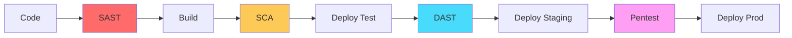
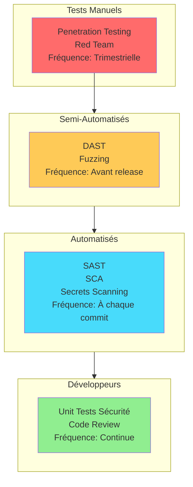
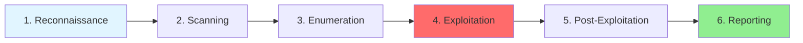

# PHASE 5 : TESTS DE SÉCURITÉ

[← Phase 4 : Développement](Secure_by_Design_04_Developpement.md) | [Retour à l'index](Secure_by_Design_00_Index.md) | [Phase 6 : Déploiement →](Secure_by_Design_06_Deploiement.md)

---

## Table des matières

1. [Vue d'ensemble](#vue-densemble)
2. [Pyramide des tests de sécurité](#pyramide)
3. [SAST - Static Application Security Testing](#sast)
4. [DAST - Dynamic Application Security Testing](#dast)
5. [IAST - Interactive Application Security Testing](#iast)
6. [SCA - Software Composition Analysis](#sca)
7. [Penetration Testing](#pentest)
8. [Fuzzing](#fuzzing)
9. [Automatisation dans CI/CD](#cicd)

---

## Vue d'ensemble {#vue-densemble}

Les **Tests de Sécurité** visent à identifier les vulnérabilités avant la mise en production à travers différentes techniques complémentaires.

### Objectifs

1. **Détecter** les vulnérabilités automatiquement (SAST/DAST/SCA)
2. **Valider** les contrôles de sécurité implémentés
3. **Simuler** des attaques réelles (Pentest)
4. **Mesurer** la posture de sécurité
5. **Prévenir** les régressions de sécurité

### Types de tests selon la phase



---

## Pyramide des tests de sécurité {#pyramide}



### Comparaison des approches

| Type | Moment | Couverture | Faux positifs | Effort | Coût |
|------|--------|------------|---------------|--------|------|
| **Unit Tests** | Développement | Code spécifique | Faible | Moyen | Faible |
| **SAST** | Commit/Build | Code complet | Élevé | Faible | Faible |
| **SCA** | Commit/Build | Dépendances | Moyen | Très faible | Faible |
| **DAST** | Runtime (test) | App en marche | Moyen | Moyen | Moyen |
| **IAST** | Runtime (test) | Code + Runtime | Faible | Moyen | Moyen |
| **Pentest** | Pré-production | App complète | Très faible | Élevé | Élevé |
| **Red Team** | Production | Tout | Nul | Très élevé | Très élevé |

---

## SAST - Static Application Security Testing {#sast}

### Concept

**SAST** analyse le code source **sans l'exécuter** pour détecter des vulnérabilités.

**Avantages :**
- ✅ Très tôt dans le cycle (Shift-Left)
- ✅ Couverture complète du code
- ✅ Rapide (quelques minutes)
- ✅ Automatisable dans CI/CD

**Inconvénients :**
- ⚠️ Taux de faux positifs élevé (30-50%)
- ⚠️ Ne détecte pas les vulnérabilités runtime
- ⚠️ Spécifique au langage

### Outils SAST recommandés

| Langage | Outil Open Source | Outil Commercial |
|---------|-------------------|------------------|
| **Python** | Bandit, Semgrep | SonarQube Professional |
| **JavaScript/Node** | ESLint + plugins, Semgrep | SonarQube, Checkmarx |
| **Java** | SpotBugs, FindSecBugs | Fortify, Veracode |
| **C#/.NET** | Security Code Scan | Checkmarx, Veracode |
| **Go** | Gosec, Semgrep | SonarQube |
| **Multi-langage** | Semgrep | SonarQube Enterprise |

### Exemple : Bandit (Python)

```bash
# Installation
pip install bandit

# Scan basique
bandit -r ./src

# Résultat exemple
[main]  INFO    profile include tests: None
[main]  INFO    profile exclude tests: None
[main]  INFO    running on Python 3.11.0
Run started:2026-01-05 10:30:00.123456

Test results:
>> Issue: [B201:flask_debug_true] A Flask app appears to have debug mode enabled.
   Severity: High   Confidence: Medium
   CWE: CWE-489 (https://cwe.mitre.org/data/definitions/489.html)
   Location: ./src/app.py:15
14  app = Flask(__name__)
15  app.run(debug=True)  # ← DANGER en production
16

>> Issue: [B608:hardcoded_sql_expressions] Possible SQL injection
   Severity: Medium   Confidence: Low
   CWE: CWE-89 (https://cwe.mitre.org/data/definitions/89.html)
   Location: ./src/views.py:42
41  def get_user(user_id):
42      query = f"SELECT * FROM users WHERE id = {user_id}"  # ← Vulnérable
43      return db.execute(query)

Code scanned:
        Total lines of code: 1234
        Total lines skipped (#nosec): 10

Run metrics:
        Total issues (by severity):
                High: 2
                Medium: 5
                Low: 12
        Total issues (by confidence):
                High: 3
                Medium: 8
                Low: 8
```

### Configuration Bandit

```yaml
# .bandit
exclude_dirs:
  - /test
  - /venv

tests:
  - B201  # flask_debug_true
  - B301  # pickle
  - B303  # MD5/SHA1
  - B304  # insecure ciphers
  - B305  # insecure cipher modes
  - B306  # mktemp
  - B307  # eval
  - B308  # mark_safe
  - B501  # request_with_no_cert_validation
  - B502  # ssl_with_bad_version
  - B503  # ssl_with_bad_defaults
  - B504  # ssl_with_no_version
  - B505  # weak_cryptographic_key
  - B506  # yaml_load
  - B507  # ssh_no_host_key_verification
  - B601  # paramiko_calls
  - B602  # shell_injection
  - B603  # subprocess_without_shell_equals_true
  - B604  # any_other_function_with_shell_equals_true
  - B605  # start_process_with_a_shell
  - B606  # start_process_with_no_shell
  - B607  # start_process_with_partial_path
  - B608  # hardcoded_sql_expressions
  - B609  # linux_commands_wildcard_injection

# Ignorer faux positifs
skips:
  - B101  # assert_used (OK dans tests)
```

### Exemple : Semgrep (Multi-langage)

```yaml
# .semgrep.yml
rules:
  - id: hardcoded-password
    pattern: |
      password = "..."
    message: Hardcoded password detected
    severity: ERROR
    languages:
      - python
      - javascript

  - id: sql-injection
    pattern-either:
      - pattern: |
          db.execute(f"... {$VAR} ...")
      - pattern: |
          db.execute("... " + $VAR + " ...")
    message: Possible SQL injection
    severity: ERROR
    languages:
      - python

  - id: jwt-none-algorithm
    pattern: |
      jwt.decode(..., algorithms=["none"])
    message: JWT with 'none' algorithm is insecure
    severity: ERROR
    languages:
      - python

  - id: eval-usage
    pattern: eval(...)
    message: eval() is dangerous, avoid it
    severity: WARNING
    languages:
      - python
      - javascript
```

```bash
# Scan avec Semgrep
semgrep --config=.semgrep.yml --config=p/security-audit ./src

# Résultat
Running 247 rules from:
  .semgrep.yml
  p/security-audit

Findings:

  src/auth.py
     severity:error rule:hardcoded-password
      10┆ SECRET_KEY = "super-secret-key-123"
        ⋮┆----------------------------------------
        ⋮┆ Hardcoded password detected

  src/api.py
     severity:error rule:sql-injection
      25┆ query = f"SELECT * FROM users WHERE email = '{email}'"
        ⋮┆----------------------------------------
        ⋮┆ Possible SQL injection

Ran 247 rules on 42 files: 2 findings
```

### Intégration IDE (VS Code)

```json
// .vscode/settings.json
{
  "python.linting.banditEnabled": true,
  "python.linting.banditArgs": ["--config", ".bandit"],

  "semgrep.scan": {
    "configuration": [".semgrep.yml", "p/security-audit"],
    "exclude": ["test/", "venv/"],
    "jobs": 4
  }
}
```

---

## DAST - Dynamic Application Security Testing {#dast}

### Concept

**DAST** teste l'application **en cours d'exécution** comme un attaquant externe.

**Avantages :**
- ✅ Détecte vulnérabilités runtime
- ✅ Pas de faux positifs de code
- ✅ Agnostique au langage
- ✅ Teste la config réelle

**Inconvénients :**
- ⚠️ Nécessite app déployée
- ⚠️ Plus lent que SAST
- ⚠️ Moins de couverture de code
- ⚠️ Peut crasher l'app

### OWASP ZAP (Zed Attack Proxy)

```bash
# Installation Docker
docker pull owasp/zap2docker-stable

# Scan baseline (rapide, 5-10 min)
docker run -t owasp/zap2docker-stable zap-baseline.py \
  -t https://bankapp-test.com \
  -r zap-report.html

# Scan complet (avec spider, plusieurs heures)
docker run -t owasp/zap2docker-stable zap-full-scan.py \
  -t https://bankapp-test.com \
  -r zap-full-report.html
```

### ZAP avec authentification

```python
# zap-auth-scan.py
from zapv2 import ZAPv2
import time

# Connexion à ZAP
zap = ZAPv2(
    apikey='your-zap-api-key',
    proxies={'http': 'http://127.0.0.1:8080', 'https': 'http://127.0.0.1:8080'}
)

# URL cible
target = 'https://bankapp-test.com'

# 1. Spider (découverte URLs)
print('Spidering target...')
scan_id = zap.spider.scan(target)

while int(zap.spider.status(scan_id)) < 100:
    print(f'Spider progress: {zap.spider.status(scan_id)}%')
    time.sleep(5)

print('Spider completed')

# 2. Authentification
print('Setting up authentication...')

# Configurer context
context_id = zap.context.new_context('BankApp')
zap.context.include_in_context('BankApp', f'{target}.*')

# Configurer form-based auth
login_url = f'{target}/login'
zap.authentication.set_authentication_method(
    contextid=context_id,
    authmethodname='formBasedAuthentication',
    authmethodconfigparams=f'loginUrl={login_url}&loginRequestData=username={}&password={}'
)

# Ajouter utilisateur
user_id = zap.users.new_user(context_id, 'testuser')
zap.users.set_authentication_credentials(
    contextid=context_id,
    userid=user_id,
    authcredentialsconfigparams='username=test@example.com&password=TestPassword123!'
)

zap.users.set_user_enabled(context_id, user_id, True)

# 3. Active Scan (tests d'attaque)
print('Starting active scan...')
scan_id = zap.ascan.scan(target, contextid=context_id, userid=user_id)

while int(zap.ascan.status(scan_id)) < 100:
    print(f'Active scan progress: {zap.ascan.status(scan_id)}%')
    time.sleep(10)

print('Active scan completed')

# 4. Récupérer résultats
alerts = zap.core.alerts(baseurl=target)

print(f'\nFound {len(alerts)} alerts:')

for alert in alerts:
    print(f"""
Risk: {alert['risk']}
Alert: {alert['alert']}
URL: {alert['url']}
Description: {alert['description'][:100]}...
Solution: {alert['solution'][:100]}...
    """)

# 5. Générer rapport HTML
with open('zap-report.html', 'w') as f:
    f.write(zap.core.htmlreport())

print('Report saved to zap-report.html')
```

### DAST avec Burp Suite

```bash
# Burp Suite Professional - Scan automatisé

# 1. Configuration scan
curl -X POST https://burp-api:8080/v0.1/scan \
  -H "Content-Type: application/json" \
  -d '{
    "scan_configurations": [
      {
        "name": "Crawl and Audit - Fast",
        "type": "NamedConfiguration"
      }
    ],
    "urls": ["https://bankapp-test.com"],
    "application_logins": [
      {
        "type": "FormBased",
        "login_url": "https://bankapp-test.com/login",
        "username": "test@example.com",
        "password": "TestPassword123!"
      }
    ]
  }'

# Réponse : {"task_id": "12345"}

# 2. Vérifier statut
curl https://burp-api:8080/v0.1/scan/12345

# 3. Récupérer résultats
curl https://burp-api:8080/v0.1/scan/12345/report \
  -o burp-report.html
```

### Nuclei (Scan rapide de vulnérabilités)

```bash
# Installation
go install -v github.com/projectdiscovery/nuclei/v2/cmd/nuclei@latest

# Mise à jour templates
nuclei -update-templates

# Scan basique
nuclei -u https://bankapp-test.com

# Scan avec templates spécifiques
nuclei -u https://bankapp-test.com \
  -t cves/ \
  -t vulnerabilities/ \
  -t exposures/ \
  -severity critical,high \
  -o nuclei-results.txt

# Résultat exemple
[2026-01-05 10:45:23] [CVE-2021-44228] [critical] https://bankapp-test.com/
[2026-01-05 10:45:25] [CVE-2023-12345] [high] https://bankapp-test.com/api/
[2026-01-05 10:45:27] [exposed-git-config] [medium] https://bankapp-test.com/.git/config
```

---

## IAST - Interactive Application Security Testing {#iast}

### Concept

**IAST** combine SAST et DAST : agent dans l'application qui analyse le code pendant l'exécution.

**Avantages :**
- ✅ Très peu de faux positifs
- ✅ Contexte complet (code + runtime)
- ✅ Détecte vulnérabilités complexes

**Inconvénients :**
- ⚠️ Impact performance (10-30%)
- ⚠️ Nécessite instrumentation
- ⚠️ Coûteux

### Exemple : Contrast Security (IAST)

```yaml
# Intégration Python (Django/Flask)
# settings.py ou app.py

# 1. Installer agent
# pip install contrast-agent

# 2. Configuration
CONTRAST_CONFIG = {
    'api': {
        'url': 'https://app.contrastsecurity.com/Contrast',
        'api_key': os.getenv('CONTRAST_API_KEY'),
        'service_key': os.getenv('CONTRAST_SERVICE_KEY'),
        'user_name': os.getenv('CONTRAST_USER_NAME')
    },
    'application': {
        'name': 'BankApp',
        'group': 'Production'
    },
    'server': {
        'name': 'bankapp-test-1',
        'environment': 'QA'
    }
}

# 3. Activer agent
if os.getenv('ENABLE_CONTRAST') == 'true':
    from contrast.agent import middleware as contrast_middleware
    app.wsgi_app = contrast_middleware.ContrastMiddleware(
        app.wsgi_app,
        CONTRAST_CONFIG
    )

# L'agent analyse chaque requête et détecte les vulnérabilités en temps réel
```

---

## SCA - Software Composition Analysis {#sca}

### Concept

**SCA** analyse les dépendances tierces pour détecter des vulnérabilités connues (CVE).

### Outils SCA

| Outil | Licence | Langages |
|-------|---------|----------|
| **OWASP Dependency-Check** | Open Source | Java, .NET, Python, Node, Ruby, PHP |
| **Snyk** | Freemium | Tous |
| **GitHub Dependabot** | Gratuit (GitHub) | Tous |
| **npm audit** | Gratuit | Node.js |
| **pip-audit** | Open Source | Python |
| **Trivy** | Open Source | Tous + containers |

### Exemple : OWASP Dependency-Check

```bash
# Installation
wget https://github.com/jeremylong/DependencyCheck/releases/download/v8.4.0/dependency-check-8.4.0-release.zip
unzip dependency-check-8.4.0-release.zip

# Scan Python
./dependency-check/bin/dependency-check.sh \
  --project "BankApp" \
  --scan ./requirements.txt \
  --format HTML \
  --out dependency-check-report.html

# Résultat exemple
Dependency-Check Report
Project: BankApp
Report Date: 2026-01-05

Summary:
  Total Dependencies: 42
  Vulnerable Dependencies: 3
  Vulnerabilities: 5

Critical Vulnerabilities:
  - django 2.2.0 (CVE-2023-12345)
    Severity: CRITICAL (CVSS 9.8)
    Description: SQL injection in admin panel
    Recommendation: Upgrade to django >= 2.2.28

High Vulnerabilities:
  - requests 2.20.0 (CVE-2023-67890)
    Severity: HIGH (CVSS 7.5)
    Description: SSRF vulnerability
    Recommendation: Upgrade to requests >= 2.31.0
```

### Snyk (Multi-langage)

```bash
# Installation
npm install -g snyk

# Authentification
snyk auth

# Test Python
snyk test --file=requirements.txt

# Test Node.js
snyk test

# Test Docker image
snyk container test python:3.11-slim

# Fix automatique (si possible)
snyk fix

# Résultat exemple
Testing /path/to/project...

Organization:      bankapp-team
Package manager:   pip
Target file:       requirements.txt
Project name:      BankApp
Open source:       no
Project path:      /path/to/project
Licenses:          enabled

✗ High severity vulnerability found in django
  Description: SQL Injection
  Info: https://snyk.io/vuln/SNYK-PYTHON-DJANGO-12345
  Introduced through: django@2.2.0
  From: django@2.2.0
  Fixed in: 2.2.28
  Fixable by upgrade: django@2.2.28

✗ Medium severity vulnerability found in requests
  Description: SSRF
  Info: https://snyk.io/vuln/SNYK-PYTHON-REQUESTS-67890
  Introduced through: requests@2.20.0
  Fixed in: 2.31.0

Tested 42 dependencies for known issues, found 5 issues, 5 vulnerable paths.
```

### GitHub Dependabot

```yaml
# .github/dependabot.yml
version: 2

updates:
  # Python dependencies
  - package-ecosystem: "pip"
    directory: "/"
    schedule:
      interval: "weekly"
      day: "monday"
      time: "09:00"
    open-pull-requests-limit: 10
    reviewers:
      - "security-team"
    labels:
      - "dependencies"
      - "security"

    # Auto-merge patch updates
    versioning-strategy: increase

  # Node.js dependencies
  - package-ecosystem: "npm"
    directory: "/frontend"
    schedule:
      interval: "weekly"

  # Docker base images
  - package-ecosystem: "docker"
    directory: "/"
    schedule:
      interval: "weekly"

# Dependabot crée automatiquement des PRs pour mettre à jour
```

---

## Penetration Testing {#pentest}

### Méthodologie



### 1. Reconnaissance (OSINT)

```bash
# Whois
whois bankapp.com

# DNS enumeration
dig bankapp.com ANY
nslookup -type=ANY bankapp.com

# Subdomains
sublist3r -d bankapp.com
amass enum -d bankapp.com

# Google Dorking
site:bankapp.com filetype:pdf
site:bankapp.com inurl:admin
site:*.bankapp.com -www

# Wayback Machine (archives)
curl "http://web.archive.org/cdx/search/cdx?url=bankapp.com/*&output=json"

# GitHub reconnaissance
python3 gitrob.py bankapp-team

# Shodan (services exposés)
shodan search org:"BankApp Inc"
```

### 2. Scanning

```bash
# Nmap - Scan de ports
nmap -sV -sC -p- bankapp.com -oA nmap-scan

# Résultat
PORT      STATE SERVICE  VERSION
22/tcp    open  ssh      OpenSSH 8.2p1
80/tcp    open  http     nginx 1.18.0
443/tcp   open  ssl/http nginx 1.18.0
5432/tcp  open  postgresql

# Nikto - Scan web
nikto -h https://bankapp.com

# WPScan (si WordPress)
wpscan --url https://bankapp.com --enumerate

# SSL/TLS test
sslscan bankapp.com
testssl.sh https://bankapp.com
```

### 3. Enumeration

```bash
# Énumération directories/files
ffuf -u https://bankapp.com/FUZZ \
  -w /usr/share/wordlists/dirb/common.txt \
  -mc 200,301,302,403

gobuster dir -u https://bankapp.com \
  -w /usr/share/wordlists/dirbuster/directory-list-2.3-medium.txt \
  -x php,html,js,txt,zip,bak

# Énumération API
ffuf -u https://bankapp.com/api/FUZZ \
  -w /path/to/api-wordlist.txt \
  -mc 200,401,403

# Énumération subdomains
ffuf -u https://FUZZ.bankapp.com \
  -w /path/to/subdomains.txt \
  -mc 200
```

### 4. Exploitation (Exemples éthiques)

```bash
# SQLMap - SQL Injection
sqlmap -u "https://bankapp.com/api/user?id=1" \
  --cookie="session=abc123" \
  --batch \
  --level=5 \
  --risk=3

# XSSer - XSS
xsser -u "https://bankapp.com/search?q=test" \
  --auto

# Burp Suite Intruder
# 1. Capturer requête dans Burp Proxy
# 2. Envoyer vers Intruder
# 3. Configurer payload positions
# 4. Attaque (Sniper, Battering Ram, Pitchfork)

# Metasploit (si vulnérabilité identifiée)
msfconsole
use exploit/multi/http/struts2_content_type_ognl
set RHOSTS bankapp.com
set RPORT 443
set SSL true
exploit
```

### Rapport de Penetration Test

```markdown
# PENETRATION TEST REPORT

## Executive Summary

**Target:** BankApp (https://bankapp.com)
**Test Period:** 2026-01-01 to 2026-01-05
**Tester:** Security Team
**Methodology:** OWASP Testing Guide v4

**Risk Summary:**
- CRITICAL: 2
- HIGH: 5
- MEDIUM: 12
- LOW: 8
- INFO: 15

## Findings

### CRITICAL-001: SQL Injection in /api/search

**Severity:** CRITICAL (CVSS 9.8)

**Description:**
SQL injection vulnerability allows attacker to extract entire database.

**Location:**
- URL: https://bankapp.com/api/search
- Parameter: q
- Method: GET

**Proof of Concept:**
```bash
curl "https://bankapp.com/api/search?q=' OR '1'='1"
# Returns all records

sqlmap -u "https://bankapp.com/api/search?q=test" --dump
# Successfully extracted users table with password hashes
```

**Impact:**
- Data breach: All user data accessible
- Regulatory: GDPR violation → fines up to 20M€
- Reputation: Loss of customer trust

**Recommendation:**
1. Use prepared statements (parameterized queries)
2. Implement input validation
3. Apply WAF rules
4. Review all database queries

**Remediation Code:**
```python
# BEFORE (Vulnerable)
query = f"SELECT * FROM products WHERE name LIKE '%{search}%'"

# AFTER (Secure)
from sqlalchemy import text
query = text("SELECT * FROM products WHERE name LIKE :search")
results = db.execute(query, {'search': f'%{search}%'})
```

**Status:** OPEN
**Assigned to:** Backend Team
**Deadline:** 2026-01-10 (URGENT)

---

### HIGH-002: Broken Access Control

**Severity:** HIGH (CVSS 7.5)

**Description:**
Users can access other users' accounts by modifying account_id parameter (IDOR).

**Location:**
- URL: https://bankapp.com/api/account/{account_id}
- Parameter: account_id
- Method: GET

**Proof of Concept:**
```bash
# Logged in as user ID 123
curl -H "Authorization: Bearer abc123" \
  https://bankapp.com/api/account/123
# OK - My account

curl -H "Authorization: Bearer abc123" \
  https://bankapp.com/api/account/456
# VULNERABLE - Returns account 456 data!
```

**Impact:**
- Privacy violation
- Account takeover potential
- Financial data exposure

**Recommendation:**
```python
# Add ownership check
if account.user_id != current_user.id:
    abort(403)
```

**Status:** OPEN
**Assigned to:** Backend Team
**Deadline:** 2026-01-15

[... Autres findings ...]

## Positive Findings

✅ HTTPS properly configured (TLS 1.3)
✅ Security headers present (HSTS, CSP, X-Frame-Options)
✅ No hardcoded credentials in public repos
✅ MFA enabled for admin accounts
✅ Rate limiting on login endpoint

## Recommendations Summary

**Priority P0 (Immediate):**
1. Fix SQL injection (CRITICAL-001)
2. Fix IDOR (HIGH-002)

**Priority P1 (This sprint):**
3. Implement CSRF protection
4. Upgrade outdated dependencies
5. Fix XSS in search

**Priority P2 (Next sprint):**
6. Implement Content Security Policy
7. Add subresource integrity (SRI)
8. Improve logging

## Re-test Plan

After remediation, a focused re-test will be conducted on:
- All CRITICAL and HIGH findings
- Related attack vectors

**Re-test Date:** 2026-01-20
```

---

## Fuzzing {#fuzzing}

### Concept

**Fuzzing** : Envoyer des inputs aléatoires/malformés pour crasher l'application.

### AFL (American Fuzzy Lop) - Fuzzing binaire

```bash
# Installation
sudo apt install afl++

# Compile programme avec instrumentation
afl-gcc -o myprogram myprogram.c

# Créer corpus d'inputs initiaux
mkdir inputs
echo "test" > inputs/sample1.txt

# Lancer fuzzing
afl-fuzz -i inputs -o findings -- ./myprogram @@

# AFL va générer des millions de mutations
# et détecter les crashs
```

### API Fuzzing avec ffuf

```bash
# Fuzzing paramètres GET
ffuf -u "https://bankapp.com/api/transfer?amount=FUZZ&to=test" \
  -w /path/to/fuzzing-payloads.txt \
  -mc all \
  -fc 404 \
  -o fuzzing-results.json

# Fuzzing headers
ffuf -u "https://bankapp.com/api/account" \
  -H "X-Custom-Header: FUZZ" \
  -w /path/to/headers-payloads.txt

# Fuzzing JSON body
ffuf -u "https://bankapp.com/api/user" \
  -X POST \
  -H "Content-Type: application/json" \
  -d '{"username":"admin","password":"FUZZ"}' \
  -w /path/to/passwords.txt
```

### Radamsa (Fuzzing intelligent)

```bash
# Installation
git clone https://gitlab.com/akihe/radamsa.git
cd radamsa && make && sudo make install

# Générer payloads mutés
echo '{"user":"test","amount":100}' | radamsa -n 1000 -o fuzzed-%n.json

# Résultat : 1000 fichiers avec mutations
# fuzzed-1.json: {"user":"test","amount":-100}
# fuzzed-2.json: {"user":"","amount":999999999999}
# fuzzed-3.json: {"user":"<script>alert(1)</script>","amount":100}
# ...

# Tester chaque payload
for file in fuzzed-*.json; do
  curl -X POST https://bankapp.com/api/transfer \
    -H "Content-Type: application/json" \
    -d @$file
done
```

---

## Automatisation dans CI/CD {#cicd}

### Pipeline complet de sécurité

```yaml
# .gitlab-ci.yml
stages:
  - secrets
  - sast
  - build
  - sca
  - deploy-test
  - dast
  - pentest-request

# Stage 1: Secrets Scanning
secrets-scan:
  stage: secrets
  image: trufflesecurity/trufflehog:latest
  script:
    - trufflehog filesystem . --json --fail
  allow_failure: false

# Stage 2: SAST
sast-bandit:
  stage: sast
  image: python:3.11
  script:
    - pip install bandit
    - bandit -r ./src -f json -o bandit-report.json
    - bandit -r ./src -ll  # Fail if HIGH/MEDIUM
  artifacts:
    reports:
      sast: bandit-report.json
    when: always

sast-semgrep:
  stage: sast
  image: returntocorp/semgrep
  script:
    - semgrep --config=auto --json --output=semgrep-report.json ./src
    - semgrep --config=auto --error ./src  # Fail on errors
  artifacts:
    reports:
      sast: semgrep-report.json

# Stage 3: Build
build:
  stage: build
  script:
    - docker build -t bankapp:$CI_COMMIT_SHA .
    - docker push bankapp:$CI_COMMIT_SHA

# Stage 4: SCA
sca-trivy:
  stage: sca
  image: aquasec/trivy:latest
  script:
    - trivy image --severity HIGH,CRITICAL --exit-code 1 bankapp:$CI_COMMIT_SHA
  allow_failure: false

sca-snyk:
  stage: sca
  image: snyk/snyk:python
  script:
    - snyk test --severity-threshold=high --json --json-file-output=snyk-report.json
    - snyk monitor  # Upload to Snyk for continuous monitoring
  artifacts:
    reports:
      dependency_scanning: snyk-report.json

# Stage 5: Deploy Test Environment
deploy-test:
  stage: deploy-test
  script:
    - kubectl apply -f k8s/test/
    - kubectl rollout status deployment/bankapp -n test
  environment:
    name: test
    url: https://bankapp-test.com

# Stage 6: DAST
dast-zap:
  stage: dast
  image: owasp/zap2docker-stable
  script:
    - |
      zap-full-scan.py \
        -t https://bankapp-test.com \
        -r zap-report.html \
        -J zap-report.json \
        -z "-config api.key=$ZAP_API_KEY"
  artifacts:
    reports:
      dast: zap-report.json
    paths:
      - zap-report.html
  allow_failure: true  # DAST peut avoir faux positifs

dast-nuclei:
  stage: dast
  image: projectdiscovery/nuclei
  script:
    - nuclei -u https://bankapp-test.com -severity critical,high -json -o nuclei-results.json
  artifacts:
    paths:
      - nuclei-results.json
  allow_failure: true

# Stage 7: Pentest Request (manuel)
request-pentest:
  stage: pentest-request
  when: manual
  only:
    - main
  script:
    - |
      curl -X POST https://jira.company.com/api/issue \
        -H "Authorization: Bearer $JIRA_TOKEN" \
        -d '{
          "fields": {
            "project": {"key": "SEC"},
            "summary": "Pentest request for BankApp v'$CI_COMMIT_TAG'",
            "description": "Automated pentest request from CI/CD",
            "issuetype": {"name": "Task"}
          }
        }'
```

### GitHub Actions (Alternative)

```yaml
# .github/workflows/security.yml
name: Security Scanning

on:
  push:
    branches: [main, develop]
  pull_request:
    branches: [main]
  schedule:
    - cron: '0 2 * * 1'  # Weekly Monday 2am

jobs:
  secrets:
    runs-on: ubuntu-latest
    steps:
      - uses: actions/checkout@v3
        with:
          fetch-depth: 0

      - name: TruffleHog Secrets Scan
        uses: trufflesecurity/trufflehog@main
        with:
          path: ./
          base: ${{ github.event.repository.default_branch }}
          head: HEAD

  sast:
    runs-on: ubuntu-latest
    steps:
      - uses: actions/checkout@v3

      - name: Run Semgrep
        uses: returntocorp/semgrep-action@v1
        with:
          config: >-
            p/security-audit
            p/secrets
            p/owasp-top-ten

  sca:
    runs-on: ubuntu-latest
    steps:
      - uses: actions/checkout@v3

      - name: Run Snyk
        uses: snyk/actions/python@master
        env:
          SNYK_TOKEN: ${{ secrets.SNYK_TOKEN }}
        with:
          args: --severity-threshold=high

  build-and-scan:
    runs-on: ubuntu-latest
    steps:
      - uses: actions/checkout@v3

      - name: Build Docker image
        run: docker build -t bankapp:${{ github.sha }} .

      - name: Scan with Trivy
        uses: aquasecurity/trivy-action@master
        with:
          image-ref: bankapp:${{ github.sha }}
          format: 'sarif'
          output: 'trivy-results.sarif'
          severity: 'CRITICAL,HIGH'

      - name: Upload to GitHub Security
        uses: github/codeql-action/upload-sarif@v2
        with:
          sarif_file: 'trivy-results.sarif'
```

### Métriques de sécurité

```python
# security_metrics.py
"""
Calcule et publie des métriques de sécurité
"""
import json
from prometheus_client import Gauge, push_to_gateway

# Métriques Prometheus
vulnerabilities_gauge = Gauge(
    'security_vulnerabilities_total',
    'Total vulnerabilities by severity',
    ['severity', 'tool']
)

def parse_bandit_report(report_path):
    """Parse rapport Bandit JSON"""
    with open(report_path) as f:
        data = json.load(f)

    counts = {'HIGH': 0, 'MEDIUM': 0, 'LOW': 0}

    for result in data.get('results', []):
        severity = result['issue_severity']
        counts[severity] += 1

    return counts

def parse_snyk_report(report_path):
    """Parse rapport Snyk JSON"""
    with open(report_path) as f:
        data = json.load(f)

    counts = {'HIGH': 0, 'MEDIUM': 0, 'LOW': 0}

    for vuln in data.get('vulnerabilities', []):
        severity = vuln['severity'].upper()
        counts[severity] += 1

    return counts

def publish_metrics():
    """Publie métriques vers Prometheus"""

    # SAST (Bandit)
    bandit_counts = parse_bandit_report('bandit-report.json')
    for severity, count in bandit_counts.items():
        vulnerabilities_gauge.labels(
            severity=severity,
            tool='bandit'
        ).set(count)

    # SCA (Snyk)
    snyk_counts = parse_snyk_report('snyk-report.json')
    for severity, count in snyk_counts.items():
        vulnerabilities_gauge.labels(
            severity=severity,
            tool='snyk'
        ).set(count)

    # Push vers Prometheus Pushgateway
    push_to_gateway(
        'pushgateway:9091',
        job='security-scan',
        registry=vulnerabilities_gauge._collector_registry
    )

if __name__ == '__main__':
    publish_metrics()
```

---

[← Phase 4 : Développement](Secure_by_Design_04_Developpement.md) | [Phase 6 : Déploiement Sécurisé →](Secure_by_Design_06_Deploiement.md)

**Version :** 1.0
**Date :** 2026-01-05
