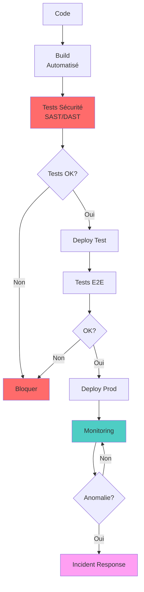

# PHASE 6 : DÉPLOIEMENT SÉCURISÉ

[← Phase 5 : Tests](Secure_by_Design_05_Tests.md) | [Retour à l'index](Secure_by_Design_00_Index.md)

---

## Table des matières

1. [Vue d'ensemble](#vue-densemble)
2. [Infrastructure as Code (IaC)](#iac)
3. [Sécurisation Kubernetes](#kubernetes)
4. [Secrets Management](#secrets)
5. [Pipeline CI/CD sécurisé](#cicd)
6. [Monitoring et Alertes](#monitoring)
7. [Incident Response](#incident-response)
8. [Exemple complet](#exemple-complet)

---

## Vue d'ensemble {#vue-densemble}

Le **Déploiement Sécurisé** garantit que l'application est mise en production de manière sécurisée et reproductible.

### Objectifs

1. **Automatiser** le déploiement (Infrastructure as Code)
2. **Sécuriser** la configuration des environnements
3. **Isoler** les composants (conteneurs, namespaces)
4. **Monitorer** en continu la sécurité
5. **Répondre** rapidement aux incidents

### Principes



---

## Infrastructure as Code (IaC) {#iac}

### Terraform - AWS Infrastructure

```hcl
# terraform/main.tf

# Provider
terraform {
  required_version = ">= 1.0"

  required_providers {
    aws = {
      source  = "hashicorp/aws"
      version = "~> 5.0"
    }
  }

  # Remote state sécurisé
  backend "s3" {
    bucket         = "bankapp-terraform-state"
    key            = "prod/terraform.tfstate"
    region         = "eu-west-1"
    encrypt        = true
    dynamodb_table = "terraform-lock"
  }
}

provider "aws" {
  region = var.region

  default_tags {
    tags = {
      Environment = var.environment
      Project     = "BankApp"
      ManagedBy   = "Terraform"
    }
  }
}

# VPC avec segmentation
module "vpc" {
  source = "terraform-aws-modules/vpc/aws"

  name = "bankapp-vpc"
  cidr = "10.0.0.0/16"

  azs             = ["eu-west-1a", "eu-west-1b", "eu-west-1c"]
  private_subnets = ["10.0.1.0/24", "10.0.2.0/24", "10.0.3.0/24"]
  public_subnets  = ["10.0.101.0/24", "10.0.102.0/24", "10.0.103.0/24"]
  database_subnets = ["10.0.201.0/24", "10.0.202.0/24", "10.0.203.0/24"]

  enable_nat_gateway = true
  enable_vpn_gateway = false

  # Flow logs pour audit
  enable_flow_log                      = true
  create_flow_log_cloudwatch_iam_role  = true
  create_flow_log_cloudwatch_log_group = true

  tags = {
    Compliance = "PCI-DSS"
  }
}

# Security Groups
resource "aws_security_group" "alb" {
  name        = "bankapp-alb-sg"
  description = "ALB Security Group"
  vpc_id      = module.vpc.vpc_id

  # HTTPS uniquement
  ingress {
    from_port   = 443
    to_port     = 443
    protocol    = "tcp"
    cidr_blocks = ["0.0.0.0/0"]
    description = "HTTPS from Internet"
  }

  # Redirection HTTP → HTTPS
  ingress {
    from_port   = 80
    to_port     = 80
    protocol    = "tcp"
    cidr_blocks = ["0.0.0.0/0"]
    description = "HTTP redirect to HTTPS"
  }

  egress {
    from_port   = 0
    to_port     = 0
    protocol    = "-1"
    cidr_blocks = ["0.0.0.0/0"]
  }
}

resource "aws_security_group" "app" {
  name        = "bankapp-app-sg"
  description = "Application Security Group"
  vpc_id      = module.vpc.vpc_id

  # Trafic depuis ALB uniquement
  ingress {
    from_port       = 8080
    to_port         = 8080
    protocol        = "tcp"
    security_groups = [aws_security_group.alb.id]
    description     = "Traffic from ALB"
  }

  egress {
    from_port   = 0
    to_port     = 0
    protocol    = "-1"
    cidr_blocks = ["0.0.0.0/0"]
  }
}

resource "aws_security_group" "db" {
  name        = "bankapp-db-sg"
  description = "Database Security Group"
  vpc_id      = module.vpc.vpc_id

  # PostgreSQL depuis app uniquement
  ingress {
    from_port       = 5432
    to_port         = 5432
    protocol        = "tcp"
    security_groups = [aws_security_group.app.id]
    description     = "PostgreSQL from app"
  }

  # Pas d'egress (base de données isolée)
}

# RDS PostgreSQL chiffrée
resource "aws_db_instance" "main" {
  identifier = "bankapp-db"

  engine         = "postgres"
  engine_version = "15.3"
  instance_class = "db.r6g.xlarge"

  allocated_storage     = 100
  max_allocated_storage = 1000
  storage_encrypted     = true
  kms_key_id           = aws_kms_key.rds.arn

  db_name  = "bankapp"
  username = "dbadmin"
  password = random_password.db_password.result

  multi_az               = true
  db_subnet_group_name   = aws_db_subnet_group.main.name
  vpc_security_group_ids = [aws_security_group.db.id]

  # Backups
  backup_retention_period = 30
  backup_window          = "03:00-04:00"
  maintenance_window     = "mon:04:00-mon:05:00"

  # Logs
  enabled_cloudwatch_logs_exports = ["postgresql", "upgrade"]

  # Deletion protection
  deletion_protection = true
  skip_final_snapshot = false
  final_snapshot_identifier = "bankapp-db-final-snapshot"

  # Audit
  performance_insights_enabled = true
  performance_insights_kms_key_id = aws_kms_key.rds.arn

  tags = {
    Compliance = "PCI-DSS"
    Backup     = "Required"
  }
}

# KMS Key pour chiffrement
resource "aws_kms_key" "rds" {
  description             = "BankApp RDS encryption key"
  deletion_window_in_days = 30
  enable_key_rotation     = true

  tags = {
    Purpose = "RDS Encryption"
  }
}

resource "aws_kms_alias" "rds" {
  name          = "alias/bankapp-rds"
  target_key_id = aws_kms_key.rds.key_id
}

# EKS Cluster
module "eks" {
  source = "terraform-aws-modules/eks/aws"

  cluster_name    = "bankapp-eks"
  cluster_version = "1.28"

  vpc_id     = module.vpc.vpc_id
  subnet_ids = module.vpc.private_subnets

  # Encryption des secrets etcd
  cluster_encryption_config = {
    provider_key_arn = aws_kms_key.eks.arn
    resources        = ["secrets"]
  }

  # Logs
  cluster_enabled_log_types = ["api", "audit", "authenticator"]

  # IRSA (IAM Roles for Service Accounts)
  enable_irsa = true

  eks_managed_node_groups = {
    main = {
      min_size     = 3
      max_size     = 10
      desired_size = 3

      instance_types = ["t3.large"]

      # Metadata v2 obligatoire (sécurité)
      metadata_options = {
        http_endpoint               = "enabled"
        http_tokens                 = "required"
        http_put_response_hop_limit = 1
      }

      # Disk encryption
      block_device_mappings = {
        xvda = {
          device_name = "/dev/xvda"
          ebs = {
            volume_size           = 100
            volume_type           = "gp3"
            encrypted             = true
            kms_key_id           = aws_kms_key.eks.arn
            delete_on_termination = true
          }
        }
      }
    }
  }
}

# WAF
resource "aws_wafv2_web_acl" "main" {
  name  = "bankapp-waf"
  scope = "REGIONAL"

  default_action {
    allow {}
  }

  # Règle 1: Rate limiting
  rule {
    name     = "RateLimitRule"
    priority = 1

    statement {
      rate_based_statement {
        limit              = 2000
        aggregate_key_type = "IP"
      }
    }

    action {
      block {}
    }

    visibility_config {
      cloudwatch_metrics_enabled = true
      metric_name                = "RateLimitRule"
      sampled_requests_enabled   = true
    }
  }

  # Règle 2: AWS Managed Rules
  rule {
    name     = "AWSManagedRulesCommonRuleSet"
    priority = 2

    override_action {
      none {}
    }

    statement {
      managed_rule_group_statement {
        name        = "AWSManagedRulesCommonRuleSet"
        vendor_name = "AWS"
      }
    }

    visibility_config {
      cloudwatch_metrics_enabled = true
      metric_name                = "AWSManagedRulesCommonRuleSetMetric"
      sampled_requests_enabled   = true
    }
  }

  # Règle 3: SQL Injection
  rule {
    name     = "SQLInjectionRule"
    priority = 3

    override_action {
      none {}
    }

    statement {
      managed_rule_group_statement {
        name        = "AWSManagedRulesSQLiRuleSet"
        vendor_name = "AWS"
      }
    }

    visibility_config {
      cloudwatch_metrics_enabled = true
      metric_name                = "SQLInjectionRuleMetric"
      sampled_requests_enabled   = true
    }
  }

  visibility_config {
    cloudwatch_metrics_enabled = true
    metric_name                = "BankAppWAF"
    sampled_requests_enabled   = true
  }
}

# CloudWatch Alarms
resource "aws_cloudwatch_metric_alarm" "high_cpu" {
  alarm_name          = "bankapp-high-cpu"
  comparison_operator = "GreaterThanThreshold"
  evaluation_periods  = "2"
  metric_name         = "CPUUtilization"
  namespace           = "AWS/RDS"
  period              = "300"
  statistic           = "Average"
  threshold           = "80"
  alarm_description   = "Database CPU above 80%"
  alarm_actions       = [aws_sns_topic.alerts.arn]

  dimensions = {
    DBInstanceIdentifier = aws_db_instance.main.id
  }
}

resource "aws_sns_topic" "alerts" {
  name = "bankapp-security-alerts"

  kms_master_key_id = aws_kms_key.sns.id
}

resource "aws_sns_topic_subscription" "security_team" {
  topic_arn = aws_sns_topic.alerts.arn
  protocol  = "email"
  endpoint  = "security@bankapp.com"
}
```

### Scan sécurité Terraform (Checkov)

```bash
# Installation
pip install checkov

# Scan Terraform
checkov -d terraform/ --framework terraform

# Résultat
Check: CKV_AWS_23: "Ensure every security groups rule has a description"
        PASSED for resource: aws_security_group.alb

Check: CKV_AWS_16: "Ensure all data stored in the RDS is securely encrypted at rest"
        PASSED for resource: aws_db_instance.main

Check: CKV_AWS_17: "Ensure all data stored in RDS is not publicly accessible"
        PASSED for resource: aws_db_instance.main

Check: CKV_AWS_118: "Ensure that enhanced monitoring is enabled for RDS"
        FAILED for resource: aws_db_instance.main

Summary:
  Passed checks: 42
  Failed checks: 3
  Skipped checks: 0

# Remédiation des échecs
```

### Terraform avec politique OPA

```rego
# policy.rego
package terraform.analysis

import input as tfplan

# Règle: RDS doit être chiffré
deny[msg] {
  resource := tfplan.resource_changes[_]
  resource.type == "aws_db_instance"
  not resource.change.after.storage_encrypted

  msg := sprintf(
    "RDS instance '%s' must have encryption enabled",
    [resource.address]
  )
}

# Règle: Security groups ne doivent pas être ouverts à 0.0.0.0/0 sur tous ports
deny[msg] {
  resource := tfplan.resource_changes[_]
  resource.type == "aws_security_group"

  rule := resource.change.after.ingress[_]
  rule.cidr_blocks[_] == "0.0.0.0/0"
  rule.from_port == 0
  rule.to_port == 0

  msg := sprintf(
    "Security group '%s' allows all traffic from Internet",
    [resource.address]
  )
}

# Règle: S3 buckets doivent être chiffrés
deny[msg] {
  resource := tfplan.resource_changes[_]
  resource.type == "aws_s3_bucket"
  not resource.change.after.server_side_encryption_configuration

  msg := sprintf(
    "S3 bucket '%s' must have encryption enabled",
    [resource.address]
  )
}
```

```bash
# Valider avec OPA
terraform plan -out=tfplan.binary
terraform show -json tfplan.binary > tfplan.json
opa eval --data policy.rego --input tfplan.json "data.terraform.analysis.deny"

# Si violations, bloquer le apply
```

---

## Sécurisation Kubernetes {#kubernetes}

### Namespace avec isolation

```yaml
# namespaces.yaml
apiVersion: v1
kind: Namespace
metadata:
  name: production
  labels:
    name: production
    pod-security.kubernetes.io/enforce: restricted
    pod-security.kubernetes.io/audit: restricted
    pod-security.kubernetes.io/warn: restricted

---
# Resource Quotas (limiter abus)
apiVersion: v1
kind: ResourceQuota
metadata:
  name: compute-quota
  namespace: production
spec:
  hard:
    requests.cpu: "100"
    requests.memory: 200Gi
    limits.cpu: "200"
    limits.memory: 400Gi
    persistentvolumeclaims: "10"

---
# Network Policy (segmentation)
apiVersion: networking.k8s.io/v1
kind: NetworkPolicy
metadata:
  name: default-deny-all
  namespace: production
spec:
  podSelector: {}
  policyTypes:
    - Ingress
    - Egress

---
apiVersion: networking.k8s.io/v1
kind: NetworkPolicy
metadata:
  name: allow-api-to-db
  namespace: production
spec:
  podSelector:
    matchLabels:
      app: postgres
  policyTypes:
    - Ingress
  ingress:
    - from:
        - podSelector:
            matchLabels:
              app: api-server
      ports:
        - protocol: TCP
          port: 5432
```

### Pod Security Standards

```yaml
# deployment.yaml
apiVersion: apps/v1
kind: Deployment
metadata:
  name: bankapp-api
  namespace: production
spec:
  replicas: 3
  selector:
    matchLabels:
      app: bankapp-api
  template:
    metadata:
      labels:
        app: bankapp-api
    spec:
      # Security Context (Pod-level)
      securityContext:
        runAsNonRoot: true
        runAsUser: 1000
        fsGroup: 1000
        seccompProfile:
          type: RuntimeDefault

      # Service Account (pas default)
      serviceAccountName: bankapp-api-sa
      automountServiceAccountToken: false

      containers:
        - name: api
          image: bankapp/api:v1.2.3
          imagePullPolicy: Always

          # Security Context (Container-level)
          securityContext:
            allowPrivilegeEscalation: false
            readOnlyRootFilesystem: true
            runAsNonRoot: true
            runAsUser: 1000
            capabilities:
              drop:
                - ALL

          # Resources limits (anti-DoS)
          resources:
            requests:
              memory: "256Mi"
              cpu: "250m"
            limits:
              memory: "512Mi"
              cpu: "500m"

          # Probes
          livenessProbe:
            httpGet:
              path: /health
              port: 8080
            initialDelaySeconds: 30
            periodSeconds: 10

          readinessProbe:
            httpGet:
              path: /ready
              port: 8080
            initialDelaySeconds: 5
            periodSeconds: 5

          # Variables d'environnement (pas de secrets ici!)
          env:
            - name: DATABASE_HOST
              value: postgres-service
            - name: DATABASE_PORT
              value: "5432"

          # Secrets via volume
          volumeMounts:
            - name: secrets
              mountPath: /app/secrets
              readOnly: true
            - name: tmp
              mountPath: /tmp

      volumes:
        - name: secrets
          secret:
            secretName: bankapp-secrets
        - name: tmp
          emptyDir: {}

---
# Service Account
apiVersion: v1
kind: ServiceAccount
metadata:
  name: bankapp-api-sa
  namespace: production

---
# RBAC Role
apiVersion: rbac.authorization.k8s.io/v1
kind: Role
metadata:
  name: bankapp-api-role
  namespace: production
rules:
  - apiGroups: [""]
    resources: ["secrets"]
    resourceNames: ["bankapp-secrets"]
    verbs: ["get"]

---
# RBAC RoleBinding
apiVersion: rbac.authorization.k8s.io/v1
kind: RoleBinding
metadata:
  name: bankapp-api-rolebinding
  namespace: production
subjects:
  - kind: ServiceAccount
    name: bankapp-api-sa
    namespace: production
roleRef:
  kind: Role
  name: bankapp-api-role
  apiGroup: rbac.authorization.k8s.io
```

### Istio Service Mesh (mTLS)

```yaml
# istio/peer-authentication.yaml
apiVersion: security.istio.io/v1beta1
kind: PeerAuthentication
metadata:
  name: default
  namespace: production
spec:
  mtls:
    mode: STRICT  # mTLS obligatoire

---
# istio/authorization-policy.yaml
apiVersion: security.istio.io/v1beta1
kind: AuthorizationPolicy
metadata:
  name: api-authz
  namespace: production
spec:
  selector:
    matchLabels:
      app: bankapp-api

  action: ALLOW

  rules:
    # Seul frontend peut appeler API
    - from:
        - source:
            principals: ["cluster.local/ns/production/sa/frontend-sa"]
      to:
        - operation:
            methods: ["GET", "POST"]
            paths: ["/api/*"]

    # Health checks depuis n'importe où
    - to:
        - operation:
            methods: ["GET"]
            paths: ["/health", "/ready"]

---
# istio/request-authentication.yaml
apiVersion: security.istio.io/v1beta1
kind: RequestAuthentication
metadata:
  name: jwt-auth
  namespace: production
spec:
  selector:
    matchLabels:
      app: bankapp-api
  jwtRules:
    - issuer: "https://auth.bankapp.com"
      jwksUri: "https://auth.bankapp.com/.well-known/jwks.json"
      audiences:
        - "bankapp-api"
```

### Kyverno (Policy Engine)

```yaml
# kyverno-policies.yaml
apiVersion: kyverno.io/v1
kind: ClusterPolicy
metadata:
  name: require-non-root
spec:
  validationFailureAction: enforce
  background: true
  rules:
    - name: check-runAsNonRoot
      match:
        any:
          - resources:
              kinds:
                - Pod
      validate:
        message: "Running as root is not allowed"
        pattern:
          spec:
            securityContext:
              runAsNonRoot: true

---
apiVersion: kyverno.io/v1
kind: ClusterPolicy
metadata:
  name: require-requests-limits
spec:
  validationFailureAction: enforce
  rules:
    - name: check-resources
      match:
        any:
          - resources:
              kinds:
                - Pod
      validate:
        message: "CPU and memory requests and limits are required"
        pattern:
          spec:
            containers:
              - resources:
                  requests:
                    memory: "?*"
                    cpu: "?*"
                  limits:
                    memory: "?*"
                    cpu: "?*"

---
apiVersion: kyverno.io/v1
kind: ClusterPolicy
metadata:
  name: disallow-latest-tag
spec:
  validationFailureAction: enforce
  rules:
    - name: require-image-tag
      match:
        any:
          - resources:
              kinds:
                - Pod
      validate:
        message: "Using 'latest' tag is not allowed"
        pattern:
          spec:
            containers:
              - image: "!*:latest"
```

---

## Secrets Management {#secrets}

### HashiCorp Vault avec Kubernetes

```yaml
# vault/deployment.yaml
apiVersion: v1
kind: ServiceAccount
metadata:
  name: vault
  namespace: vault

---
apiVersion: apps/v1
kind: StatefulSet
metadata:
  name: vault
  namespace: vault
spec:
  serviceName: vault
  replicas: 3
  selector:
    matchLabels:
      app: vault
  template:
    metadata:
      labels:
        app: vault
    spec:
      serviceAccountName: vault
      containers:
        - name: vault
          image: vault:1.15.0
          ports:
            - containerPort: 8200
              name: api
            - containerPort: 8201
              name: cluster
          env:
            - name: VAULT_ADDR
              value: "https://127.0.0.1:8200"
            - name: VAULT_API_ADDR
              value: "https://vault.vault.svc:8200"
          volumeMounts:
            - name: vault-config
              mountPath: /vault/config
            - name: vault-data
              mountPath: /vault/data
          securityContext:
            capabilities:
              add:
                - IPC_LOCK
      volumes:
        - name: vault-config
          configMap:
            name: vault-config
  volumeClaimTemplates:
    - metadata:
        name: vault-data
      spec:
        accessModes: ["ReadWriteOnce"]
        storageClassName: encrypted-gp3
        resources:
          requests:
            storage: 10Gi

---
# External Secrets Operator
apiVersion: external-secrets.io/v1beta1
kind: SecretStore
metadata:
  name: vault-backend
  namespace: production
spec:
  provider:
    vault:
      server: "https://vault.vault.svc:8200"
      path: "secret"
      version: "v2"
      auth:
        kubernetes:
          mountPath: "kubernetes"
          role: "bankapp-role"
          serviceAccountRef:
            name: bankapp-api-sa

---
apiVersion: external-secrets.io/v1beta1
kind: ExternalSecret
metadata:
  name: bankapp-secrets
  namespace: production
spec:
  refreshInterval: 1h
  secretStoreRef:
    name: vault-backend
    kind: SecretStore

  target:
    name: bankapp-secrets
    creationPolicy: Owner

  data:
    - secretKey: database-password
      remoteRef:
        key: bankapp/database
        property: password

    - secretKey: stripe-api-key
      remoteRef:
        key: bankapp/stripe
        property: api_key

    - secretKey: jwt-secret
      remoteRef:
        key: bankapp/auth
        property: jwt_secret
```

### Sealed Secrets (Alternative)

```bash
# Installation
kubectl apply -f https://github.com/bitnami-labs/sealed-secrets/releases/download/v0.24.0/controller.yaml

# Créer secret normal
kubectl create secret generic bankapp-secrets \
  --from-literal=db-password=SuperSecret123! \
  --dry-run=client -o yaml > secret.yaml

# Chiffrer (sealed)
kubeseal --format yaml < secret.yaml > sealed-secret.yaml

# sealed-secret.yaml peut être commité dans Git
# Seul le cluster peut déchiffrer
```

---

## Pipeline CI/CD sécurisé {#cicd}

### GitLab CI/CD complet

```yaml
# .gitlab-ci.yml
variables:
  DOCKER_REGISTRY: "registry.gitlab.com/bankapp"
  DOCKER_TLS_CERTDIR: "/certs"
  TRIVY_VERSION: "0.48.0"

stages:
  - secrets
  - build
  - test
  - security-scan
  - deploy-staging
  - security-test
  - deploy-production

# =====================
# STAGE: Secrets Scan
# =====================
secrets-scan:
  stage: secrets
  image: trufflesecurity/trufflehog:latest
  script:
    - trufflehog filesystem . --json --fail
  allow_failure: false
  only:
    - branches
    - merge_requests

# =====================
# STAGE: Build
# =====================
build:
  stage: build
  image: docker:24-dind
  services:
    - docker:24-dind
  before_script:
    - echo "$CI_REGISTRY_PASSWORD" | docker login -u "$CI_REGISTRY_USER" --password-stdin $CI_REGISTRY
  script:
    # Build multi-stage avec cache
    - |
      docker build \
        --cache-from $DOCKER_REGISTRY/api:latest \
        --tag $DOCKER_REGISTRY/api:$CI_COMMIT_SHA \
        --tag $DOCKER_REGISTRY/api:latest \
        --build-arg BUILD_DATE=$(date -u +'%Y-%m-%dT%H:%M:%SZ') \
        --build-arg VCS_REF=$CI_COMMIT_SHA \
        .
    - docker push $DOCKER_REGISTRY/api:$CI_COMMIT_SHA
    - docker push $DOCKER_REGISTRY/api:latest

# =====================
# STAGE: Test
# =====================
unit-tests:
  stage: test
  image: python:3.11
  script:
    - pip install -r requirements-test.txt
    - pytest --cov=app --cov-report=xml
  coverage: '/TOTAL.*\s+(\d+%)$/'
  artifacts:
    reports:
      coverage_report:
        coverage_format: cobertura
        path: coverage.xml

# =====================
# STAGE: Security Scan
# =====================
sast-semgrep:
  stage: security-scan
  image: returntocorp/semgrep
  script:
    - semgrep --config=auto --json --output=semgrep-report.json .
  artifacts:
    reports:
      sast: semgrep-report.json
  allow_failure: false

container-scan-trivy:
  stage: security-scan
  image: aquasec/trivy:$TRIVY_VERSION
  script:
    - trivy image --exit-code 1 --severity CRITICAL,HIGH $DOCKER_REGISTRY/api:$CI_COMMIT_SHA
  allow_failure: false

iac-scan-checkov:
  stage: security-scan
  image: bridgecrew/checkov:latest
  script:
    - checkov -d terraform/ --framework terraform --output json --output-file checkov-report.json
  artifacts:
    paths:
      - checkov-report.json
  allow_failure: true

# =====================
# STAGE: Deploy Staging
# =====================
deploy-staging:
  stage: deploy-staging
  image: bitnami/kubectl:latest
  environment:
    name: staging
    url: https://staging.bankapp.com
    on_stop: stop-staging
  before_script:
    - kubectl config set-cluster k8s --server="$KUBE_URL" --insecure-skip-tls-verify=false --certificate-authority="$KUBE_CA_CERT"
    - kubectl config set-credentials deployer --token="$KUBE_TOKEN"
    - kubectl config set-context staging --cluster=k8s --user=deployer --namespace=staging
    - kubectl config use-context staging
  script:
    # Update image tag
    - kubectl set image deployment/bankapp-api api=$DOCKER_REGISTRY/api:$CI_COMMIT_SHA -n staging

    # Wait for rollout
    - kubectl rollout status deployment/bankapp-api -n staging --timeout=5m

    # Smoke tests
    - |
      for i in {1..10}; do
        STATUS=$(curl -s -o /dev/null -w "%{http_code}" https://staging.bankapp.com/health)
        if [ "$STATUS" == "200" ]; then
          echo "Health check passed"
          exit 0
        fi
        echo "Waiting for app to be ready... ($i/10)"
        sleep 10
      done
      echo "Health check failed"
      exit 1
  only:
    - develop
    - main

# =====================
# STAGE: Security Test (DAST)
# =====================
dast-zap:
  stage: security-test
  image: owasp/zap2docker-stable
  script:
    - mkdir -p /zap/wrk
    - |
      zap-full-scan.py \
        -t https://staging.bankapp.com \
        -r zap-report.html \
        -J zap-report.json \
        -I
  artifacts:
    paths:
      - zap-report.html
      - zap-report.json
    reports:
      dast: zap-report.json
  allow_failure: true
  only:
    - develop
    - main

# =====================
# STAGE: Deploy Production
# =====================
deploy-production:
  stage: deploy-production
  image: bitnami/kubectl:latest
  environment:
    name: production
    url: https://bankapp.com
  before_script:
    - kubectl config set-cluster k8s --server="$KUBE_URL_PROD" --certificate-authority="$KUBE_CA_CERT_PROD"
    - kubectl config set-credentials deployer --token="$KUBE_TOKEN_PROD"
    - kubectl config set-context production --cluster=k8s --user=deployer --namespace=production
    - kubectl config use-context production
  script:
    # Blue-Green deployment
    - |
      # Deploy new version (green)
      kubectl set image deployment/bankapp-api-green api=$DOCKER_REGISTRY/api:$CI_COMMIT_SHA -n production
      kubectl rollout status deployment/bankapp-api-green -n production --timeout=10m

      # Health check green
      kubectl wait --for=condition=available --timeout=300s deployment/bankapp-api-green -n production

      # Switch traffic (blue → green)
      kubectl patch service bankapp-api -n production -p '{"spec":{"selector":{"version":"green"}}}'

      # Wait 5 min for monitoring
      sleep 300

      # If no issues, scale down blue
      kubectl scale deployment/bankapp-api-blue --replicas=0 -n production
  when: manual
  only:
    - main

# Notification Slack
notify-success:
  stage: .post
  image: curlimages/curl:latest
  script:
    - |
      curl -X POST $SLACK_WEBHOOK \
        -H 'Content-Type: application/json' \
        -d '{
          "text": "✅ Deployment successful",
          "blocks": [
            {
              "type": "section",
              "text": {
                "type": "mrkdwn",
                "text": "*BankApp Deployment* ✅\n*Environment:* Production\n*Commit:* '"$CI_COMMIT_SHA"'\n*Author:* '"$GITLAB_USER_NAME"'"
              }
            }
          ]
        }'
  when: on_success
  only:
    - main
```

---

## Monitoring et Alertes {#monitoring}

### Prometheus + Grafana

```yaml
# prometheus/values.yaml (Helm)
prometheus:
  prometheusSpec:
    retention: 30d
    storageSpec:
      volumeClaimTemplate:
        spec:
          accessModes: ["ReadWriteOnce"]
          resources:
            requests:
              storage: 50Gi

    # Security metrics
    additionalScrapeConfigs:
      - job_name: 'vault'
        static_configs:
          - targets: ['vault.vault.svc:8200']
        metrics_path: '/v1/sys/metrics'

      - job_name: 'istio-mesh'
        kubernetes_sd_configs:
          - role: endpoints
            namespaces:
              names:
                - istio-system
        relabel_configs:
          - source_labels: [__meta_kubernetes_service_name]
            action: keep
            regex: istio-telemetry

# Alertes de sécurité
alerting:
  alertmanagers:
    - static_configs:
        - targets: ['alertmanager:9093']

# PrometheusRule
apiVersion: monitoring.coreos.com/v1
kind: PrometheusRule
metadata:
  name: bankapp-security-alerts
spec:
  groups:
    - name: security
      interval: 30s
      rules:
        # Trop de 401 (attaque brute force ?)
        - alert: HighUnauthorizedRate
          expr: |
            sum(rate(http_requests_total{code="401"}[5m])) by (service) > 10
          for: 2m
          labels:
            severity: warning
          annotations:
            summary: "High rate of 401 errors on {{ $labels.service }}"
            description: "{{ $value }} unauthorized requests/sec"

        # Pic soudain de trafic (DDoS ?)
        - alert: TrafficSpike
          expr: |
            rate(http_requests_total[1m]) >
            (avg_over_time(http_requests_total[1h]) * 3)
          for: 1m
          labels:
            severity: critical
          annotations:
            summary: "Traffic spike detected"

        # Secrets accessibles (Vault unsealed)
        - alert: VaultSealed
          expr: vault_core_unsealed == 0
          for: 1m
          labels:
            severity: critical
          annotations:
            summary: "Vault is sealed"

        # Pod crashlooping (possible exploit)
        - alert: PodCrashLooping
          expr: |
            rate(kube_pod_container_status_restarts_total[15m]) > 0
          for: 5m
          labels:
            severity: warning
          annotations:
            summary: "Pod {{ $labels.pod }} is crash looping"
```

### ELK Stack (Logs)

```yaml
# filebeat-config.yaml
apiVersion: v1
kind: ConfigMap
metadata:
  name: filebeat-config
  namespace: logging
data:
  filebeat.yml: |
    filebeat.inputs:
      - type: container
        paths:
          - /var/log/containers/*.log
        processors:
          - add_kubernetes_metadata:
              host: ${NODE_NAME}
              matchers:
                - logs_path:
                    logs_path: "/var/log/containers/"

    # Filtres de sécurité
    processors:
      - drop_event:
          when:
            not:
              or:
                - contains:
                    kubernetes.labels.security: "true"
                - regexp:
                    message: ".*(error|fail|attack|injection|unauthorized).*"

    output.elasticsearch:
      hosts: ['${ELASTICSEARCH_HOST}:${ELASTICSEARCH_PORT}']
      username: ${ELASTICSEARCH_USERNAME}
      password: ${ELASTICSEARCH_PASSWORD}
      ssl.verification_mode: full
      ssl.certificate_authorities: ["/etc/pki/root/ca.pem"]

    # Index par namespace + date
    setup.ilm.enabled: true
    setup.template.name: "bankapp"
    setup.template.pattern: "bankapp-*"
    output.elasticsearch.index: "bankapp-%{[kubernetes.namespace]}-%{+yyyy.MM.dd}"
```

### SIEM Integration (Splunk)

```python
# splunk_forwarder.py
"""
Envoie logs de sécurité vers Splunk via HEC (HTTP Event Collector)
"""
import requests
import json
from datetime import datetime

class SplunkForwarder:
    def __init__(self, hec_url, hec_token):
        self.hec_url = hec_url
        self.hec_token = hec_token
        self.headers = {
            'Authorization': f'Splunk {hec_token}',
            'Content-Type': 'application/json'
        }

    def send_event(self, event_type, severity, **kwargs):
        """Envoie événement de sécurité"""
        event = {
            'time': datetime.utcnow().timestamp(),
            'host': 'bankapp-k8s',
            'source': 'bankapp-security',
            'sourcetype': '_json',
            'event': {
                'event_type': event_type,
                'severity': severity,
                'timestamp': datetime.utcnow().isoformat(),
                **kwargs
            }
        }

        response = requests.post(
            self.hec_url,
            headers=self.headers,
            data=json.dumps(event),
            verify=True
        )

        response.raise_for_status()

# Usage
splunk = SplunkForwarder(
    hec_url='https://splunk.company.com:8088/services/collector',
    hec_token=os.getenv('SPLUNK_HEC_TOKEN')
)

# Événements à logger
@app.route('/api/transfer', methods=['POST'])
def transfer():
    amount = request.json['amount']
    to_account = request.json['to']

    # Log activité sensible
    splunk.send_event(
        event_type='MONEY_TRANSFER',
        severity='INFO',
        user_id=current_user.id,
        amount=amount,
        from_account=current_user.account_id,
        to_account=to_account,
        ip=request.remote_addr,
        user_agent=request.headers.get('User-Agent')
    )

    # ...logique métier...

# Log tentative d'accès non autorisé
@app.errorhandler(403)
def forbidden(error):
    splunk.send_event(
        event_type='ACCESS_DENIED',
        severity='WARNING',
        user_id=current_user.id if current_user else None,
        url=request.url,
        ip=request.remote_addr,
        reason=str(error)
    )
    return {'error': 'Forbidden'}, 403
```

---

## Incident Response {#incident-response}

### Playbook Incident de Sécurité

```markdown
# INCIDENT RESPONSE PLAYBOOK

## Phase 1: Détection (0-15 min)

☐ Alerte reçue via :
  ☐ SIEM (Splunk)
  ☐ Prometheus Alertmanager
  ☐ WAF (Cloudflare/AWS WAF)
  ☐ Rapport utilisateur
  ☐ Autre : __________

☐ Créer ticket Incident : [LIEN JIRA]

☐ Notification équipe On-Call :
  ☐ PagerDuty
  ☐ Slack #security-incidents
  ☐ Email security@bankapp.com

## Phase 2: Évaluation (15-30 min)

☐ Classifier incident :
  ☐ P0 - CRITIQUE (data breach, ransomware, DDoS massif)
  ☐ P1 - URGENT (exploitation active, malware)
  ☐ P2 - IMPORTANT (vulnérabilité exploitable)
  ☐ P3 - NORMAL (scan, tentative échouée)

☐ Portée :
  ☐ Nombre de comptes affectés : __________
  ☐ Systèmes compromis : __________
  ☐ Données exposées : __________

☐ Escalade si P0/P1 :
  ☐ RSSI notifié
  ☐ CTO notifié
  ☐ CEO notifié (si P0)
  ☐ DPO notifié (si données personnelles)

## Phase 3: Containment (30min - 2h)

☐ Isolation :
  ☐ Bloquer IP attaquant (WAF)
  ☐ Révoquer tokens compromis
  ☐ Désactiver comptes compromis
  ☐ Isoler pods/nodes Kubernetes si nécessaire

☐ Préservation des preuves :
  ☐ Snapshot disques
  ☐ Export logs (48h)
  ☐ Capture trafic réseau
  ☐ Screenshots/vidéos

## Phase 4: Éradication (2-24h)

☐ Identifier cause racine :
  ☐ Vulnérabilité exploitée : __________
  ☐ Mauvaise configuration : __________
  ☐ Credentials compromis : __________

☐ Patch/Fix :
  ☐ Déployer correctif
  ☐ Rotation secrets
  ☐ Mise à jour dépendances
  ☐ Changement configuration

## Phase 5: Récupération (24-72h)

☐ Restauration service :
  ☐ Vérifier intégrité backups
  ☐ Restaurer depuis backup sain
  ☐ Tests de non-régression
  ☐ Validation sécurité (scan)

☐ Communication :
  ☐ Clients affectés (si RGPD)
  ☐ CNIL (si breach > 72h)
  ☐ Partenaires
  ☐ Public (si nécessaire)

## Phase 6: Post-Incident (1 semaine)

☐ Post-Mortem :
  ☐ Timeline détaillée
  ☐ Cause racine
  ☐ Actions prises
  ☐ Actions préventives futures

☐ Améliorations :
  ☐ Mise à jour runbooks
  ☐ Nouveaux contrôles
  ☐ Formation équipe
  ☐ Tests de régression

☐ Métriques :
  ☐ TTD (Time To Detect) : __________
  ☐ TTR (Time To Respond) : __________
  ☐ TTM (Time To Mitigate) : __________
  ☐ Impact financier : __________
```

### Automatisation Incident Response

```python
# incident_response.py
import boto3
import requests
from datetime import datetime

class IncidentResponder:
    """Automatisation des premières étapes de réponse"""

    def __init__(self):
        self.ec2 = boto3.client('ec2')
        self.waf = boto3.client('wafv2')
        self.sns = boto3.client('sns')

    def block_ip(self, ip_address, duration_minutes=60):
        """Bloquer IP dans WAF"""
        response = self.waf.create_ip_set(
            Scope='REGIONAL',
            Name=f'blocked-ip-{ip_address}-{int(datetime.utcnow().timestamp())}',
            IPAddressVersion='IPV4',
            Addresses=[f'{ip_address}/32']
        )

        # Associer à Web ACL
        self.waf.update_web_acl(
            # ... configuration ...
        )

        print(f"[INCIDENT] IP {ip_address} blocked for {duration_minutes} min")

        return response

    def isolate_instance(self, instance_id):
        """Isoler instance EC2 compromise"""
        # Snapshot pour forensics
        volumes = self.ec2.describe_volumes(
            Filters=[{'Name': 'attachment.instance-id', 'Values': [instance_id]}]
        )

        for volume in volumes['Volumes']:
            snapshot = self.ec2.create_snapshot(
                VolumeId=volume['VolumeId'],
                Description=f'Incident snapshot {datetime.utcnow()}'
            )
            print(f"[INCIDENT] Snapshot created: {snapshot['SnapshotId']}")

        # Déplacer vers security group isolé
        self.ec2.modify_instance_attribute(
            InstanceId=instance_id,
            Groups=['sg-isolated-quarantine']
        )

        print(f"[INCIDENT] Instance {instance_id} isolated")

    def revoke_user_sessions(self, user_id):
        """Révoquer toutes les sessions d'un utilisateur"""
        # Invalider JWT tokens (via Redis blacklist)
        import redis
        r = redis.Redis(host='redis', port=6379)

        # Blacklist user
        r.setex(
            f'user:blocked:{user_id}',
            86400,  # 24h
            'incident-response'
        )

        print(f"[INCIDENT] User {user_id} sessions revoked")

    def notify_team(self, severity, message):
        """Notification équipe sécurité"""
        # PagerDuty
        requests.post(
            'https://events.pagerduty.com/v2/enqueue',
            json={
                'routing_key': os.getenv('PAGERDUTY_KEY'),
                'event_action': 'trigger',
                'payload': {
                    'summary': f'[{severity}] {message}',
                    'severity': severity.lower(),
                    'source': 'bankapp-security',
                    'timestamp': datetime.utcnow().isoformat()
                }
            }
        )

        # Slack
        requests.post(
            os.getenv('SLACK_WEBHOOK_SECURITY'),
            json={'text': f':rotating_light: [{severity}] {message}'}
        )

        # SNS (Email)
        self.sns.publish(
            TopicArn='arn:aws:sns:eu-west-1:123456:security-alerts',
            Subject=f'[{severity}] Security Incident',
            Message=message
        )

# Usage
responder = IncidentResponder()

# Scénario: Détection tentative de SQL injection
if is_sql_injection_attempt(request):
    responder.notify_team('CRITICAL', f'SQL injection attempt from {ip}')
    responder.block_ip(ip)
    responder.revoke_user_sessions(user_id)
```

---

[← Phase 5 : Tests](Secure_by_Design_05_Tests.md) | [Retour à l'index](Secure_by_Design_00_Index.md)

**Version :** 1.0
**Date :** 2026-01-05
